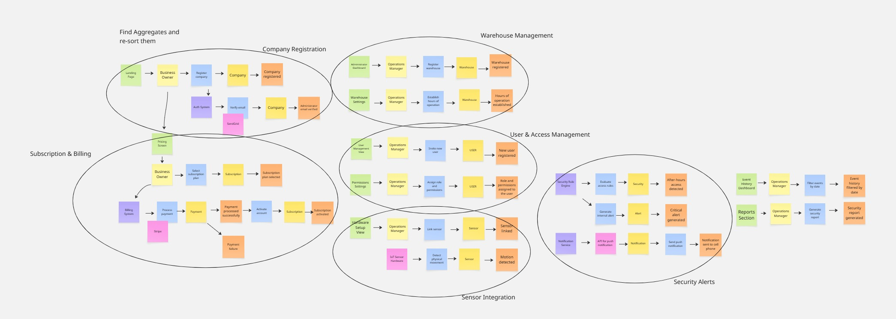
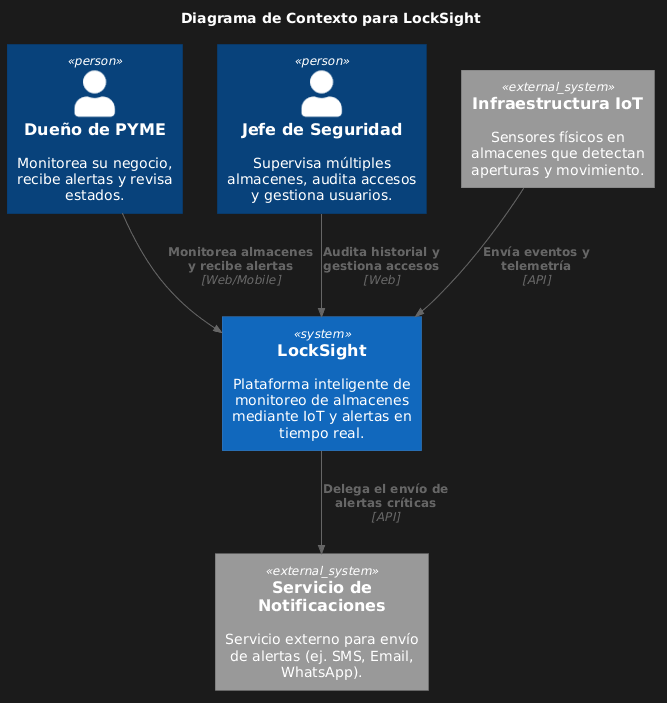
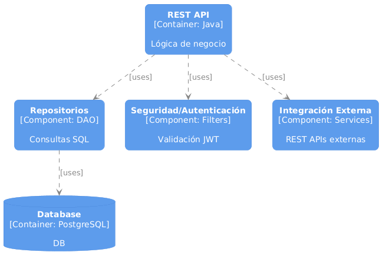
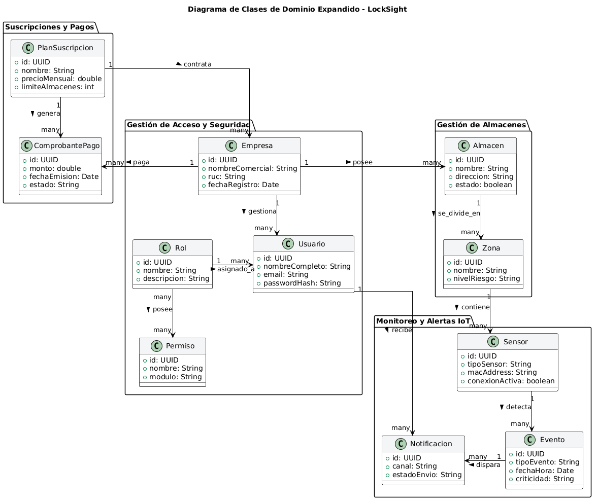
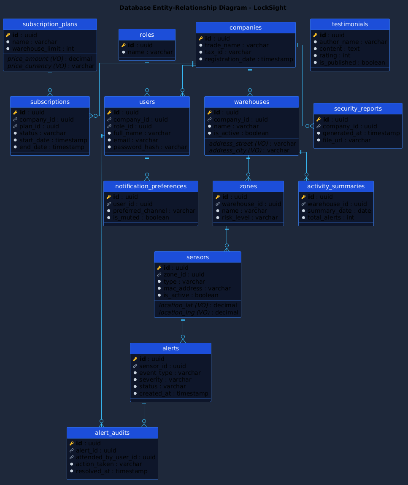

    

# Universidad Peruana de Ciencias Aplicadas

## Carrera de Ingeniería de Software

 

**Ciclo:** 2026 - 1  
**Curso:** Aplicaciones Web 
**NRC:** 12144 
**Docente:** Efraín Ricardo Bautista Ubillús

## "Informe del trabajo final"
**Startup:** watchgate 
**Producto:** locksight

## Relacion de integrantes:

| Código      | Nombre                              |
|-------------|-------------------------------------|
| U201819276  | Bardales Tejada, Luis Alexis        |
| U202416276  | Higa Kohatsu, Alonso Enrique       |
| U202412903  | Lozano Quispe, Fabricio Jofred      |
| U202418645  | Sandoval Aiquipa, Kelber Yamir      |
| U202414356  | Vite Celis, Rodrigo Matias          |

 Abril, 2026

## Registro de Versiones del Informe

| Versión | Fecha    | Autor       | Descripción de Modificación            |
| ------- | -------- | ----------- | -------------------------------------- |
| 0.1     | 00/04/26 | Bardales Tejada, Luis Alexis    | Desarrollo de la Estructura del informe |
| 0.1    | 00/04/26 | Higa Kohatsue, Alonso Enrique | Desarrollo de la Estructura del informe|
| 0.1    | 10/04/26 | Lozano Quispe, Fabricio Jofred | Desarrollar de la estructura del informe |
| 0.1    | 00/04/26 | Sandoval Aiquipa, Kelver Yamir | Desarrollo de la Estructura del informe|
| 0.1    | 10/04/26 | Vite Celis, Rodrigo Matias | Desarrollo de la Estructura del informe|

## Project Report Collaboration Insights

| URL de la organización del proyecto | URL del repositorio del reporte   |
| :------------------: | :---------------------------: | 
|  |  |

| URL del repositorio de la landing page |
| :----------------------------: | 
|  | 

**URL LANDING PAGE DESPLEGADO**:

Commits del Report:

## CONTENIDO

### Tabla de contenido
- [Capítulo I: Introducción](#capítulo-i-introducción)
  - [1.1. Startup Profile](#11-startup-profile)
    - [1.1.1. Descripción de la Startup](#111-descripción-de-la-startup)
    - [1.1.2. Perfiles de integrantes del equipo](#112-perfiles-de-integrantes-del-equipo)
  - [1.2. Solution Profile](#12-solution-profile)
    - [1.2.1. Antecedentes y problemática](#121-antecedentes-y-problemática)
    - [1.2.2. Lean UX Process](#122-lean-ux-process)
      - [1.2.2.1. Lean UX Problem Statements](#1221-lean-ux-problem-statements)
      - [1.2.2.2. Lean UX Assumptions](#1222-lean-ux-assumptions)
      - [1.2.2.3. Lean UX Hypothesis Statements](#1223-lean-ux-hypothesis-statements)
      - [1.2.2.4. Lean UX Canvas](#1224-lean-ux-canvas)
  - [1.3. Segmentos objetivos](#13-segmentos-objetivos)
- [Capítulo II: Requirements Elicitation & Analysis](#capítulo-ii-requirements-elicitation--analysis)
  - [2.1. Competidores](#21-competidores)
    - [2.1.1. Análisis competitivo](#211-análisis-competitivo)
    - [2.1.2. Estrategias y tácticas frente a competidores](#212-estrategias-y-tácticas-frente-a-competidores)
  - [2.2. Entrevistas](#22-entrevistas)
    - [2.2.1. Diseño de entrevistas](#221-diseño-de-entrevistas)
    - [2.2.2. Registro de entrevistas](#222-registro-de-entrevistas)
    - [2.2.3. Análisis de entrevistas](#223-análisis-de-entrevistas)
  - [2.3. Needfinding](#23-needfinding)
    - [2.3.1. User Personas](#231-user-personas)
    - [2.3.2. User Task Matrix](#232-user-task-matrix)
    - [2.3.3. User Journey Mapping](#233-user-journey-mapping)
    - [2.3.4. Empathy Mapping](#234-empathy-mapping)
  - [2.4. Big Picture Event Storming](#24-big-picture-event-storming)
  - [2.5. Ubiquitous Language](#25-ubiquitous-language)
- [Capítulo III: Requirements Specification](#capítulo-iii-requirements-specification)
  - [3.1. User Stories](#31-user-stories)
  - [3.2. Impact Mapping](#32-impact-mapping)
  - [3.3. Product Backlog](#33-product-backlog)
- [Capítulo IV: Product Design](#capítulo-iv-product-design)
  - [4.1. Style Guidelines](#41-style-guidelines)
    - [4.1.1. General Style Guidelines](#411-general-style-guidelines)
    - [4.1.2. Web Style Guidelines](#412-web-style-guidelines)
  - [4.2. Information Architecture](#42-information-architecture)
    - [4.2.1. Organization Systems](#421-organization-systems)
    - [4.2.2. Labeling Systems](#422-labeling-systems)
    - [4.2.3. SEO Tags and Meta Tags](#423-seo-tags-and-meta-tags)
    - [4.2.4. Searching Systems](#424-searching-systems)
    - [4.2.5. Navigation Systems](#425-navigation-systems)
  - [4.3. Landing Page UI Design](#43-landing-page-ui-design)
    - [4.3.1. Landing Page Wireframe](#431-landing-page-wireframe)
    - [4.3.2. Landing Page Mock-up](#432-landing-page-mock-up)
  - [4.4. Web Applications UX/UI Design](#44-web-applications-uxui-design)
    - [4.4.1. Web Applications Wireframes](#441-web-applications-wireframes)
    - [4.4.2. Web Applications Wireflow Diagrams](#442-web-applications-wireflow-diagrams)
    - [4.4.3. Web Applications Mock-ups](#443-web-applications-mock-ups)
    - [4.4.4. Web Applications User Flow Diagrams](#444-web-applications-user-flow-diagrams)
  - [4.5. Web Applications Prototyping](#45-web-applications-prototyping)
  - [4.6. Domain-Driven Software Architecture](#46-domain-driven-software-architecture)
    - [4.6.1. Design-Level Event Storming](#461-design-level-event-storming)
    - [4.6.2. Software Architecture Context Diagram](#462-software-architecture-context-diagram)
    - [4.6.3. Software Architecture Container Diagrams](#463-software-architecture-container-diagrams)
    - [4.6.4. Software Architecture Components Diagrams](#464-software-architecture-components-diagrams)
  - [4.7. Software Object-Oriented Design](#47-software-object-oriented-design)
    - [4.7.1. Class Diagrams](#471-class-diagrams)
  - [4.8. Database Design](#48-database-design)
    - [4.8.1. Database Diagrams](#481-database-diagrams)
- [Capítulo V: Product Implementation, Validation & Deployment](#capítulo-v-product-implementation-validation--deployment)
  - [5.1. Software Configuration Management](#51-software-configuration-management)
    - [5.1.1. Software Development Environment Configuration](#511-software-development-environment-configuration)
    - [5.1.2. Source Code Management](#512-source-code-management)
    - [5.1.3. Source Code Style Guide & Conventions](#513-source-code-style-guide--conventions)
    - [5.1.4. Software Deployment Configuration](#514-software-deployment-configuration)
  - [5.2. Landing Page, Services & Applications Implementation](#52-landing-page-services--applications-implementation)
    - [5.2.1. Sprint n](#521-sprint-n)
      - [5.2.1.1. Sprint Planning n](#5211-sprint-planning-n)
      - [5.2.1.2. Aspect Leaders and Collaborators](#5212-aspect-leaders-and-collaborators)
      - [5.2.1.3. Sprint Backlog n](#5213-sprint-backlog-n)
      - [5.2.1.4. Development Evidence for Sprint Review](#5214-development-evidence-for-sprint-review)
      - [5.2.1.5. Execution Evidence for Sprint Review](#5215-execution-evidence-for-sprint-review)
      - [5.2.1.6. Services Documentation Evidence for Sprint Review](#5216-services-documentation-evidence-for-sprint-review)
      - [5.2.1.7. Software Deployment Evidence for Sprint Review](#5217-software-deployment-evidence-for-sprint-review)
      - [5.2.1.8. Team Collaboration Insights during Sprint](#5218-team-collaboration-insights-during-sprint)
  - [5.3. Validation Interviews](#53-validation-interviews)
    - [5.3.1. Diseño de Entrevistas](#531-diseño-de-entrevistas)
    - [5.3.2. Registro de Entrevistas](#532-registro-de-entrevistas)
    - [5.3.3. Evaluaciones según heurísticas](#533-evaluaciones-según-heurísticas)
  - [5.4. Video About-the-Product](#54-video-about-the-product)
- [Conclusiones](#conclusiones)
  - [Conclusiones y recomendaciones](#conclusiones-y-recomendaciones)
- [Video About-the-Team](#video-about-the-team)
- [Bibliografía](#bibliografía)
- [Anexos](#anexos)

# **Student Outcomes**

# Capítulo I: Introducción

## 1.1. Startup Profile

###  1.1.1. Descripción de la Startup
En un entorno empresarial donde la seguridad de los almacenes y el control de accesos representan un desafío constante, especialmente en ciudades como Lima donde las pérdidas por robos internos, accesos no autorizados y falta de monitoreo en tiempo real impactan directamente en la rentabilidad de las empresas, las soluciones tradicionales ya no son suficientes. Frente a esta problemática surge nuestra startup, una iniciativa impulsada por estudiantes enfocada en transformar la gestión de seguridad mediante el uso de tecnología IoT. Reconocemos que la falta de visibilidad, control y trazabilidad en los almacenes genera vulnerabilidad operativa, por lo que proponemos una solución que conecta sensores físicos con una plataforma web inteligente, permitiendo supervisar en tiempo real lo que ocurre en cada espacio. No nos limitamos a registrar eventos, sino que convertimos cada almacén en un entorno inteligente capaz de detectar anomalías, generar alertas automáticas y proporcionar información clara para la toma de decisiones, brindando así mayor control, seguridad y eficiencia operativa.

**Misión:** Nuestra misión es transformar la seguridad y gestión de accesos en almacenes mediante un sistema inteligente basado en IoT, que permita a las empresas monitorear en tiempo real sus instalaciones, reducir riesgos y tomar decisiones informadas a partir de datos precisos. Buscamos proteger los activos empresariales y optimizar la operación mediante alertas inteligentes, trazabilidad completa y una plataforma accesible que elimine la incertidumbre y fortalezca el control sobre cada evento crítico dentro del almacén.

**Visión:** Nuestra visión es posicionarnos como una plataforma líder en seguridad inteligente para entornos empresariales, elevando el estándar de control y protección en almacenes mediante el uso de IoT y análisis de datos. Aspiramos a que cada instalación conectada opere como un sistema autónomo capaz de anticipar riesgos, detectar comportamientos inusuales y activar mecanismos de alerta en tiempo real, permitiendo a las empresas mantener el control total desde cualquier lugar. Con nuestra solución buscamos construir un ecosistema seguro, eficiente y escalable que no solo reduzca pérdidas, sino que también transforme la manera en que las organizaciones gestionan su seguridad y operación diaria.

## 1.2.2. Lean UX Process

###  1.2.2.1. Lean UX Problem Statements
Nuestro servicio busca resolver la falta de control y visibilidad en la gestión de almacenes empresariales. Es por esto que se propone integrar tecnología IoT como sensores, con una plataforma web que permita monitorear los espacios, controlar accesos y gestionar la información en tiempo real.

En muchos sectores, especialmente en logística e industria, las empresas enfrentan dificultades para proteger sus activos de manera eficiente. Los sistemas tradicionales de seguridad suelen ser reactivos, ya que solo registran lo que ocurrió, pero no ayudan a prevenir incidentes, esto genera problemas como robos internos, accesos no autorizados y falta de control continuo, afectando directamente la rentabilidad de las empresas.

Ante esta situación, surge la necesidad de contar con soluciones que permitan un control más activo y en tiempo real. Sin embargo, muchas empresas no adoptan nuevas tecnologías porque las perciben como costosas, complejas o difíciles de implementar. Es por esto que proponemos una solución que centraliza la gestión de los almacenes en una sola plataforma, permitiendo supervisar accesos, recibir alertas y tomar decisiones con información actualizada. De esta manera, se busca pasar de un enfoque reactivo a uno preventivo, donde los problemas puedan detectarse antes de que ocurran.

Conociendo esto, se generan las siguientes preguntas, ¿Cómo podemos ayudar a las empresas a tener un control más claro y en tiempo real de sus almacenes?,
¿Cómo podemos hacer que el uso de tecnología IoT sea más accesible y fácil de implementar? y ¿Cómo podemos convertir los datos recolectados en información útil para reducir pérdidas?

###  1.2.2.2. Lean UX Assumptions

**Business Outcomes**

* Incrementar la cantidad de empresas que se suscriban a la plataforma Locksight.
* Mejorar la retención de clientes corporativos ofreciendo un servicio estable y confiable.
* Reducir las pérdidas económicas causadas por robos, accesos no autorizados y fallas de control en los almacenes.
* Facilitar el uso de tecnología IoT para que las empresas puedan modernizar su seguridad y pasar de un enfoque reactivo a uno solo preventivo.
* Generar ingresos recurrentes mediante un modelo de suscripción con distintos planes según el tamaño del cliente.

**User Benefits**

* **Dueños de empresas medianas**

  Tener control claro sobre lo que ocurre en sus almacenes sin necesidad de estar físicamente presentes, reduciendo la incertidumbre sobre posibles pérdidas o accesos no autorizados.

* **Jefes de Operaciones / Logística**

  Monitorear en tiempo real la actividad del almacén y reaccionar rápidamente ante cualquier incidente gracias a alertas automáticas y un panel centralizado.

* **Personal de Seguridad**

  Reducir la carga de trabajo manual al contar con un sistema que automatiza la vigilancia y registra los eventos de forma ordenada.

* **Empresas con múltiples almacenes**

  Centralizar la supervisión de todas sus sedes en una sola plataforma, facilitando el control y la toma de decisiones.

**Assumptions**

* Se asume que los clientes necesitan una forma más activa y en tiempo real de monitorear sus almacenes, en lugar de depender de sistemas que solo registran incidentes.
* Se cree que esta necesidad puede resolverse mediante una plataforma que conecte sensores físicos con un dashboard web simple y claro.
* Los clientes iniciales serán dueños de PYMES y responsables de operaciones en empresas más grandes que necesitan mayor control y trazabilidad.
* El principal valor para el cliente será la tranquilidad de saber que sus activos están protegidos y monitoreados constantemente.
* Se espera que valoren beneficios adicionales como el control de horarios del personal y la gestión de varias sedes.
* Los clientes se captarán principalmente mediante contacto directo, redes profesionales y pruebas piloto.
* El modelo de ingresos será por suscripción, según la cantidad de almacenes o sensores utilizados.
* La principal competencia serán los sistemas tradicionales de cámaras y alarmas.
* Uno de los principales riesgos es la dependencia de una conexión a internet estable. Para reducir este riesgo, el sistema podrá almacenar información de forma temporal y sincronizarla cuando se recupere la conexión.
* Se asume que las empresas estarán dispuestas a pagar una suscripción mensual por el servicio. Si no es así, el modelo de negocio podría verse afectado.

**Assumptions Worksheet**

* ¿Quién es el usuario?
  
  Son dueños o administradores de PYMES, así como jefes de operaciones o seguridad en empresas más grandes que necesitan controlar sus almacenes.
* ¿Dónde encaja nuestro producto en su trabajo o vida?
  
  Forma parte de la gestión diaria del almacén. Funciona de manera continua y se consulta desde una computadora o celular en cualquier momento.
* ¿Qué problemas tiene nuestro producto y cómo se puede resolver?
  
  Puede existir cierta dificultad inicial al usar tecnología nueva, por lo que se priorizará una interfaz simple e intuitiva. También pueden presentarse problemas de conexión o energía, que se manejarán guardando información temporalmente hasta recuperar el servicio.
* ¿Cuándo y cómo es usado nuestro producto?
  
  Los sensores funcionan todo el tiempo. La plataforma se usa para revisar el estado del almacén, controlar accesos o responder ante alertas.
* ¿Qué características son importantes?
  
  Que sea confiable, rápido, fácil de usar y que muestre la información de forma clara.
* ¿Cómo debe verse nuestro producto y cómo comportarse?
  
  Debe tener un diseño limpio y profesional, transmitiendo seguridad. Además, debe responder de forma rápida y precisa ante cualquier evento.

###  1.2.2.3. Lean UX Hypothesis Statements

* Creemos que implementar alertas en tiempo real mediante sensores IoT permitirá a los dueños de empresas y jefes de seguridad reaccionar más rápido ante accesos no autorizados. Sabremos que funciona si el tiempo de respuesta se reduce a menos de 1 minuto y los casos de mermas o robos disminuyen durante el primer trimestre.
* Creemos que contar con un dashboard web centralizado e intuitivo permitirá a los administradores gestionar varios almacenes y configurar accesos sin necesidad de conocimientos técnicos. Sabremos que funciona si el 90% de los usuarios puede revisar eventos o configurar permisos en menos de 3 minutos sin ayuda.
* Creemos que incorporar almacenamiento local temporal en los dispositivos mejorará la confiabilidad del sistema, evitando la pérdida de datos ante fallas de conexión. Sabremos que funciona si el 100% de los eventos se sincroniza correctamente después de restablecer el servicio y se mantiene una alta retención de clientes.
* Creemos que ofrecer un modelo de suscripción flexible junto con pruebas piloto facilitará la adopción del sistema. Sabremos que funciona si al menos 5 empresas prueban el sistema en el primer mes y el 60% decide continuar con un plan de pago.

###  1.2.2.4. Lean UX Canvas

## 1.3. Segmentos objetivos

El modelo de negocio se enmarca en el sector B2B (Business-to-Business), enfocándose en la seguridad de activos críticos y la optimización de la gestión operativa en almacenes. Se han identificado dos segmentos principales que presentan necesidades diferenciadas en cuanto a escalabilidad y profundidad de control:

### Segmento 1: Dueños y Administradores de PYMES (Retail, Tiendas y Pequeños Almacenes)
Este segmento representa a los emprendedores y gerentes de pequeñas y medianas empresas. Son los clientes objetivo para el **Plan Básico**. Por lo general, no cuentan con el presupuesto para mantener un equipo de vigilancia 24/7, pero tienen una necesidad imperiosa de tranquilidad y control sobre su inventario.

**Aspectos demográficos:**
* **Edad:** Entre 25 y 55 años.
* **Ocupación:** Dueños de negocio, gerentes generales o administradores comerciales.
* **Nivel de digitalización:** Usan intensivamente el celular para actividades clave de su negocio (WhatsApp, banca móvil). Buscan *dashboards* simples que no requieran conocimientos técnicos previos.

**Aspectos psicográficos:**
* **Motivaciones:** Obtener tranquilidad mental, mantener el control del negocio a distancia y evitar inversiones costosas o complejas en seguridad tradicional.
* **Intereses:** Soluciones simples, tecnología accesible y herramientas prácticas que faciliten la gestión diaria sin añadir carga operativa.

**Comportamiento y necesidades:**
* Prefieren herramientas intuitivas y valoran la rapidez de configuración.
* Priorizan el uso de la plataforma desde sus dispositivos móviles.
* **Principal dolor:** La merma por robos (internos o externos, como el "robo hormiga").
* Necesitan notificaciones en tiempo real en el celular, especialmente para saber si el local fue abierto fuera del horario establecido.

> **Dato estadistico:** De acuerdo con Gómez et al. (2024), el 73% de las PYMES latinoamericanas carecen de sistemas automatizados de gestión de almacenes, lo cual genera ineficiencias que pueden representar hasta el 25% de sus costos logísticos totales.

---

### Segmento 2: Jefes de Seguridad y Operaciones (Medianas y Grandes Corporaciones)
Este segmento incluye a profesionales que gestionan infraestructuras logísticas complejas para empresas de gran envergadura (fábricas, constructoras, centros de distribución). Son el público objetivo que justificaría la adquisición del **Plan Pro o Empresarial**, ya que su enfoque requiere el cumplimiento de normativas de seguridad industrial.

**Aspectos demográficos:**
* **Edad:** Entre 35 y 60 años.
* **Ocupación:** Jefes de Seguridad Industrial, Supervisores Logísticos, Supply Chain Managers o Jefes de Planta.
* **Nivel de digitalización:** Alto. Acostumbrados a manejar sistemas ERP (SAP, Oracle), generar reportes consolidados y utilizar software de gestión de almacenes (WMS).

**Aspectos psicográficos:**
* **Motivaciones:** Tener control total de las operaciones, reducir las pérdidas a gran escala y optimizar la seguridad en múltiples sedes de forma simultánea.
* **Intereses:** Auditoría constante, trazabilidad de eventos, automatización de procesos y gestión centralizada.

**Comportamiento y necesidades:**
* Buscan soluciones robustas y escalables que puedan crecer con la empresa.
* Prefieren plataformas que ofrezcan facilidades de integración con sus sistemas corporativos existentes.
* **Principal dolor:** La lentitud para auditar incidentes y la falta de control granular.
* Necesitan más que simples alertas: requieren una auditoría completa y trazabilidad detallada de accesos (quién, cuándo y dónde).
* Requieren control de permisos diferenciados por usuario y zona, además de historiales completos para justificar pérdidas y la capacidad de configurar reglas automáticas inteligentes para múltiples almacenes.

> **Dato estadistico:** Simultáneamente, el Internet de las Cosas Industrial (IIoT) permite monitorear condiciones ambientales y ubicación de productos en tiempo real, reduciendo pérdidas por caducidad o daños en un 35% (Ortiz y Paredes-Rodríguez, 2021).

# Capítulo II: Requirements Elicitation & Analysis
## 2.1. Competidores.
### 2.1.1. Análisis competitivo

## ¿Por qué llevar a cabo este análisis?
**Objetivo:**  
Identificar y comparar a los principales competidores en soluciones de seguridad IoT y rastreo de flotas, con el fin de definir ventajas competitivas, estrategias de precios y oportunidades de diferenciación para nuestra startup en el mercado.

| Característica | Su Startup | Competidor 1: Ditrack | Competidor 2: Global GPS Perú | Competidor 3: Soluciones Globales |
|--------------|------------|------------------------|-------------------------------|----------------------------------|
| Logo | 

 | 

 | 

 | 

 |
| Overview | Plataforma IoT que integra sensores físicos y software para monitoreo en tiempo real de almacenes y rutas. | Empresa líder en rastreo satelital con larga trayectoria en Perú. | Empresa enfocada en GPS accesible para pymes con planes simples. | Empresas globales con soluciones avanzadas de gestión de flotas e IoT. |
| Perfil | Startup tecnológica enfocada en innovación IoT aplicada a seguridad. | Empresa consolidada con enfoque en monitoreo tradicional. | Empresa pequeña enfocada en soluciones económicas. | Corporaciones tecnológicas con soluciones avanzadas. |
| Ventaja competitiva | Monitoreo inteligente + detección de anomalías + integración almacén + flota. | Experiencia, cumplimiento normativo y monitoreo confiable 24/7. | Bajo costo + facilidad de uso. | Tecnología avanzada, escalabilidad global y analítica. |
| ¿Qué valor ofrece? | Control total, prevención de riesgos y toma de decisiones en tiempo real. | Seguridad confiable y cumplimiento legal. | Ahorro y accesibilidad para pymes. | Optimización operativa y análisis avanzado. |
| Mercado objetivo | Empresas logísticas, almacenes, pymes y medianas empresas. | Grandes flotas, minería y transporte formal. | Pymes de transporte y logística. | Empresas globales y grandes flotas. |
| Estrategias de marketing | Enfoque en innovación, eficiencia y seguridad inteligente. | Posicionamiento como empresa confiable y líder. | Estrategia basada en precios bajos. | Marketing digital global y branding fuerte. |
| Perfil de Producto | Sensores IoT + plataforma web + alertas inteligentes + trazabilidad. | GPS vehicular + monitoreo + reportes. | GPS + plataforma básica + alertas. | GPS + dashboards + cámaras + analítica avanzada. |
| Precios & Costos | Planes mensuales escalonados (Básico, Profesional, Empresarial). | Desde aprox. S/600 mensual por vehículo. | Desde S/550 anuales. | Desde ~$16 USD mensual por activo. |
| Canales de distribución | Web + app móvil propia. | Web + app + instalación física. | Web + WhatsApp + app. | Web + app + integraciones empresariales. |
| Fortalezas | Innovación IoT, integración completa, escalabilidad. | Marca fuerte, experiencia, cumplimiento legal. | Precio competitivo y accesibilidad. | Tecnología avanzada y gran inversión en I+D. |
| Debilidades | Falta de posicionamiento y experiencia. | Menor innovación tecnológica. | Baja diferenciación y alcance limitado. | Costos elevados y menor enfoque local. |
| Oportunidades | Crecimiento del IoT y necesidad de seguridad inteligente. | Integrar nuevas tecnologías. | Expansión a nuevos segmentos. | Expansión en Latinoamérica. |
| Amenazas | Competidores posicionados y barrera de confianza. | Nuevas startups innovadoras. | Alta competencia en precios. | Regulaciones y competencia local. |

### 2.1.2. Estrategias y tácticas frente a competidores

En el mercado actual existen distintas soluciones de seguridad para almacenes, desde sistemas tradicionales solo enfocados en alarmas hasta plataformas avanzadas de videovigilancia. Sin embargo, muchas de estas opciones se limitan a registrar incidentes, sin enfocarse en prevenirlos o analizarlos en tiempo real. Ante esta situación, nuestra propuesta se diferencia al integrar monitoreo en tiempo real, tecnología IoT adaptable y análisis inteligente en una sola plataforma, accesible para empresas de distintos tamaños.

#### Estrategia de diferenciación tecnológica
Nuestra propuesta se posiciona como una solución integral que reúne monitoreo en tiempo real, sensores IoT y análisis inteligente en un solo sistema. En comparación de otros competidores que ofrecen estos servicios por separado, nosotros buscamos simplificar la gestión a través de un dashboard intuitivo que permita controlar sensores, alertas y accesos desde un único lugar.

#### Estrategia de inserción en el mercado
Puesto que existen empresas consolidadas con alta reputación, nuestra entrada al mercado se enfocará en la implementación de pruebas piloto en pequeñas y medianas empresas. Esto nos permitirá demostrar la efectividad del sistema, generar casos de éxito reales y reducir la desconfianza hacia una nueva startup.

#### Estrategia de captación de clientes
Aprovechando la creciente digitalización de las empresas peruanas, ofreceremos un modelo SaaS flexible y escalable. Los planes de suscripción estarán diseñados según la cantidad de almacenes que maneje cada empresa, permitiendo que elijan la opción que mejor se adapte a sus necesidades y presupuesto.

#### Estrategia frente a lo existente
Para empresas que aún utilizan sistemas tradicionales, ya sea por desconfianza o por los elevados costos, nuestra estrategia será demostrar de forma clara los beneficios de la solución, como la facilidad de uso y capacidad preventiva. Buscaremos posicionarnos no solo como una alternativa tecnológica, sino como una inversión rentable que mejora la seguridad y optimiza la operación.

## 2.2. Entrevistas.
### 2.2.1. Diseño de entrevistas
**Primer segmento: Dueños y Administradores de PYMES**

A continuación, se presentan las preguntas dirigidas al segmento de dueños y administradores de pequeñas y medianas empresas, quienes buscan tener mayor control y seguridad sobre sus almacenes sin necesidad de sistemas complejos o costosos.

**Preguntas principales**
1. ¿Te preocupa la seguridad de tu almacén o negocio?
2. ¿Has tenido problemas de robos o pérdidas dentro de tu local?
3. ¿Cómo controlas actualmente quién entra o sale de tu almacén?
4. ¿Te gustaría saber en tiempo real lo que pasa en tu almacén?
5. ¿Qué tan útil sería recibir alertas en tu celular si ocurre algo extraño?
6. ¿Qué tipo de alertas te gustaría recibir? (puertas abiertas, movimiento, fuera de horario, etc.)
7. ¿Te ayudaría poder revisar lo que pasó en el almacén en cualquier momento?
8. ¿Qué tan fácil debería ser usar una app para controlar tu almacén?
9. ¿Qué es lo más importante para ti en un sistema de seguridad?
10. ¿Te daría tranquilidad poder ver todo desde tu celular sin estar presente?
11. ¿Qué problemas te gustaría evitar con una herramienta como esta?
12. ¿Usarías una solución como Locksight en tu negocio?

**Preguntas complementarias**

13. ¿Qué edad tienes?
14. ¿A qué se dedica tu negocio?
15. ¿Cuántas personas trabajan contigo?
16. ¿En qué distrito está tu negocio?
17. ¿Usas aplicaciones en tu celular para tu negocio? ¿Cuáles?
18. ¿Qué tan seguido revisas tu negocio cuando no estás presente?
19. ¿Prefieres usar más el celular o la computadora?
20. ¿Qué tan cómodo te sientes usando tecnología nueva?

**Segundo segmento: Jefes de Seguridad y Operaciones**

A continuación, se presentan las preguntas dirigidas al segmento de jefes de seguridad y operaciones, quienes necesitan controlar almacenes de mayor tamaño, tener registro de accesos y tomar decisiones basadas en información.

**Preguntas principales**
1. ¿Te preocupa la seguridad de los almacenes o instalaciones que supervisas?
2. ¿Qué problemas has tenido con accesos no autorizados o pérdidas?
3. ¿Cómo controlan actualmente quién entra y sale de los almacenes?
4. ¿Te gustaría tener información en tiempo real de lo que ocurre en cada almacén?
5. ¿Qué tan útil sería recibir alertas automáticas ante movimientos sospechosos?
6. ¿Qué tipo de alertas serían más útiles para tu trabajo?
7. ¿Te serviría tener un historial de accesos y eventos del almacén?
8. ¿Qué tan importante es para ti poder revisar información desde cualquier lugar?
9. ¿Qué es lo más importante en un sistema de seguridad para almacenes?
10. ¿Te ayudaría tener todo el control en una sola plataforma?
11. ¿Qué problemas actuales te gustaría solucionar con una herramienta como esta?
12. ¿Crees que una solución así mejoraría la seguridad y control en tu trabajo?
    
**Preguntas complementarias**

13. ¿Cuál es tu cargo dentro de la empresa?
14. ¿En qué tipo de empresa trabajas?
15. ¿Cuántos almacenes o sedes manejan?
16. ¿En qué zonas operan?
17. ¿Qué sistemas o herramientas usan actualmente?
18. ¿Qué tan seguido usas computadora o celular en tu trabajo?
19. ¿Trabajas más en oficina o en campo?
20. ¿Qué tan familiarizado estás con sistemas tecnológicos?

### 2.2.1. Registro de entrevistas
**Primer segmento: Dueños y Administradores de PYMES**

| Nº Entrevista | Datos del entrevistado | Resumen de la entrevista | Evidencia de entrevista |
|--------------|------------------------|--------------------------|--------------------------|
| 1 | **Nombre:** Carlos Marcelo Mansilla Rivero   **Edad:** 23   **Distrito:** Surquillo   **Ocupación:** Dueño/Administrador de distribuidora mayorista   **Link:** colocar link | El entrevistado administra una distribuidora mayorista y utiliza herramientas digitales para su gestión diaria; su principal problema es la merma y el “robo hormiga”, lo que afecta la rentabilidad del negocio; considera que el control actual es insuficiente, por lo que valora el monitoreo en tiempo real y alertas ante eventos críticos; busca una solución intuitiva, confiable y accesible desde el celular que le brinde mayor control y tranquilidad. | 

 |
| 2 | **Nombre:** Valeria Alejandra Flores Paz   **Edad:** 28   **Distrito:** San Borja   **Ocupación:** Administradora de tienda de ropa   **Link:** colocar link | La entrevistada administra una tienda de ropa y utiliza exclusivamente su celular para la gestión diaria; su principal problema es el "robo hormiga", lo que le genera preocupación al no tener registro de accesos; considera fundamental recibir alertas en tiempo real en su celular ante aperturas fuera de horario; por ello, busca una aplicación sumamente intuitiva, de rápida instalación y costo accesible que le brinde tranquilidad. | 

 |
| 3 | **Nombre:** Song Ju Loo   **Edad:** 22   **Distrito:** El Agustino   **Ocupación:** Dueño de tienda mayorista   **Link:** — | El entrevistado, dueño de una tienda mayorista, presenta preocupación por pérdidas de mercadería sin poder identificar su origen; actualmente usa cámaras y confianza en el personal, pero considera el sistema limitado; valora monitoreo en tiempo real, alertas inmediatas y registros históricos; busca una solución simple, accesible desde el celular y que le permita mayor control sin estar presente. | 

 |
| 4 | **Nombre:** Gloria Celis   **Edad:** 59   **Distrito:** Villa el Salvador   **Ocupación:** Dueña de almacén   **Link:** — | La entrevistada, dueña de un almacén con un equipo de aprox 5 personas, enfrenta pérdidas constantes y falta de control de accesos; depende de métodos manuales y cámaras básicas, por lo que valora monitoreo en tiempo real y alertas inmediatas; busca una solución confiable, simple y accesible desde el celular que le brinde mayor control y tranquilidad. | 

 |

**Resumen de entrevistas segmento #1**
En general, todas las entrevistas muestran algo bien claro: quienes manejan estos negocios viven con la preocupación constante de pérdidas de mercadería, sobre todo por el “robo hormiga”, y sienten que el control que tienen hoy no es suficiente. Usan cámaras o registros manuales, pero igual les cuesta saber exactamente qué pasa y cuándo ocurre. Por eso, todos coinciden en que necesitan ver lo que sucede en tiempo real y recibir alertas inmediatas para poder reaccionar rápido. También valoran mucho tener un historial que les permita revisar lo ocurrido cuando hay dudas. Al final, lo que buscan es una solución sencilla de usar, que funcione desde el celular y que no sea complicada de implementar, porque más que nada quieren tener mayor control sobre su negocio y sentirse tranquilos incluso cuando no están presentes.

**Segundo segmento: Jefes de Seguridad y Operaciones**

| Nº Entrevista | Datos del entrevistado | Resumen de la entrevista | Evidencia de entrevista |
|--------------|------------------------|--------------------------|--------------------------|
| 1 | **Nombre:** Joao Jiménez   **Edad:** 26   **Distrito:** San Juan de Lurigancho   **Ocupación:** Encargado de seguridad y planificación   **Link:** colocar link | El entrevistado trabaja en seguridad supervisando almacenes y utilizando métodos tradicionales como guardias, registros manuales y cámaras; enfrenta problemas como accesos fuera de horario y pérdidas difíciles de rastrear, además de la ineficiencia al revisar grabaciones; por ello, valora el monitoreo en tiempo real, alertas precisas y un historial de accesos, buscando una solución confiable que optimice el control y mejore la toma de decisiones. | 

 |
| 2 | **Nombre:** Carlos Rodrigo Chavez Quispe   **Edad:** 36   **Distrito:** La Molina   **Ocupación:** Supervisor Logístico   **Link:** colocar link | El entrevistado supervisa tres almacenes utilizando sistemas tradicionales desconectados entre sí; su principal problema es rastrear las mermas debido a la naturaleza reactiva de las cámaras actuales; valora críticamente la información en tiempo real para reaccionar ante aperturas no autorizadas o fallas de sensores; por ello, requiere una plataforma centralizada que ofrezca trazabilidad absoluta y reportes consolidados, buscando una solución estable que optimice sus auditorías. | 

 |
| 3 | **Nombre:** Diego Castillo   **Edad:** 24   **Distrito:** San Juan de Lurigancho   **Ocupación:** Jefe de seguridad y supervisor de almacenes   **Link:** — | El entrevistado, jefe de seguridad en una empresa de logística y distribución, es responsable de supervisar múltiples almacenes, lo que implica un alto nivel de control y toma de decisiones sobre la seguridad operativa. Señala que la seguridad es crítica, ya que cualquier falla impacta directamente en la empresa, y ha enfrentado problemas como accesos no autorizados y pérdidas difíciles de justificar. Actualmente utiliza cámaras, controles de acceso y registros manuales, pero identifica como principal limitación la falta de centralización de la información, lo que genera ineficiencia y pérdida de tiempo en el monitoreo y análisis. Valora especialmente la posibilidad de contar con información en tiempo real, alertas automáticas ante eventos sospechosos (como accesos fuera de horario o movimientos en zonas restringidas) y un historial completo de accesos para auditorías y toma de decisiones. Busca un sistema confiable, claro y centralizado, que le permita supervisar múltiples almacenes desde cualquier lugar, mejorar la trazabilidad y optimizar la gestión de la seguridad, facilitando una respuesta más rápida y efectiva ante incidentes. | 

 |
| 4 | **Nombre:** Cristina Celis   **Edad:** 61   **Distrito:** Ate   **Ocupación:** Jefa de almacen—   **Link:** — | La entrevistada, jefa de Seguridad/Operaciones en una empresa mediana/grande de logística o retail que gestiona entre 2 y 10 almacenes en Lima y alrededores, enfrenta problemas de accesos fuera de horario, pérdidas difíciles de rastrear y falta de integración entre sistemas (CCTV, controles básicos y registros manuales), lo que limita la visibilidad y retrasa la detección de incidentes; valora altamente el monitoreo en tiempo real, las alertas automáticas (accesos no autorizados, actividad inusual, puertas abiertas) y un historial detallado para auditorías, además de poder acceder a la información desde cualquier lugar, por lo que considera clave una solución unificada, precisa e integrada que mejore la eficiencia, reduzca riesgos y simplifique la gestión operativa.| 

**Resumen de entrevistas segmento #2**
En estas entrevistas se repite una idea bastante clara: quienes trabajan en seguridad y supervisión de almacenes lidian todos los días con sistemas poco integrados que les hacen perder tiempo y les quitan visibilidad. Aunque usan cámaras, controles de acceso y registros manuales, igual les cuesta detectar a tiempo accesos fuera de horario o pérdidas, y muchas veces terminan reaccionando tarde porque todo es más reactivo que preventivo. Por eso, valoran mucho poder tener información en tiempo real, recibir alertas precisas apenas ocurre algo sospechoso y contar con un historial claro que les facilite auditorías y decisiones. Al final, lo que buscan es una plataforma centralizada, confiable y fácil de manejar que les permita controlar varios almacenes desde cualquier lugar, reducir riesgos y responder más rápido sin complicarse con sistemas dispersos.

### 2.2.3. Análisis de entrevistas.
## Análisis de entrevistas – Segmento 1: Dueños y Administradores de PYMES

A partir de las 4 entrevistas realizadas a dueños y administradores de PYMES en distintos rubros (distribución, retail y almacenes), se identificaron patrones consistentes en sus características objetivas y subjetivas, evidenciando necesidades claras relacionadas con el control y la seguridad de sus negocios.

### Características objetivas

- El **100% de los entrevistados administra directamente su negocio** (dueños o responsables de operación).
- El **100% utiliza herramientas digitales básicas** (principalmente celular, apps como WhatsApp o sistemas simples de control).
- El **75% depende de métodos tradicionales de seguridad**, como cámaras y registros manuales.
- El **100% ha experimentado pérdidas de mercadería** o situaciones donde no pueden identificar claramente su origen.
- El **100% gestiona equipos de trabajo**, lo que incrementa la necesidad de control de accesos y supervisión.

### Características subjetivas

- El **100% manifiesta preocupación constante por pérdidas de mercadería**, especialmente asociadas al “robo hormiga”.

- El **100% considera que sus sistemas actuales son insuficientes**, debido a:
  - Falta de monitoreo en tiempo real  
  - Dependencia de revisión manual (cámaras o registros)  
  - Dificultad para identificar responsables o momentos exactos de incidentes  

- El **100% valora funcionalidades clave como:**
  - Monitoreo en tiempo real  
  - Alertas inmediatas ante accesos o movimientos sospechosos  
  - Historial o registro de eventos para revisión  

- El **100% busca una solución que sea:**
  - Fácil de usar  
  - Accesible desde el celular  
  - Rápida de implementar  
  - Intuitiva (sin necesidad de capacitación compleja)  

- El **75% prioriza la confiabilidad del sistema**, mostrando rechazo a soluciones con falsas alarmas o fallos.

- El **100% muestra disposición a adoptar nuevas tecnologías**, siempre que:
  - Sean accesibles en costo  
  - No compliquen su operación diaria  
  - Generen valor directo en reducción de pérdidas  

- El **100% asocia este tipo de soluciones con mayor control y tranquilidad**, destacando que el principal beneficio es poder supervisar su negocio sin estar físicamente presente.

## Análisis de entrevistas – Segmento 2: Jefes de Seguridad y Operaciones

A partir de las 4 entrevistas realizadas a jefes de seguridad y supervisores de operaciones en entornos logísticos, se identificaron patrones claros en sus características objetivas y subjetivas, evidenciando necesidades enfocadas en la centralización, eficiencia y control de la seguridad operativa.

### Características objetivas

- El **100% de los entrevistados trabaja en roles de supervisión o gestión de seguridad**, con responsabilidad directa sobre uno o más almacenes.
- El **75% supervisa múltiples almacenes**, lo que incrementa la complejidad del control y monitoreo.
- El **100% utiliza sistemas tradicionales de seguridad**, como cámaras, controles de acceso y registros manuales.
- El **75% trabaja con sistemas no integrados**, lo que dificulta la gestión unificada de la información.
- El **100% ha enfrentado incidentes como accesos no autorizados o pérdidas difíciles de rastrear**.

### Características subjetivas

- El **100% manifiesta frustración por la falta de integración de los sistemas actuales**, lo que genera pérdida de tiempo y menor visibilidad.

- El **100% considera que el monitoreo actual es reactivo e ineficiente**, debido a:
  - Dependencia de revisión manual de cámaras  
  - Falta de alertas en tiempo real  
  - Dificultad para detectar incidentes de forma oportuna  

- El **100% valora funcionalidades clave como:**
  - Monitoreo en tiempo real  
  - Alertas automáticas y precisas  
  - Historial de accesos y eventos para auditorías  

- El **100% busca una solución que sea:**
  - Centralizada (una sola plataforma)  
  - Confiable y sin errores  
  - Accesible desde cualquier lugar  
  - Clara y fácil de usar  

- El **75% prioriza la trazabilidad y generación de reportes**, como apoyo para auditorías y toma de decisiones.

- El **100% muestra disposición a adoptar nuevas tecnologías**, siempre que:
  - Se integren con sus sistemas actuales  
  - Mejoren la eficiencia operativa  
  - Reduzcan tiempos de supervisión  

- El **100% asocia este tipo de soluciones con mayor control, rapidez de respuesta y reducción de riesgos**, destacando que el valor principal está en pasar de un enfoque reactivo a uno preventivo en la gestión de seguridad.

## 2.3. Needfinding
### 2.3.1. User Personas
> Segmento 1

> Segmento 2

### 2.3.2 User Task Matrix
### Segmento 1: Dueños y Administradores de PYMES

| Tarea | Frecuencia | Importancia |
|------|------------|-------------|
| Monitorear el estado de su negocio o almacén cuando no está presente | Often | High |
| Detectar pérdidas o faltantes de mercadería | Often | High |
| Identificar posibles robos o “robo hormiga” | Often | High |
| Revisar registros de accesos o actividad del personal | Sometimes | High |
| Recibir alertas ante eventos sospechosos | Occasionally | High |
| Gestionar su negocio desde el celular | Often | High |
| Tomar decisiones rápidas ante incidentes | Sometimes | High |

---

### Segmento 2: Jefes de Seguridad y Operaciones

| Tarea | Frecuencia | Importancia |
|------|------------|-------------|
| Supervisar múltiples almacenes o puntos de control | Often | High |
| Revisar cámaras o registros de seguridad | Often | High |
| Detectar accesos no autorizados o fuera de horario | Often | High |
| Coordinar acciones ante incidentes de seguridad | Sometimes | High |
| Analizar historial de eventos para auditorías | Occasionally | High |
| Gestionar información dispersa de diferentes sistemas | Often | High |
| Responder rápidamente ante alertas de seguridad | Sometimes | High |

### 2.3.3 User Journey Mapping
> Segmento 1

> Segmento 2

### 2.3.4. Empathy Mapping
> Segmento 1

> Segmento 2

## 2.4. Big Picture Event Storming

En la sesión de Big Picture Event Storming, el equipo identificó los eventos más relevantes del dominio de seguridad inteligente para almacenes, trazando de forma visual el panorama general de la plataforma LockSight. Se representaron los flujos críticos de monitoreo, control de accesos y gestión de alertas, integrando los sistemas externos que interactúan con la solución e identificando dudas, problemas y oportunidades de mejora. Esta primera exploración permitió al equipo alinear el entendimiento del negocio y establecer las bases para un diseño más detallado en etapas posteriores.

### Big Picture Event Storming – Mapa General

# Capitulo III: Requirements Specification
## 3.1 User Stories
| Epic / Story ID | Título | Descripción | Criterios de Aceptación | Relacionado con (Epic ID) |
|----------------|--------|-------------|--------------------------|---------------------------|
| US01 | Visualizar almacenes registrados | Como dueño de PYME, quiero visualizar mis almacenes registrados para tener control general de mis operaciones. | Given el usuario tiene almacenes registrados, When accede al sistema, Then el sistema muestra la lista de almacenes asociados. Given no tiene almacenes, When accede, Then el sistema muestra un estado vacío. | EP01 |
| US02 | Ver estado de un almacén | Como dueño de PYME, quiero consultar el estado de un almacén para conocer su situación actual. | Given existe un almacén, When el usuario lo selecciona, Then el sistema muestra su estado actual. Given el almacén tiene eventos recientes, When se consulta, Then se muestran dichos eventos. | EP01 |
| US03 | Monitorear actividad en tiempo real | Como jefe de seguridad, quiero monitorear la actividad en tiempo real para detectar incidentes rápidamente. | Given existen eventos en el almacén, When ocurren, Then el sistema los actualiza en tiempo real. Given múltiples eventos, When se generan, Then se visualizan sin retraso significativo. | EP01 |
| US04 | Registrar un nuevo almacén | Como dueño de PYME, quiero registrar un nuevo almacén para gestionarlo dentro del sistema. | Given el usuario ingresa datos válidos, When registra un almacén, Then el sistema lo guarda correctamente. Given datos incompletos, When intenta registrar, Then el sistema rechaza la operación. | EP02 |
| US05 | Configurar horarios de acceso | Como jefe de seguridad, quiero definir horarios de acceso para controlar entradas y salidas. | Given el usuario define un horario, When lo guarda, Then el sistema lo aplica al almacén. Given un acceso fuera de horario, When ocurre, Then se registra como evento. | EP02 |
| US06 | Recibir alertas de acceso fuera de horario | Como jefe de seguridad, quiero recibir alertas cuando haya accesos fuera de horario para reaccionar rápidamente. | Given ocurre un acceso fuera de horario, When el evento es detectado, Then el sistema genera una alerta. Given una alerta generada, When se envía, Then llega al usuario correctamente. | EP03 |
| US07 | Recibir alertas de movimiento sospechoso | Como dueño de PYME, quiero recibir alertas de movimientos sospechosos para prevenir robos. | Given se detecta un movimiento inusual, When el sistema lo identifica, Then genera una alerta. Given la alerta es válida, When se envía, Then el usuario la recibe. | EP03 |
| US08 | Registrar eventos de seguridad | Como jefe de seguridad, quiero registrar eventos de seguridad para mantener control histórico. | Given ocurre un evento, When es detectado, Then el sistema lo almacena. Given eventos registrados, When se consultan, Then se muestran correctamente. | EP04 |
| TS09 | Registrar evento mediante API | Como developer, quiero registrar eventos de seguridad mediante API para integrarlos al sistema. | Given una solicitud válida, When se envía al endpoint, Then el sistema registra el evento. Given datos inválidos, When se envía la solicitud, Then el sistema retorna error. | EP05 |
| US10 | Visualizar historial de eventos | Como jefe de seguridad, quiero visualizar el historial de eventos para analizar incidentes pasados. | Given existen eventos registrados, When el usuario consulta el historial, Then el sistema muestra la lista completa. Given no existen eventos, When se consulta, Then se muestra un estado vacío. | EP04 |
| US11 | Filtrar eventos por tipo | Como jefe de seguridad, quiero filtrar eventos por tipo para facilitar el análisis. | Given existen múltiples tipos de eventos, When el usuario aplica un filtro, Then el sistema muestra solo los eventos correspondientes. Given un filtro aplicado, When se elimina, Then se muestran todos los eventos. | EP04 |
| US12 | Filtrar eventos por fecha | Como jefe de seguridad, quiero filtrar eventos por fecha para revisar periodos específicos. | Given el usuario selecciona un rango de fechas, When aplica el filtro, Then el sistema muestra eventos dentro del rango. Given fechas inválidas, When se aplican, Then el sistema no procesa la consulta. | EP04 |
| US13 | Gestionar múltiples almacenes | Como jefe de seguridad, quiero gestionar múltiples almacenes para tener control centralizado. | Given el usuario tiene varios almacenes, When accede al sistema, Then puede visualizar y seleccionar cualquiera. Given cambia de almacén, When lo selecciona, Then el sistema actualiza la información mostrada. | EP02 |
| US14 | Recibir alertas de puertas abiertas | Como dueño de PYME, quiero recibir alertas cuando una puerta quede abierta para evitar riesgos. | Given una puerta permanece abierta, When se supera el tiempo permitido, Then el sistema genera una alerta. Given la alerta generada, When se envía, Then el usuario la recibe. | EP03 |
| US15 | Consultar detalle de un evento | Como jefe de seguridad, quiero ver el detalle de un evento para entender lo ocurrido. | Given existe un evento, When el usuario lo selecciona, Then el sistema muestra su información detallada. Given el evento no existe, When se consulta, Then el sistema retorna error. | EP04 |
| US16 | Recibir notificaciones en tiempo real | Como jefe de seguridad, quiero recibir notificaciones en tiempo real para actuar inmediatamente. | Given ocurre un evento crítico, When es detectado, Then el sistema envía una notificación inmediata. Given múltiples eventos, When ocurren, Then se notifican sin retraso significativo. | EP03 |
| US17 | Acceder al sistema desde dispositivo móvil | Como dueño de PYME, quiero acceder al sistema desde mi celular para monitorear mi negocio en cualquier momento. | Given el usuario accede desde un dispositivo móvil, When ingresa al sistema, Then la interfaz se adapta correctamente. Given interacción en móvil, When navega, Then las funcionalidades se mantienen operativas. | EP01, EP10 |
| TS18 | Obtener eventos mediante API | Como developer, quiero obtener eventos mediante API para integrarlos en el sistema. | Given una solicitud válida, When se consulta el endpoint, Then el sistema retorna los eventos. Given la solicitud es inválida, When se envía, Then el sistema retorna error. | EP05 |
| US19 | Acceder al sistema | Como dueño de PYME, quiero acceder al sistema para gestionar mis almacenes. | Given el usuario tiene credenciales válidas, When intenta acceder, Then el sistema permite el ingreso. Given credenciales inválidas, When intenta acceder, Then el sistema rechaza el acceso. | EP02, EP09 |
| US20 | Cerrar sesión | Como jefe de seguridad, quiero cerrar sesión para proteger el acceso al sistema. | Given el usuario tiene sesión activa, When cierra sesión, Then el sistema finaliza la sesión. Given sesión cerrada, When intenta acceder a recursos, Then el sistema requiere autenticación. | EP02, EP09 |
| US21 | Visualizar landing page | Como dueño de PYME (visitante), quiero visualizar la landing page para conocer el producto. | Given el usuario accede al sitio, When carga la página, Then el sistema muestra la información del producto. Given contenido disponible, When se visualiza, Then se presenta correctamente. | EP06 |
| US22 | Visualizar video del producto | Como jefe de seguridad (visitante), quiero ver el video del producto para entender su funcionamiento. | Given el video está disponible, When el usuario lo reproduce, Then el sistema lo muestra correctamente. Given el video no carga, When se intenta reproducir, Then el sistema muestra un error. | EP06 |
| US23 | Visualizar información del equipo | Como dueño de PYME (visitante), quiero ver información del equipo para generar confianza en el producto. | Given existe información del equipo, When el usuario accede a la sección, Then el sistema la muestra. Given no hay contenido, When se accede, Then se muestra estado vacío. | EP06 |
| US24 | Contactar desde la landing page | Como jefe de seguridad (visitante), quiero contactar al equipo para resolver dudas. | Given el usuario completa los datos requeridos, When envía el formulario, Then el sistema registra la solicitud. Given datos inválidos, When intenta enviar, Then el sistema rechaza la solicitud. | EP06 |
| US25 | Registrar usuario | Como dueño de PYME, quiero registrarme en el sistema para usar la plataforma. | Given el usuario ingresa datos válidos, When se registra, Then el sistema crea la cuenta. Given datos inválidos, When intenta registrarse, Then el sistema rechaza el registro. | EP02, EP09 |
| US26 | Asociar usuario a almacén | Como jefe de seguridad, quiero asociarme a un almacén para gestionarlo. | Given el usuario tiene permisos, When se asocia a un almacén, Then el sistema registra la relación. Given no tiene permisos, When intenta asociarse, Then el sistema rechaza la acción. | EP02 |
| TS27 | Autenticación de usuario mediante API | Como developer, quiero autenticar usuarios mediante API para controlar el acceso al sistema. | Given credenciales válidas, When se envía la solicitud, Then el sistema retorna autenticación exitosa. Given credenciales inválidas, When se envía, Then el sistema retorna error. | EP05, EP09 |
| US28 | Visualizar dashboard consolidado | Como jefe de seguridad, quiero visualizar un dashboard consolidado para tener una visión general de todos los almacenes. | Given existen múltiples almacenes, When el usuario accede al dashboard, Then el sistema muestra información consolidada. Given no hay datos, When accede, Then se muestra estado vacío. | EP01, EP10 |
| US29 | Priorizar alertas críticas | Como jefe de seguridad, quiero priorizar alertas críticas para atender primero los incidentes más importantes. | Given existen múltiples alertas, When se generan, Then el sistema identifica las críticas. Given alertas críticas, When se visualizan, Then se muestran con prioridad. | EP03 |
| US30 | Marcar alertas como atendidas | Como jefe de seguridad, quiero marcar alertas como atendidas para llevar control de incidentes gestionados. | Given una alerta existe, When el usuario la marca como atendida, Then el sistema actualiza su estado. Given alerta actualizada, When se consulta, Then refleja el nuevo estado. | EP03 |
| US31 | Generar reportes de seguridad | Como jefe de seguridad, quiero generar reportes para analizar el comportamiento de los almacenes. | Given existen datos registrados, When el usuario genera un reporte, Then el sistema produce el reporte. Given no hay datos, When genera el reporte, Then el sistema indica ausencia de información. | EP04 |
| US32 | Acceder desde diferentes ubicaciones | Como jefe de seguridad, quiero acceder al sistema desde cualquier lugar para mantener el control operativo. | Given el usuario tiene conexión, When accede al sistema, Then puede ingresar desde cualquier ubicación. Given acceso remoto, When navega, Then mantiene funcionalidades completas. | EP01, EP10 |
| US33 | Gestionar permisos de acceso | Como dueño de PYME, quiero gestionar permisos de acceso para controlar quién puede ver mis almacenes. | Given el usuario asigna permisos, When guarda los cambios, Then el sistema los aplica. Given permisos insuficientes, When un usuario accede, Then el sistema restringe el acceso. | EP02, EP09 |
| US34 | Integrar servicio externo de notificaciones | Como jefe de seguridad, quiero integrar un servicio externo para recibir notificaciones confiables. | Given el servicio externo está disponible, When ocurre un evento, Then el sistema envía la notificación. Given falla del servicio, When se intenta enviar, Then el sistema maneja el error. | EP05 |
| TS35 | Manejo de errores en API | Como developer, quiero manejar errores en la API para asegurar la estabilidad del sistema. | Given ocurre un error, When se procesa la solicitud, Then el sistema retorna un mensaje de error controlado. Given error inesperado, When ocurre, Then el sistema registra el incidente. | EP05, EP09 |
| US36 | Registrar empresa en la plataforma | Como dueño de PYME, quiero registrar mi empresa con nombre comercial y RUC para vincularla al sistema y activar la gestión de almacenes. | Given el usuario ingresa nombre comercial y RUC válidos, When registra la empresa, Then el sistema crea la entidad Empresa y la asocia al usuario. Given el RUC ya existe en el sistema, When intenta registrar, Then el sistema rechaza el registro duplicado. | EP02, EP07 |
| US37 | Seleccionar plan de suscripción | Como dueño de PYME, quiero seleccionar un plan de suscripción (Básico, Premium, Corporativo) para activar los límites de almacenes y sensores correspondientes. | Given el usuario accede a la sección de planes, When selecciona un plan, Then el sistema registra la suscripción y activa los límites del plan contratado. Given el usuario ya tiene un plan activo, When intenta contratar otro, Then el sistema ofrece la opción de actualizar el plan. | EP07 |
| US38 | Procesar pago de suscripción | Como dueño de PYME, quiero procesar el pago de mi plan de suscripción para mantener el servicio activo y generar un comprobante. | Given el usuario ingresa datos de pago válidos, When confirma el pago, Then el sistema registra el comprobante y activa la suscripción. Given el pago es rechazado, When ocurre el error, Then el sistema notifica el fallo y permite reintentar sin perder la sesión. | EP07 |
| US39 | Gestionar zonas dentro de un almacén | Como jefe de seguridad, quiero crear y configurar zonas dentro de un almacén con su nombre y nivel de riesgo para organizar el monitoreo por áreas. | Given el almacén existe, When el usuario crea una zona con nombre y nivel de riesgo (alto, medio, bajo), Then el sistema la registra y la vincula al almacén. Given la zona tiene sensores asignados, When se consulta, Then muestra el listado de sensores activos en esa zona. | EP08 |
| US40 | Registrar sensor IoT en una zona | Como jefe de seguridad, quiero registrar un sensor IoT asignándolo a una zona del almacén para activar la detección de eventos físicos. | Given el usuario ingresa el tipo de sensor y MAC address, When lo registra en una zona, Then el sistema activa la conexión y registra el sensor como activo. Given la MAC address ya está registrada, When intenta registrar, Then el sistema rechaza el duplicado e indica el conflicto. | EP08 |
| US41 | Ver estado de conexión de sensores IoT | Como jefe de seguridad, quiero consultar el estado de conexión de cada sensor IoT para detectar sensores offline antes de que generen fallos en la detección. | Given existen sensores registrados, When el usuario accede a la vista de sensores, Then el sistema muestra el estado de conexión (activo/inactivo) de cada sensor. Given un sensor pierde conexión, When ocurre, Then el sistema genera automáticamente un evento de tipo SensorDesconectado. | EP08 |
| US42 | Consultar comprobantes de pago | Como dueño de PYME, quiero consultar el historial de comprobantes de pago generados para llevar control de mis transacciones con la plataforma. | Given existen comprobantes registrados, When el usuario accede al historial de pagos, Then el sistema muestra la lista con fecha, monto y estado de cada comprobante. Given no hay comprobantes, When se consulta, Then el sistema muestra un estado vacío con mensaje informativo. | EP07 |
| US43 | Asignar roles a usuarios del sistema | Como dueño de PYME, quiero asignar roles específicos (administrador, jefe de seguridad, operario) a los usuarios de mi empresa para controlar sus permisos dentro del sistema. | Given el usuario tiene rol de administrador, When asigna un rol a otro usuario, Then el sistema aplica los permisos del rol inmediatamente. Given el rol asignado es eliminado, When ocurre, Then el sistema revoca los permisos del usuario y lo notifica. | EP02, EP09 |
| TS44 | Gestionar sensores mediante API | Como developer, quiero exponer endpoints para registrar, actualizar y consultar el estado de los sensores IoT para que el sistema procese eventos físicos en tiempo real. | Given se envía un payload válido con MAC address y tipo de sensor, When se realiza POST /sensores, Then el sistema registra el sensor y retorna su ID. Given el sensor reporta un cambio de estado, When se recibe la señal, Then el sistema actualiza el estado y dispara el evento correspondiente. | EP05, EP08 |
| TS45 | Gestionar suscripciones y pagos mediante API | Como developer, quiero exponer endpoints para crear, consultar y cancelar suscripciones y registrar comprobantes de pago para que el sistema controle los límites del plan contratado. | Given una empresa tiene suscripción activa, When se consulta GET /suscripciones/{empresa_id}, Then el sistema retorna el plan vigente, fecha de vencimiento y límites. Given el pago es confirmado, When se registra, Then el sistema activa o renueva la suscripción y genera el comprobante automáticamente. | EP05, EP07 |
| TS46 | Procesar eventos IoT entrantes mediante API | Como developer, quiero exponer un endpoint para recibir los eventos emitidos por los sensores IoT para que el sistema los evalúe, clasifique y dispare alertas automáticamente. | Given el sensor envía un evento válido (tipo, zona, timestamp), When llega al endpoint POST /eventos/iot, Then el sistema lo clasifica por criticidad y evalúa si corresponde generar una alerta. Given el payload del evento es inválido o incompleto, When llega, Then el sistema retorna error 400 con detalle del campo faltante. | EP05, EP08 |
| TS47 | Gestionar zonas mediante API | Como developer, quiero exponer endpoints para crear, editar y consultar zonas dentro de un almacén para que el sistema organice el monitoreo por área. | Given se envía un payload válido con nombre y nivel de riesgo, When se realiza POST /almacenes/{id}/zonas, Then el sistema crea la zona y la vincula al almacén. Given se solicita GET /almacenes/{id}/zonas, When la solicitud es válida, Then el sistema retorna la lista de zonas con sus sensores asociados. | EP05, EP08 |
| TS48 | Gestionar empresas mediante API | Como developer, quiero exponer endpoints para registrar y consultar empresas para que el sistema las vincule correctamente a usuarios, almacenes y planes de suscripción. | Given se envía un payload válido con nombre comercial y RUC, When se realiza POST /empresas, Then el sistema crea la empresa, la asocia al usuario registrado y retorna el ID generado. Given el RUC ya existe, When se envía la solicitud, Then el sistema retorna error 409 indicando el conflicto de duplicado. | EP05, EP07 |
| US49 | Desactivar almacén | Como dueño de PYME, quiero poder desactivar un almacén para dejar de monitorearlo sin eliminarlo del sistema y conservar su historial. | Given el almacén está activo, When el usuario lo desactiva, Then el sistema cambia su estado a inactivo y deja de procesar eventos de sus sensores. Given el almacén está inactivo, When el usuario consulta el listado, Then el sistema lo muestra con indicador de estado desactivado. | EP02 |
| US50 | Recibir alerta por sensor desconectado | Como jefe de seguridad, quiero recibir una alerta cuando un sensor IoT se desconecte inesperadamente para actuar antes de que quede una zona sin cobertura. | Given un sensor pierde conexión, When el sistema lo detecta, Then genera automáticamente una alerta de tipo SensorOffline con la zona afectada. Given la alerta de sensor offline es generada, When se envía, Then el usuario la recibe por el canal de notificación configurado. | EP03, EP08 |
| US51 | Visualizar nivel de riesgo por zona en el dashboard | Como jefe de seguridad, quiero ver el nivel de riesgo de cada zona en el dashboard para priorizar la atención sobre las áreas más críticas. | Given existen zonas con nivel de riesgo configurado, When el usuario accede al dashboard, Then el sistema muestra cada zona con su indicador de nivel de riesgo (alto, medio, bajo). Given el nivel de riesgo de una zona cambia, When se actualiza, Then el dashboard refleja el cambio sin necesidad de recargar la página. | EP01, EP10 |
| US52 | Consultar resumen de actividad diaria del almacén | Como dueño de PYME, quiero consultar un resumen de la actividad diaria de cada almacén para tener una visión rápida de lo ocurrido sin revisar evento por evento. | Given existen eventos registrados en el día, When el usuario accede al resumen diario del almacén, Then el sistema muestra el total de eventos, alertas generadas y accesos registrados. Given no hay actividad en el día, When se consulta, Then el sistema muestra el resumen con valores en cero. | EP01, EP10 |
| US53 | Configurar canal de notificación preferido | Como dueño de PYME, quiero configurar el canal de notificación preferido (correo, SMS, WhatsApp) para recibir las alertas por el medio que uso habitualmente. | Given el usuario accede a la configuración de notificaciones, When selecciona un canal preferido y lo guarda, Then el sistema envía las alertas futuras por ese canal. Given el canal configurado falla al enviar, When ocurre el error, Then el sistema intenta el canal alternativo y registra el incidente. | EP03 |
| US54 | Consultar alertas activas por almacén | Como jefe de seguridad, quiero consultar las alertas activas de un almacén específico para gestionar los incidentes pendientes. | Given existen alertas activas, When el usuario accede a la vista del almacén, Then el sistema muestra las alertas sin atender ordenadas por criticidad. Given no hay alertas activas, When se consulta, Then el sistema muestra estado vacío. | EP03 |
| US55 | Exportar reporte de seguridad | Como jefe de seguridad, quiero exportar el reporte de seguridad en formato descargable para compartirlo con la gerencia. | Given el reporte fue generado, When el usuario selecciona exportar, Then el sistema produce el archivo descargable. Given el reporte está vacío, When intenta exportar, Then el sistema indica que no hay datos para exportar. | EP04 |
| US56 | Consultar historial de alertas atendidas | Como jefe de seguridad, quiero consultar el historial de alertas ya atendidas para auditar la gestión de incidentes en un período determinado. | Given existen alertas marcadas como atendidas, When el usuario accede al historial de alertas atendidas, Then el sistema muestra la lista con fecha, tipo y usuario que la atendió. Given no hay alertas atendidas en el período, When se consulta, Then el sistema muestra estado vacío. | EP04 |
| US57 | Visualizar testimonios de la comunidad | Como dueño de PYME (visitante), quiero ver testimonios de otros usuarios para generar confianza antes de registrarme. | Given existen testimonios publicados, When el usuario accede a la sección "Amado por la Comunidad", Then el sistema muestra las reseñas de usuarios. Given no hay testimonios, When se accede, Then se muestra estado vacío. | EP06, EP10 |
| US58 | Ver planes y precios desde la landing page | Como dueño de PYME (visitante), quiero ver los planes disponibles y sus precios para elegir el que mejor se adapta a mi empresa. | Given el visitante accede a la sección de planes, When carga la página, Then el sistema muestra los tres planes (Básico, Premium, Corporativo) con precios y beneficios. Given el visitante selecciona un plan, When presiona "Empezar", Then el sistema lo redirige al registro. | EP06, EP07 |
| US59 | Cancelar suscripción activa | Como dueño de PYME, quiero cancelar mi suscripción activa para dejar de ser facturado cuando ya no necesite el servicio. | Given el usuario tiene una suscripción activa, When solicita la cancelación y confirma, Then el sistema registra la cancelación y desactiva el plan al finalizar el período vigente. Given la cancelación es confirmada, When ocurre, Then el sistema genera un evento SuscripcionCancelada y notifica al usuario. | EP07 |
| US60 | Editar o eliminar un sensor IoT registrado | Como jefe de seguridad, quiero editar o eliminar un sensor IoT registrado para mantener actualizado el inventario de sensores activos. | Given el sensor existe en el sistema, When el usuario edita sus datos y guarda, Then el sistema actualiza la información del sensor y genera el evento SensorActualizado. Given el usuario elimina el sensor, When confirma la acción, Then el sistema lo marca como inactivo, desvincula de la zona y genera el evento SensorEliminado. | EP08 |

## Relación de Epics y User Stories – Locksight

### Epic 01: Monitoreo y visualización de almacenes
| Story ID | Título |
|----------|--------|
| US01 | Visualizar almacenes registrados |
| US02 | Ver estado de un almacén |
| US03 | Monitorear actividad en tiempo real |
| US17 | Acceder al sistema desde dispositivo móvil |
| US28 | Visualizar dashboard consolidado |
| US32 | Acceder desde diferentes ubicaciones |
| US51 | Visualizar nivel de riesgo por zona en el dashboard |
| US52 | Consultar resumen de actividad diaria del almacén |

---

### Epic 02: Gestión de usuarios y almacenes
| Story ID | Título |
|----------|--------|
| US04 | Registrar un nuevo almacén |
| US05 | Configurar horarios de acceso |
| US13 | Gestionar múltiples almacenes |
| US19 | Acceder al sistema |
| US20 | Cerrar sesión |
| US25 | Registrar usuario |
| US26 | Asociar usuario a almacén |
| US33 | Gestionar permisos de acceso |
| US36 | Registrar empresa en la plataforma |
| US43 | Asignar roles a usuarios del sistema |
| US49 | Desactivar almacén |

---

### Epic 03: Alertas y seguridad activa
| Story ID | Título |
|----------|--------|
| US06 | Recibir alertas de acceso fuera de horario |
| US07 | Recibir alertas de movimiento sospechoso |
| US14 | Recibir alertas de puertas abiertas |
| US16 | Recibir notificaciones en tiempo real |
| US29 | Priorizar alertas críticas |
| US30 | Marcar alertas como atendidas |
| US50 | Recibir alerta por sensor desconectado |
| US53 | Configurar canal de notificación preferido |
| US54 | Consultar alertas activas por almacén |

---

### Epic 04: Historial, auditoría y reportes
| Story ID | Título |
|----------|--------|
| US08 | Registrar eventos de seguridad |
| US10 | Visualizar historial de eventos |
| US11 | Filtrar eventos por tipo |
| US12 | Filtrar eventos por fecha |
| US15 | Consultar detalle de un evento |
| US31 | Generar reportes de seguridad |
| US55 | Exportar reporte de seguridad |
| US56 | Consultar historial de alertas atendidas |

---

### Epic 05: Integraciones técnicas y API RESTful
| Story ID | Título |
|----------|--------|
| TS09 | Registrar evento mediante API |
| TS18 | Obtener eventos mediante API |
| TS27 | Autenticación de usuario mediante API |
| US34 | Integrar servicio externo de notificaciones |
| TS35 | Manejo de errores en API |
| TS44 | Gestionar sensores mediante API |
| TS45 | Gestionar suscripciones y pagos mediante API |
| TS46 | Procesar eventos IoT entrantes mediante API |
| TS47 | Gestionar zonas mediante API |
| TS48 | Gestionar empresas mediante API |

---

### Epic 06: Landing Page y adquisición de usuarios
| Story ID | Título |
|----------|--------|
| US21 | Visualizar landing page |
| US22 | Visualizar video del producto |
| US23 | Visualizar información del equipo |
| US24 | Contactar desde la landing page |
| US57 | Visualizar testimonios de la comunidad |
| US58 | Ver planes y precios desde la landing page |

---

### Epic 07: Suscripciones y pagos
| Story ID | Título |
|----------|--------|
| US36 | Registrar empresa en la plataforma |
| US37 | Seleccionar plan de suscripción |
| US38 | Procesar pago de suscripción |
| US42 | Consultar comprobantes de pago |
| TS45 | Gestionar suscripciones y pagos mediante API |
| TS48 | Gestionar empresas mediante API |
| US59 | Cancelar suscripción activa |

---

### Epic 08: Gestión de sensores IoT y zonas
| Story ID | Título |
|----------|--------|
| US39 | Gestionar zonas dentro de un almacén |
| US40 | Registrar sensor IoT en una zona |
| US41 | Ver estado de conexión de sensores IoT |
| US50 | Recibir alerta por sensor desconectado |
| TS44 | Gestionar sensores mediante API |
| TS46 | Procesar eventos IoT entrantes mediante API |
| TS47 | Gestionar zonas mediante API |
| US60 | Editar o eliminar un sensor IoT registrado |

---

### Epic 09: Seguridad de acceso e identidad
| Story ID | Título |
|----------|--------|
| US19 | Acceder al sistema |
| US20 | Cerrar sesión |
| US25 | Registrar usuario |
| US33 | Gestionar permisos de acceso |
| US43 | Asignar roles a usuarios del sistema |
| TS27 | Autenticación de usuario mediante API |
| TS35 | Manejo de errores en API |

---

### Epic 10: Experiencia de usuario y accesibilidad
| Story ID | Título |
|----------|--------|
| US17 | Acceder al sistema desde dispositivo móvil |
| US28 | Visualizar dashboard consolidado |
| US32 | Acceder desde diferentes ubicaciones |
| US51 | Visualizar nivel de riesgo por zona en el dashboard |
| US52 | Consultar resumen de actividad diaria del almacén |
| US57 | Visualizar testimonios de la comunidad |
| US58 | Ver planes y precios desde la landing page |

## 3.3. Impact Mapping
### Segmento 1: Dueños y Administradores de PYMES

  

 

  

 

  

---

### Segmento 2: Jefes de Seguridad y Operaciones

  

 

  

 

  

## 3.4. Product Backlog

| # | User Story ID | Título | Descripción | Story Points |
|---|--------------|--------|-------------|--------------|
| 1 | US21 | Visualizar landing page | Como dueño de PYME (visitante), quiero visualizar la landing page para conocer el producto. | 3 |
| 2 | US22 | Visualizar video del producto | Como jefe de seguridad (visitante), quiero ver el video del producto para entender su funcionamiento. | 2 |
| 3 | US23 | Visualizar información del equipo | Como dueño de PYME (visitante), quiero ver información del equipo para generar confianza. | 2 |
| 4 | US24 | Contactar desde la landing page | Como jefe de seguridad (visitante), quiero contactar al equipo para resolver dudas. | 3 |
| 5 | US57 | Visualizar testimonios de la comunidad | Como dueño de PYME (visitante), quiero ver testimonios de otros usuarios para generar confianza antes de registrarme. | 2 |
| 6 | US58 | Ver planes y precios desde la landing page | Como dueño de PYME (visitante), quiero ver los planes disponibles y sus precios para elegir el que mejor se adapta a mi empresa. | 2 |
| 7 | US25 | Registrar usuario | Como dueño de PYME, quiero registrarme en el sistema para usar la plataforma. | 5 |
| 8 | US36 | Registrar empresa en la plataforma | Como dueño de PYME, quiero registrar mi empresa con nombre comercial y RUC para vincularla al sistema y activar la gestión de almacenes. | 5 |
| 9 | US19 | Acceder al sistema | Como dueño de PYME, quiero acceder al sistema para gestionar mis almacenes. | 3 |
| 10 | US37 | Seleccionar plan de suscripción | Como dueño de PYME, quiero seleccionar un plan de suscripción (Básico, Premium, Corporativo) para activar los límites de almacenes y sensores correspondientes. | 5 |
| 11 | US38 | Procesar pago de suscripción | Como dueño de PYME, quiero procesar el pago de mi plan de suscripción para mantener el servicio activo y generar un comprobante. | 8 |
| 12 | US42 | Consultar comprobantes de pago | Como dueño de PYME, quiero consultar el historial de comprobantes de pago generados para llevar control de mis transacciones con la plataforma. | 3 |
| 13 | US59 | Cancelar suscripción activa | Como dueño de PYME, quiero cancelar mi suscripción activa para dejar de ser facturado cuando ya no necesite el servicio. | 3 |
| 14 | US01 | Visualizar almacenes registrados | Como dueño de PYME, quiero visualizar mis almacenes registrados para tener control general. | 5 |
| 15 | US04 | Registrar un nuevo almacén | Como dueño de PYME, quiero registrar un nuevo almacén para gestionarlo. | 5 |
| 16 | US02 | Ver estado de un almacén | Como dueño de PYME, quiero consultar el estado de un almacén. | 3 |
| 17 | US49 | Desactivar almacén | Como dueño de PYME, quiero poder desactivar un almacén para dejar de monitorearlo sin eliminarlo del sistema y conservar su historial. | 3 |
| 18 | US17 | Acceder desde dispositivo móvil | Como dueño de PYME, quiero acceder desde mi celular para monitorear. | 3 |
| 19 | US43 | Asignar roles a usuarios del sistema | Como dueño de PYME, quiero asignar roles específicos (administrador, jefe de seguridad, operario) a los usuarios de mi empresa para controlar sus permisos dentro del sistema. | 5 |
| 20 | US39 | Gestionar zonas dentro de un almacén | Como jefe de seguridad, quiero crear y configurar zonas dentro de un almacén con su nombre y nivel de riesgo para organizar el monitoreo por áreas. | 5 |
| 21 | US40 | Registrar sensor IoT en una zona | Como jefe de seguridad, quiero registrar un sensor IoT asignándolo a una zona del almacén para activar la detección de eventos físicos. | 8 |
| 22 | US41 | Ver estado de conexión de sensores IoT | Como jefe de seguridad, quiero consultar el estado de conexión de cada sensor IoT para detectar sensores offline antes de que generen fallos en la detección. | 5 |
| 23 | US60 | Editar o eliminar un sensor IoT registrado | Como jefe de seguridad, quiero editar o eliminar un sensor IoT registrado para mantener actualizado el inventario de sensores activos. | 3 |
| 24 | US03 | Monitorear actividad en tiempo real | Como jefe de seguridad, quiero monitorear actividad en tiempo real. | 8 |
| 25 | US05 | Configurar horarios de acceso | Como jefe de seguridad, quiero definir horarios de acceso para controlar entradas y salidas. | 5 |
| 26 | US51 | Visualizar nivel de riesgo por zona en el dashboard | Como jefe de seguridad, quiero ver el nivel de riesgo de cada zona en el dashboard para priorizar la atención sobre las áreas más críticas. | 5 |
| 27 | US52 | Consultar resumen de actividad diaria del almacén | Como dueño de PYME, quiero consultar un resumen de la actividad diaria de cada almacén para tener una visión rápida de lo ocurrido sin revisar evento por evento. | 3 |
| 28 | US13 | Gestionar múltiples almacenes | Como jefe de seguridad, quiero gestionar múltiples almacenes. | 8 |
| 29 | US28 | Visualizar dashboard consolidado | Como jefe de seguridad, quiero ver un dashboard general. | 8 |
| 30 | US16 | Recibir notificaciones en tiempo real | Como jefe de seguridad, quiero recibir notificaciones inmediatas. | 5 |
| 31 | US53 | Configurar canal de notificación preferido | Como dueño de PYME, quiero configurar el canal de notificación preferido (correo, SMS, WhatsApp) para recibir las alertas por el medio que uso habitualmente. | 3 |
| 32 | US06 | Alertas de acceso fuera de horario | Como jefe de seguridad, quiero recibir alertas de accesos indebidos. | 5 |
| 33 | US07 | Alertas de movimiento sospechoso | Como dueño de PYME, quiero recibir alertas para prevenir robos. | 5 |
| 34 | US14 | Alertas de puertas abiertas | Como dueño de PYME, quiero recibir alertas de puertas abiertas. | 3 |
| 35 | US50 | Recibir alerta por sensor desconectado | Como jefe de seguridad, quiero recibir una alerta cuando un sensor IoT se desconecte inesperadamente para actuar antes de que quede una zona sin cobertura. | 5 |
| 36 | US29 | Priorizar alertas críticas | Como jefe de seguridad, quiero priorizar alertas importantes. | 5 |
| 37 | US30 | Marcar alertas como atendidas | Como jefe de seguridad, quiero gestionar alertas atendidas. | 3 |
| 38 | US54 | Consultar alertas activas por almacén | Como jefe de seguridad, quiero consultar las alertas activas de un almacén específico para gestionar los incidentes pendientes. | 5 |
| 39 | US08 | Registrar eventos de seguridad | Como jefe de seguridad, quiero registrar eventos. | 5 |
| 40 | US10 | Visualizar historial de eventos | Como jefe de seguridad, quiero revisar historial. | 5 |
| 41 | US11 | Filtrar eventos por tipo | Como jefe de seguridad, quiero filtrar eventos. | 3 |
| 42 | US12 | Filtrar eventos por fecha | Como jefe de seguridad, quiero filtrar por fechas. | 3 |
| 43 | US15 | Consultar detalle de evento | Como jefe de seguridad, quiero ver detalles. | 3 |
| 44 | US31 | Generar reportes de seguridad | Como jefe de seguridad, quiero generar reportes. | 8 |
| 45 | US55 | Exportar reporte de seguridad | Como jefe de seguridad, quiero exportar el reporte de seguridad en formato descargable para compartirlo con la gerencia. | 5 |
| 46 | US56 | Consultar historial de alertas atendidas | Como jefe de seguridad, quiero consultar el historial de alertas ya atendidas para auditar la gestión de incidentes en un período determinado. | 3 |
| 47 | US33 | Gestionar permisos de acceso | Como dueño de PYME, quiero gestionar permisos. | 5 |
| 48 | US26 | Asociar usuario a almacén | Como jefe de seguridad, quiero asociarme a un almacén. | 3 |
| 49 | US20 | Cerrar sesión | Como jefe de seguridad, quiero cerrar sesión. | 2 |
| 50 | US32 | Acceder desde cualquier ubicación | Como jefe de seguridad, quiero acceso remoto. | 3 |
| 51 | US34 | Integrar servicio de notificaciones | Como jefe de seguridad, quiero integrar notificaciones externas. | 8 |
| 52 | TS09 | Registrar evento mediante API | Como developer, quiero registrar eventos vía API. | 5 |
| 53 | TS18 | Obtener eventos mediante API | Como developer, quiero obtener eventos vía API. | 5 |
| 54 | TS27 | Autenticación mediante API | Como developer, quiero autenticar usuarios vía API. | 5 |
| 55 | TS35 | Manejo de errores en API | Como developer, quiero manejar errores. | 5 |
| 56 | TS44 | Gestionar sensores mediante API | Como developer, quiero exponer endpoints para registrar, actualizar y consultar el estado de los sensores IoT para que el sistema procese eventos físicos en tiempo real. | 5 |
| 57 | TS45 | Gestionar suscripciones y pagos mediante API | Como developer, quiero exponer endpoints para crear, consultar y cancelar suscripciones y registrar comprobantes de pago para que el sistema controle los límites del plan contratado. | 5 |
| 58 | TS46 | Procesar eventos IoT entrantes mediante API | Como developer, quiero exponer un endpoint para recibir los eventos emitidos por los sensores IoT para que el sistema los evalúe, clasifique y dispare alertas automáticamente. | 8 |
| 59 | TS47 | Gestionar zonas mediante API | Como developer, quiero exponer endpoints para crear, editar y consultar zonas dentro de un almacén para que el sistema organice el monitoreo por área. | 5 |
| 60 | TS48 | Gestionar empresas mediante API | Como developer, quiero exponer endpoints para registrar y consultar empresas para que el sistema las vincule correctamente a usuarios, almacenes y planes de suscripción. | 5 |

# Capítulo IV: Product Design

## 4.1. Style Guidelines

###  4.1.1. General Style Guidelines

**Logo de LockSight**

El imagotipo de Locksight integra visualmente tres conceptos clave del sector logístico, que son protección, tecnología y entorno operativo. El escudo central representa la seguridad y el resguardo del patrimonio, mientras que los nodos conectados representan a una red de sensores IoT que permiten la transmisión de datos en tiempo real. En la parte inferior, la silueta de estanterías vincula directamente la identidad de la marca con su enfoque principal: el monitoreo inteligente de almacenes.

A nivel tipográfico, el diseño busca transmitir autoridad y modernidad. El uso de una tipografía en negrita para el nombre refuerza la solidez de la marca, mientras que el eslogan “Smart Warehouse Control” comunica de forma directa su propuesta de valor. 

**Tipografía**

Para el desarrollo de la landing page y la plataforma web de Locksight, se ha seleccionado la tipografía Inter.

Inter es una tipografía moderna diseñada específicamente para interfaces de usuario y visualización en pantallas de alta resolución. En el contexto de Locksight, una plataforma enfocada en el monitoreo y la seguridad en tiempo real, la legibilidad se convierte en un factor crítico. Los usuarios, como dueños de negocios y jefes de seguridad, requieren interpretar alertas, datos del dashboard y reportes de forma rápida y sin esfuerzo, incluso desde dispositivos móviles o en situaciones de alta presión. Su diseño limpio y minimalista refuerza una percepción de innovación, tecnología y seriedad corporativa. A diferencia de tipografías más recargadas, Inter prioriza la claridad visual y la funcionalidad, lo que la hace especialmente adecuada para entornos donde la rapidez de lectura y la precisión en la información son esenciales.

**Características de la tipografía**

* Clasificación: Sans-Serif
* Pesos a utilizar

  * Regular 400: Para el cuerpo de texto en la landing page, descripciones largas y el historial de eventos en el dashboard.
  * Medium 500: Para subtítulos secundarios, botones y etiquetas de formularios.
  * Semi-Bold 600: Para destacar nombres de zonas, usuarios y elementos clave en las tablas del sistema.
  * Bold 700: Para los títulos principales (H1, H2), mensajes de alertas críticas y precios en la landing page.

**Paleta de colores**

La paleta de colores de Locksight está diseñada para transmitir confianza corporativa, tecnología y facilitar la rápida toma de decisiones operativas.

* Azul oscuro (#0F172A): El azul oscuro es el estándar universal en psicología del color para representar seguridad corporativa, estabilidad y confianza
* Azul eléctrico (#3B82F6): Aporta un toque moderno y tecnológico
* Rojo (#EF4444): Es vital para el dashboard. En un sistema de seguridad, el color rojo debe interpretarse de inmediato como peligro.
* Verde (#22C55E): Brinda seguridad al usuario, indicando de un solo vistazo todo fluye con normalidad y los sensores están en orden.
* Blanco humo (#F8FAFC): Permite que la interfaz "respire" y resalta la información sin cansar la vista durante largas jornadas de monitoreo.

**Tonos de Comunicación**

La voz y el tono con el que Locksight se dirige a sus usuarios en la landing page y en la plataforma son fundamentales para establecer confianza y eficacia. 

1. **Profesional y Confiable**
   
   Dado que Locksight maneja la seguridad del patrimonio y los activos de las empresas, la comunicación no puede ser informal ni excesivamente coloquial. Al dirigirnos a gerentes de operaciones y dueños de PYMES, el lenguaje debe demostrar experiencia, seriedad y solidez técnica.
  
2. **Directo y Preventivo**
   
   En situaciones de monitoreo o riesgo, los usuarios no tienen tiempo para leer textos largos. El tono debe ir directo al grano, fomentando la prevención y la acción inmediata. Debe ser instructivo y libre de ambigüedades, lo cual es clave para la interfaz de un dashboard donde una instrucción confusa podría resultar en una brecha de seguridad.

###  4.1.2. Web Style Guidelines
Para el desarrollo de las interfaces web de Locksight, se adoptará el lenguaje de diseño Material Design junto con la biblioteca de componentes PrimeVue. Esta elección permite construir interfaces responsivas mediante un sistema de grillas fluidas, adaptando la visualización del dashboard y del landing page a distintos dispositivos. De esta manera, se asegura que los administradores puedan monitorear sus almacenes de forma cómoda y eficiente en todo momento.

En cuanto a la interacción y la estructura visual, se emplearán tarjetas con ligeras elevaciones para organizar la información proveniente de los sensores IoT, favoreciendo una interfaz clara y ordenada. De igual manera, los elementos interactivos, como botones y alertas flotantes, utilizarán una paleta de colores semántica previamente definida, proporcionando un feedback visual inmediato que facilite la interpretación de eventos y la toma de decisiones operativas dentro del sistema.

## 4.2. Information Architecture
En esta sección se definen las decisiones y fundamentos que orientan la organización del contenido dentro de las interfaces web de Locksight. El objetivo principal es facilitar la adaptación de los usuarios, como dueños de negocios y jefes de seguridad, permitiéndoles acceder de manera rápida y sencilla a la información de sus almacenes, alertas y reportes. Para ello, se plantea una estructuración lógica basada en sistemas de organización, etiquetado, búsqueda y navegación, que optimizan la experiencia de uso y reducen el esfuerzo cognitivo.

### 4.2.1. Organization Systems
Para la interfaz principal de Locksight, tanto en el dashboard web como en su versión móvil, se ha optado por un sistema de organización que prioriza el acceso rápido a la información crítica. Dado que la plataforma está orientada a la seguridad de almacenes, se busca que gerentes y dueños de negocio puedan comprender de forma inmediata el estado general del sistema, especialmente en situaciones que requieren una respuesta rápida.

Se adopta una organización jerárquica, ya que permite estructurar la información según su nivel de importancia e inmediatez. Este enfoque facilita que la capa superior muestre siempre un resumen del estado de las instalaciones, como alertas activas o el estado de los sensores, mientras que los niveles inferiores agrupan información más detallada, como el historial de accesos, la gestión de usuarios, las zonas del almacén y la configuración de dispositivos. Complementariamente, se emplea una organización secuencial en procesos críticos que requieren pasos controlados, como la incorporación de nuevos sensores, la creación de perfiles de usuario o la suscripción a planes. En estos casos, el sistema permite retroceder entre pasos para verificar la información antes de confirmar una acción.

En cuanto a la categorización del contenido, el dashboard agrupa la información en función de objetos de negocio, como Sensores, Eventos, Usuarios y Sucursales, lo que facilita la localización de funcionalidades. Asimismo, el módulo de eventos y alertas, se organiza de manera cronológica, mostrando la actividad más reciente en la parte superior, con el fin de asegurar una respuesta oportuna ante cualquier incidente.

### 4.2.2. Labeling Systems

Esta sección se centra en la forma en que se nombran los grupos de información dentro de Locksight. El objetivo es que las etiquetas sean precisas, consistentes y alineadas a un entorno corporativo. En un contexto de seguridad logística, es fundamental que el usuario comprenda de inmediato el significado de cada sección, especialmente al momento de auditar un almacén.

En este sentido, se han definido etiquetas claras y estandarizadas, como “Dashboard” en lugar de “Pantalla de resumen”, “Sensores” en lugar de “Dispositivos conectados”, “Auditoría” en lugar de “Registro de lo que pasó” y “Usuarios” en lugar de “Personas que usan el sistema”. De igual manera, se ha establecido que las etiquetas de la navegación principal no excedan entre dos y tres palabras, con el fin de mantenerlas simples, directas y fáciles de escanear visualmente, incluso en situaciones de presión. Esto también garantiza su correcta adaptación a pantallas móviles. En el landing page, se emplean etiquetas breves y directas como “Solución”, “Planes” y “Contacto”.

Por último, las etiquetas están diseñadas para facilitar una asociación lógica entre los distintos niveles de información. Aquellas que representan módulos principales funcionan como contenedores de contenido más específico.

### 4.2.3. SEO Tags and Meta Tags

En esta sección se definen los SEO Tags y Meta Tags que serán implementados en las principales páginas de la experiencia de LockSight, tanto en la Landing Page como en la Web Application. Estos elementos permiten mejorar el posicionamiento del producto en motores de búsqueda y facilitar su descubrimiento por parte de profesionales del sector logístico y de seguridad.

**Landing Page:**

| Elemento | Valor |
|----------|------|
| Title | LockSight | Seguridad Inteligente para Almacenes con IoT en Tiempo Real |
| Meta Description | Plataforma inteligente de seguridad para almacenes que permite monitorear accesos, detectar anomalías y prevenir pérdidas mediante sensores IoT y alertas en tiempo real. |
| Meta Keywords | seguridad logística, monitoreo de almacenes, IoT almacenes, control de accesos, prevención de robos internos, trazabilidad logística, seguridad empresarial |
| Author | Equipo LockSight - UPC Ingeniería de Software |

**Web Application**

| Elemento | Valor |
|----------|------|
| Title | Dashboard de Seguridad | LockSight |
| Meta Description | Sistema de monitoreo de almacenes que permite gestionar sensores, visualizar eventos, auditar accesos y detectar incidentes en tiempo real. |
| Meta Keywords | dashboard seguridad, monitoreo IoT, sensores inteligentes, auditoría de accesos, control de almacenes, alertas en tiempo real |
| Author | Equipo LockSight - UPC Ingeniería de Software |

### 4.2.4. Searching Systems

En esta sección se describen los mecanismos de búsqueda que ofrece LockSight para ayudar al usuario a encontrar información dentro del sistema, evitando que se sienta perdido frente al volumen de datos generados por sensores y eventos.

El sistema permite realizar búsquedas dentro de los principales módulos del producto, facilitando la localización de información relevante de manera rápida y precisa.

**Opciones de búsqueda**

- Búsqueda de sensores por nombre o tipo.
- Búsqueda de eventos registrados (alertas, accesos, anomalías).
- Búsqueda de registros de auditoría.
- Búsqueda por sucursal o zona del almacén.

**Filtros de búsqueda**

| Filtro | Descripción |
|--------|------------|
| Fecha | Permite delimitar la búsqueda en un rango de tiempo específico |
| Tipo de evento | Permite filtrar por alertas, accesos o incidentes |
| Estado del sensor | Permite identificar sensores activos, inactivos o con fallas |
| Ubicación | Permite filtrar por zonas o sucursales |

**Presentación de resultados**

- Los resultados se muestran en listas organizadas por fecha o relevancia.
- Cada resultado incluye información como tipo de evento, ubicación y hora.
- Se utilizan indicadores visuales para diferenciar estados (alerta, normal, fallo).
- Los resultados se visualizan dentro del contexto del módulo donde se realiza la búsqueda.

**Características del sistema**

- Permite búsquedas rápidas dentro de cada módulo.
- Reduce la sobrecarga de información mediante filtros específicos.
- Presenta resultados claros y fáciles de interpretar.
- Facilita la identificación de eventos críticos en el sistema.

### 4.2.5. Navigation Systems

En esta sección se describen las acciones y técnicas de navegación que permiten guiar a los usuarios a través del Landing Page y la Web Application de LockSight, facilitando el cumplimiento de sus objetivos dentro del sistema.

El sistema de navegación está diseñado para que el usuario pueda recorrer el contenido de manera clara, desde el acceso inicial hasta la interacción con los distintos módulos del producto.

**Tipos de navegación**

| Tipo | Descripción |
|------|------------|
| Navegación global | Menú principal que permite acceder a secciones clave como Solución, Planes, Contacto y acceso al sistema |
| Navegación jerárquica | Organización por niveles que permite pasar de vistas generales a específicas (Dashboard → Sucursal → Zona → Evento) |
| Navegación local | Opciones dentro de cada módulo como Sensores, Auditoría, Usuarios y Configuración |
| Navegación contextual | Acciones disponibles según la sección, como visualizar detalles o revisar eventos |

**Recorrido del usuario**

- En la Landing Page:
  - Inicio → Información de la solución → Beneficios → Planes → Registro/Login

- En la Web Application:
  - Dashboard → Selección de sucursal → Visualización de sensores y eventos → Revisión de alertas o auditoría

**Características**

- Permite una navegación clara y estructurada.
- Facilita el acceso rápido a los módulos principales.
- Reduce la cantidad de pasos para acceder a información crítica.
- Se adapta a diferentes dispositivos (desktop y mobile).

## 4.3. Landing Page UI Design
En esta sección se presenta la propuesta de diseño de interfaz de usuario para el landing page de Locksight desde la versión desktop como la mobile. El objetivo es materializar las decisiones de arquitectura de la información y los lineamientos visuales en una experiencia digital clara y estructurada.

A través de este diseño, se busca captar la atención del segmento objetivo y guiarlo de manera progresiva desde el primer impacto visual hasta la conversión final. Todo ello se desarrolla bajo una estética limpia, corporativa y centrada en la usabilidad, asegurando una interacción intuitiva y coherente en cada etapa del recorrido del usuario.
### 4.3.1. Landing Page Wireframe
**Explicación para Desktop**

  
  
  
  
  
  

El diseño de la versión de escritorio está estructurado para guiar al usuario a través de un recorrido narrativo y persuasivo. Cuando se abre en el navegador se abre con un hero section que sigue el patrón de lectura en “F”, integrando una barra de navegación clara y un área principal donde se destaca la propuesta de valor junto con llamadas a la acción, visibles y directas. A medida que el usuario se desplaza en la landing, se presentan las principales características del servicio en una disposición de tres columnas, donde se resaltan sus pilares diferenciales, que son alertas inmediatas, trazabilidad total y gestión centralizada. Luego de esto, la sección de suscripciones escalables utiliza tarjetas comparativas, facilitando la evaluación y elección según el perfil de cada empresa.

Para reforzar la credibilidad, un aspecto clave en soluciones de seguridad, la parte inferior de la página incorpora elementos que dan seguridad al usuario. Entre ellos se incluye una sección dedicada al equipo, que aporta cercanía y transparencia y una cuadrícula de testimonios, que valida la propuesta mediante experiencias de usuarios. Estos elementos contribuyen a generar confianza en potenciales clientes.

Al final la experiencia termina con un último bloque de conversión, donde invita al usuario a registrarse, diseñado para incentivar la acción del usuario. El recorrido se cierra con un footer corporativo bien estructurado, que reúne enlaces legales, soporte, redes sociales y accesos a la aplicación móvil, asegurando que el usuario siempre disponga de una siguiente acción clara dentro de la plataforma.

**Explicación para Mobile**

    
    
  

En la versión móvil del landing page, la experiencia se replantea para priorizar la lectura vertical y la interacción táctil. Se adopta un diseño apilado que reorganiza los elementos en una secuencia clara, adaptada a pantallas reducidas. La navegación se simplifica mediante un menú de hamburguesa, liberando espacio visual y evitando distracciones. En este contexto, el hero section no solo mantiene la propuesta de valor, sino que la presenta de forma más directa, en donde el mensaje principal aparece primero, seguido del soporte visual y al final, los botones de acción, los cuales ocupan todo el ancho de la pantalla para facilitar su uso con el pulgar.

A medida que el usuario avanza, el contenido se distribuye en bloques independientes que priorizan la claridad y evitan la sobrecarga visual. Las secciones de características, planes y testimonios se presentan de forma progresiva, permitiendo una comprensión gradual sin necesidad de desplazamientos laterales. Del mismo modo, elementos como el equipo se ajustan dinámicamente al ancho del dispositivo. La experiencia se cierra con un footer organizado en formato vertical, donde los enlaces se presentan con suficiente separación para asegurar una navegación precisa, manteniendo la coherencia y usabilidad hasta el final del recorrido.

### 4.3.2. Landing Page Mock-up

**Explicación para Desktop**

  
  
  
  
  
  

El diseño de la landing page para la versión desktop de Locksight presenta una estructura clara y ordenada, iniciando con una sección principal que resalta el monitoreo inteligente en tiempo real y ofrece accesos directos para registrarse o revisar los planes disponibles. A partir de ahí, la navegación continúa de forma fluida hacia una sección organizada en tres columnas, donde se explican las funcionalidades clave como las alertas inmediatas y la trazabilidad de eventos.

**Explicación para Mobile**

    
    
  

La versión mobile adapta la landing page a un formato de desplazamiento vertical, ofreciendo una experiencia más fluida y enfocada en pantallas pequeñas. La navegación superior se simplifica mediante un menú hamburguesa, manteniendo como prioridad la propuesta de valor y los principales llamados a la acción. 

Para aprovechar mejor el espacio, las secciones de características, planes de suscripción y equipo se reorganizan en un diseño de una sola columna, lo que mejora la legibilidad y facilita la interacción táctil. 

## 4.4. Web Applications UX/UI Design
El diseño de la experiencia de usuario (UX) y de la interfaz (UI) de la plataforma Locksight se ha centrado en la operatividad bajo presión. Entendemos que un jefe de seguridad o un dueño de negocio entra a la aplicación web buscando respuestas rápidas: "¿Está todo cerrado?", "¿Hubo alguna alerta?". Por ello, la UX prioriza la visibilidad de los estados de los sensores y la facilidad para auditar eventos pasados. La UI, basada en Material Design, utiliza una estética limpia y profesional que reduce la carga cognitiva, permitiendo que el usuario identifique anomalías mediante el uso estratégico de colores semánticos (rojo para alertas, verde para estados seguros).

### 4.4.2. Web Applications Wireflow Diagrams
El Wireflow es un artefacto que combina la estructura de los wireframes con la lógica de un diagrama de flujo. Su importancia radica en que permite visualizar no solo qué elementos hay en cada pantalla, sino cómo el usuario se desplaza entre ellas para completar un proceso. Para Locksight, esto es vital porque el sistema debe ser capaz de guiar al usuario desde la recepción de una alerta hasta la resolución del incidente en el menor número de pasos posible. En esta sección se detalla la arquitectura de navegación, mostrando los caminos que conectan el panel de control con los módulos de configuración de sensores y revisión de historiales.

### 4.4.4. Web Applications User Flow Diagrams
Mientras que el wireflow se enfoca en el diseño de las pantallas, el User Flow o Diagrama de Flujo de Usuario se centra en el proceso de toma de decisiones de la persona que opera Locksight. Este diagrama ayuda a comprender el camino lógico que sigue un Administrador o Jefe de Seguridad para alcanzar un objetivo específico, como puede ser la auditoría de un acceso no autorizado. Al desglosar cada acción y punto de decisión, podemos identificar posibles fricciones en la experiencia y asegurar que el sistema responda de manera coherente a las necesidades operativas de la empresa, garantizando que el flujo de información sea siempre claro y directo.

## 4.5. Web Applications Prototyping
El prototipado de la aplicación web es la etapa donde se materializa la interacción de Locksight de manera funcional antes de pasar al desarrollo. Este artefacto, desarrollado en la herramienta Figma, permite simular el comportamiento real de la plataforma, desde el inicio de sesión hasta la recepción de una alerta inteligente. El objetivo es validar el flujo de navegación y la usabilidad, asegurando que el sistema sea comprensible y que los administradores puedan acceder a sus reportes y cámaras sin fricciones.

## 4.6. Domain-Driven Software Architecture
La arquitectura de software orientada al dominio (DDD) es el enfoque de diseño que estructura Locksight en torno a los procesos clave del negocio de seguridad y almacenamiento. Este método permite que el software refleje con precisión las reglas de negocio, como la gestión de permisos por zonas o la activación automática de alertas. Al aplicar DDD, logramos un sistema robusto, escalable y fácil de mantener, donde cada componente técnico está alineado con los objetivos de seguridad y eficiencia operativa de nuestros clientes.

### 4.6.1. Design-Level Event Storming

  

### 4.6.2. Software Architecture Context Diagram

    

### 4.6.3. Software Architecture Components Diagram

  

## 4.7. Software Object-Oriented Design
El diseño orientado a objetos es fundamental para estructurar Locksight de manera modular. A través de este diseño, definimos las clases y métodos que dan vida a las funcionalidades, aprovechando principios de reutilización de código y mantenimiento. Esto nos permite modelar entidades del mundo real (sensores, usuarios, almacenes) dentro del código de forma lógica, facilitando que el sistema crezca y se adapte a nuevas necesidades de seguridad industrial sin comprometer la estabilidad actual.
### 4.7.1. Class Diagrams

  

## 4.8. Database Design
El diseño de la base de datos proporciona la estructura necesaria para almacenar y gestionar toda la información operativa de Locksight de forma segura y eficiente. Se ha modelado un esquema relacional que organiza las tablas, relaciones y restricciones necesarias para garantizar la integridad de los datos de sensores, historiales de acceso y perfiles de usuario. Un diseño de base de datos sólido permite que el sistema responda con rapidez ante consultas históricas y guarde cada evento de seguridad con precisión milimétrica.

### 4.8.1. Database Diagrams

  

