

    

# Universidad Peruana de Ciencias Aplicadas

## Carrera de Ingeniería de Software

 

**Ciclo:** 2026 - 1  
**Curso:** Aplicaciones Web 
**NRC:** 12144 
**Docente:** Efraín Ricardo Bautista Ubillús

## "Informe del trabajo final"
**Startup:** watchgate 
**Producto:** locksight

## Relacion de integrantes:

| Código      | Nombre                              |
|-------------|-------------------------------------|
| U201819276  | Bardales Tejada, Luis Alexis        |
| U202416276  | Higa Kohatsu, Alonso Enrique       |
| U202412903  | Lozano Quispe, Fabricio Jofred      |
| U202418645  | Sandoval Aiquipa, Kelber Yamir      |
| U202414356  | Vite Celis, Rodrigo Matias          |

 Mayo, 2026

## Registro de Versiones del Informe

| Versión | Fecha    | Autor       | Descripción de Modificación            |
| ------- | -------- | ----------- | -------------------------------------- |
| 0.1     | 00/04/26 | Bardales Tejada, Luis Alexis    | Desarrollo de la Estructura del informe |
| 0.1    | 00/04/26 | Higa Kohatsue, Alonso Enrique | Desarrollo de la Estructura del informe|
| 0.1    | 10/04/26 | Lozano Quispe, Fabricio Jofred | Desarrollar de la estructura del informe |
| 0.1    | 00/04/26 | Sandoval Aiquipa, Kelber Yamir | Desarrollo de la Estructura del informe|
| 0.1    | 10/04/26 | Vite Celis, Rodrigo Matias | Desarrollo de la Estructura del informe|

## Project Report Collaboration Insights

| URL de la organización del proyecto | URL del repositorio del reporte |
| :------------------: | :---------------------------: |
| https://github.com/upc-pre-202610-1asi0730-12144-watchgate | https://github.com/upc-pre-202610-1asi0730-12144-watchgate/watchgate-report |

| URL del repositorio de la landing page |
| :----------------------------: |
| https://github.com/upc-pre-202610-1asi0730-12144-watchgate/watchgate-website |

**URL LANDING PAGE DESPLEGADO**: https://upc-pre-202610-1asi0730-12144-watchgate.github.io/watchgate-website/

Commits del Report:

## CONTENIDO

### Tabla de contenido
- [Universidad Peruana de Ciencias Aplicadas](#universidad-peruana-de-ciencias-aplicadas)
  - [Carrera de Ingeniería de Software](#carrera-de-ingeniería-de-software)
  - ["Informe del trabajo final"](#informe-del-trabajo-final)
  - [Relacion de integrantes:](#relacion-de-integrantes)
  - [Registro de Versiones del Informe](#registro-de-versiones-del-informe)
  - [Project Report Collaboration Insights](#project-report-collaboration-insights)
  - [CONTENIDO](#contenido)
    - [Tabla de contenido](#tabla-de-contenido)
- [**Student Outcomes**](#student-outcomes)
- [Capítulo I: Introducción](#capítulo-i-introducción)
  - [1.1. Startup Profile](#11-startup-profile)
    - [1.1.1. Descripción de la Startup](#111-descripción-de-la-startup)
  - [1.2.2. Lean UX Process](#122-lean-ux-process)
    - [1.2.2.1. Lean UX Problem Statements](#1221-lean-ux-problem-statements)
    - [1.2.2.2. Lean UX Assumptions](#1222-lean-ux-assumptions)
    - [1.2.2.3. Lean UX Hypothesis Statements](#1223-lean-ux-hypothesis-statements)
    - [1.2.2.4. Lean UX Canvas](#1224-lean-ux-canvas)
  - [1.3. Segmentos objetivos](#13-segmentos-objetivos)
    - [Segmento 1: Dueños y Administradores de PYMES (Retail, Tiendas y Pequeños Almacenes)](#segmento-1-dueños-y-administradores-de-pymes-retail-tiendas-y-pequeños-almacenes)
    - [Segmento 2: Jefes de Seguridad y Operaciones (Medianas y Grandes Corporaciones)](#segmento-2-jefes-de-seguridad-y-operaciones-medianas-y-grandes-corporaciones)
- [Capítulo II: Requirements Elicitation \& Analysis](#capítulo-ii-requirements-elicitation--analysis)
  - [2.1. Competidores.](#21-competidores)
    - [2.1.1. Análisis competitivo](#211-análisis-competitivo)
  - [¿Por qué llevar a cabo este análisis?](#por-qué-llevar-a-cabo-este-análisis)
    - [2.1.2. Estrategias y tácticas frente a competidores](#212-estrategias-y-tácticas-frente-a-competidores)
      - [Estrategia de diferenciación tecnológica](#estrategia-de-diferenciación-tecnológica)
      - [Estrategia de inserción en el mercado](#estrategia-de-inserción-en-el-mercado)
      - [Estrategia de captación de clientes](#estrategia-de-captación-de-clientes)
      - [Estrategia frente a lo existente](#estrategia-frente-a-lo-existente)
  - [2.2. Entrevistas.](#22-entrevistas)
    - [2.2.1. Diseño de entrevistas](#221-diseño-de-entrevistas)
    - [2.2.1. Registro de entrevistas](#221-registro-de-entrevistas)
    - [2.2.3. Análisis de entrevistas.](#223-análisis-de-entrevistas)
  - [Análisis de entrevistas – Segmento 1: Dueños y Administradores de PYMES](#análisis-de-entrevistas--segmento-1-dueños-y-administradores-de-pymes)
    - [Características objetivas](#características-objetivas)
    - [Características subjetivas](#características-subjetivas)
  - [Análisis de entrevistas – Segmento 2: Jefes de Seguridad y Operaciones](#análisis-de-entrevistas--segmento-2-jefes-de-seguridad-y-operaciones)
    - [Características objetivas](#características-objetivas-1)
    - [Características subjetivas](#características-subjetivas-1)
  - [2.3. Needfinding](#23-needfinding)
    - [2.3.1. User Personas](#231-user-personas)
    - [2.3.2 User Task Matrix](#232-user-task-matrix)
    - [Segmento 1: Dueños y Administradores de PYMES](#segmento-1-dueños-y-administradores-de-pymes)
    - [Segmento 2: Jefes de Seguridad y Operaciones](#segmento-2-jefes-de-seguridad-y-operaciones)
    - [2.3.3 User Journey Mapping](#233-user-journey-mapping)
    - [2.3.4. Empathy Mapping](#234-empathy-mapping)
  - [2.4. Big Picture Event Storming](#24-big-picture-event-storming)
    - [Big Picture Event Storming – Mapa General](#big-picture-event-storming--mapa-general)
- [Capitulo III: Requirements Specification](#capitulo-iii-requirements-specification)
  - [3.1 User Stories](#31-user-stories)
  - [Relación de Epics y User Stories – Locksight](#relación-de-epics-y-user-stories--locksight)
    - [Epic 01: Monitoreo y visualización de almacenes](#epic-01-monitoreo-y-visualización-de-almacenes)
    - [Epic 02: Gestión de usuarios y almacenes](#epic-02-gestión-de-usuarios-y-almacenes)
    - [Epic 03: Alertas y seguridad activa](#epic-03-alertas-y-seguridad-activa)
    - [Epic 04: Historial, auditoría y reportes](#epic-04-historial-auditoría-y-reportes)
    - [Epic 05: Integraciones técnicas y API RESTful](#epic-05-integraciones-técnicas-y-api-restful)
    - [Epic 06: Landing Page y adquisición de usuarios](#epic-06-landing-page-y-adquisición-de-usuarios)
    - [Epic 07: Suscripciones y pagos](#epic-07-suscripciones-y-pagos)
    - [Epic 08: Gestión de sensores IoT y zonas](#epic-08-gestión-de-sensores-iot-y-zonas)
    - [Epic 09: Seguridad de acceso e identidad](#epic-09-seguridad-de-acceso-e-identidad)
    - [Epic 10: Experiencia de usuario y accesibilidad](#epic-10-experiencia-de-usuario-y-accesibilidad)
  - [3.3. Impact Mapping](#33-impact-mapping)
    - [Segmento 1: Dueños y Administradores de PYMES](#segmento-1-dueños-y-administradores-de-pymes-1)
    - [Segmento 2: Jefes de Seguridad y Operaciones](#segmento-2-jefes-de-seguridad-y-operaciones-1)
  - [3.4. Product Backlog](#34-product-backlog)
- [Capítulo IV: Product Design](#capítulo-iv-product-design)
  - [4.1. Style Guidelines](#41-style-guidelines)
    - [4.1.1. General Style Guidelines](#411-general-style-guidelines)
    - [4.1.2. Web Style Guidelines](#412-web-style-guidelines)
  - [4.2. Information Architecture](#42-information-architecture)
    - [4.2.1. Organization Systems](#421-organization-systems)
    - [4.2.2. Labeling Systems](#422-labeling-systems)
    - [4.2.3. SEO Tags and Meta Tags](#423-seo-tags-and-meta-tags)
    - [4.2.4. Searching Systems](#424-searching-systems)
    - [4.2.5. Navigation Systems](#425-navigation-systems)
  - [4.3. Landing Page UI Design](#43-landing-page-ui-design)
    - [4.3.1. Landing Page Wireframe](#431-landing-page-wireframe)
    - [4.3.2. Landing Page Mock-up](#432-landing-page-mock-up)
  - [4.4. Web Applications UX/UI Design](#44-web-applications-uxui-design)
    - [4.4.1. Web Applications Wireframes](#441-web-applications-wireframes)
    - [4.4.2. Web Applications Wireflow Diagrams](#442-web-applications-wireflow-diagrams)
    - [4.4.3. Web Applications Mock-ups](#443-web-applications-mock-ups)
    - [4.4.4. Web Applications User Flow Diagrams](#444-web-applications-user-flow-diagrams)
      - [**User Goal 1: Acceso e Inicio en el Sistema**](#user-goal-1-acceso-e-inicio-en-el-sistema)
      - [**User Goal 2: Registro y Monitoreo de Almacenes**](#user-goal-2-registro-y-monitoreo-de-almacenes)
      - [**User Goal 3: Gestión de Dispositivos IoT**](#user-goal-3-gestión-de-dispositivos-iot)
      - [**User Goal 4: Auditoría de Eventos e Incidentes**](#user-goal-4-auditoría-de-eventos-e-incidentes)
      - [**User Goal 5: Gestión de Equipo y Accesos**](#user-goal-5-gestión-de-equipo-y-accesos)
      - [**User Goal 6: Suscripción y Facturación**](#user-goal-6-suscripción-y-facturación)
      - [**User Goal 7: Configuración de cuenta y notificaciones**](#user-goal-7-configuración-de-cuenta-y-notificaciones)
  - [4.5. Web Applications Prototyping](#45-web-applications-prototyping)
  - [4.6. Domain-Driven Software Architecture](#46-domain-driven-software-architecture)
    - [4.6.1. Design-Level Event Storming](#461-design-level-event-storming)
    - [4.6.2. Software Architecture Context Diagram](#462-software-architecture-context-diagram)
    - [4.6.3. Software Architecture Components Diagram](#463-software-architecture-components-diagram)
  - [4.7. Software Object-Oriented Design](#47-software-object-oriented-design)
    - [4.7.1. Class Diagrams](#471-class-diagrams)
  - [4.8. Database Design](#48-database-design)
    - [4.8.1. Database Diagrams](#481-database-diagrams)
- [Capítulo V: Product Implementation, Validation & Deployment](#capítulo-v-product-implementation-validation--deployment)
  - [5.1. Software Configuration Management](#51-software-configuration-management)
    - [5.1.1. Software Development Environment Configuration](#511-software-development-environment-configuration)
    - [5.1.2. Source Code Management](#512-source-code-management)
    - [5.1.3. Source Code Style Guide & Conventions](#513-source-code-style-guide--conventions)
    - [5.1.4. Software Deployment Configuration](#514-software-deployment-configuration)
  - [5.2. Landing Page, Services & Applications Implementation](#52-landing-page-services--applications-implementation)
    - [5.2.1. Sprint n](#521-sprint-n)
      - [5.2.1.1. Sprint Planning n](#5211-sprint-planning-n)
      - [5.2.1.2. Aspect Leaders and Collaborators](#5212-aspect-leaders-and-collaborators)
      - [5.2.1.3. Sprint Backlog n](#5213-sprint-backlog-n)
      - [5.2.1.4. Development Evidence for Sprint Review](#5214-development-evidence-for-sprint-review)
      - [5.2.1.5. Execution Evidence for Sprint Review](#5215-execution-evidence-for-sprint-review)
      - [5.2.1.6. Services Documentation Evidence for Sprint Review](#5216-services-documentation-evidence-for-sprint-review)
      - [5.2.1.7. Software Deployment Evidence for Sprint Review](#5217-software-deployment-evidence-for-sprint-review)
      - [5.2.1.8. Team Collaboration Insights during Sprint](#5218-team-collaboration-insights-during-sprint)
  - [5.3. Validation Interviews](#53-validation-interviews)
    - [5.3.1. Diseño de Entrevistas](#531-diseño-de-entrevistas)
    - [5.3.2. Registro de Entrevistas](#532-registro-de-entrevistas)
    - [5.3.3. Evaluaciones según heurísticas](#533-evaluaciones-según-heurísticas)
  - [5.4. Video About-the-Product](#54-video-about-the-product)
- [Conclusiones](#conclusiones)
  - [Conclusiones y recomendaciones](#conclusiones-y-recomendaciones)
- [Video About-the-Team](#video-about-the-team)
- [Bibliografía](#bibliografía)
- [Anexos](#anexos)

# **Student Outcomes**

| Criterio Específico | Acciones realizadas | Conclusiones |
|---|---|---|
| Trabaja en equipo para proporcionar liderazgo en forma conjunta | **Higa Kohatsu, Alonso Enrique:** Realice la estructuración del diseño del producto al analizar y definir las estrategias y tácticas frente a los competidores. También desarrollé parte del Capítulo IV Product Design estableciendo los lineamientos de estilo General y Web Style Guidelines, la arquitectura de la información, SEO Tags Navigation y Searching Systems. Esto proporcionó una dirección clara y unificada que guió para la visión del Landing Page y las aplicaciones web.    **Vite Celis, Rodrigo Matias:** Desarrollé el proceso integral de análisis, diseño y gestión del producto, iniciando con la comprensión profunda de los usuarios mediante la creación de User Personas, User Task Matrix, User Journey Mapping y Empathy Mapping, lo que permitió identificar necesidades, comportamientos y puntos críticos de interacción. A partir de ello, estructuré la visión del sistema mediante la definición del Ubiquitous Language, asegurando una comunicación clara y consistente entre negocio y desarrollo. Asimismo, elaboré las User Stories, el Impact Mapping y el Product Backlog, estableciendo una base sólida para la planificación y priorización del producto. En la fase de desarrollo, configuré la gestión del proyecto mediante Software Configuration Management, incluyendo la definición del entorno de desarrollo, control de versiones, estándares de código y despliegue. Además, participé en la implementación del Landing Page y las aplicaciones, organizando el trabajo a través de sprints, con su respectiva planificación, ejecución y evidencia de resultados. Finalmente, contribuí en la evaluación del producto mediante heurísticas de usabilidad y en el análisis de la colaboración del equipo durante los sprints, lo que permitió identificar oportunidades de mejora continua y asegurar la calidad de la solución desarrollada.    **Lozano Quispe, Fabricio Jofred:** Realicé el diseño de entrevistas y realice parte del capítulo III, lleve a cabo la actualización de Epics, User Stories y Product Backlog, asegurando su alineación con los requerimientos del proyecto. Asimismo, optimicé los SEO Tags, Meta Tags y los sistemas de navegación y búsqueda para mejorar la experiencia del usuario. Finalmente, actualice el Design-Level y Big Picture Event Storming, fortaleciendo la comprensión del dominio y los procesos del sistema.    **Bardales Tejada, Luis Alexis:** Realicé la estructuración de la arquitectura de software del producto al analizar y definir los subdominios del sistema mediante el Design-Level Event Storming. También desarrollé parte del Capítulo IV Software Architecture estableciendo los diagramas del Modelo C4 tanto para el frontend como para el backend. Esto proporcionó una dirección técnica clara y unificada que guió la visión arquitectónica para la integración de las aplicaciones web, la base de datos y la infraestructura IoT.    **Sandoval Aiquipa, Kelber Yamir:** Desarrollé el análisis y definición de los Segmentos Objetivos, identificando los perfiles de usuarios clave y sus principales necesidades, lo que permitió orientar estratégicamente la propuesta de valor del producto y asegurar su alineación con el mercado objetivo. A partir de ello, participé en el diseño y desarrollo del Landing Page, estructurando su contenido, jerarquía visual y elementos de interacción para comunicar de manera efectiva los beneficios del sistema y mejorar la experiencia del usuario. En la fase de mejora continua, realicé correcciones en el Capítulo IV Product Design, optimizando la coherencia, claridad y consistencia de los lineamientos de diseño, así como su alineación con los requerimientos y objetivos del proyecto. Finalmente, contribuí a consolidar una presentación más estructurada del producto, asegurando que tanto la propuesta visual como la documentación reflejen de manera clara el valor y funcionalidad de la solución desarrollada. | El desarrollo de experimentos permitió estructurar de manera integral el diseño, la arquitectura y la planificación del producto, abarcando desde la comprensión de los usuarios hasta la definición técnica del sistema. A través de la aplicación de diversas herramientas y metodologías como entrevistas, User Stories, Event Storming, UX/UI y modelos arquitectónicos, se logró establecer una base sólida y coherente para el desarrollo. Asimismo, la integración de aspectos estratégicos, funcionales y técnicos facilitó una visión unificada del producto, asegurando su alineación con los requerimientos del negocio y las necesidades del usuario, además de servir como guía clara para las siguientes etapas de implementación. |
| Crea un entorno colaborativo e inclusivo, establece metas, planifica tareas y cumple objetivos. | **Higa Kohatsu, Alonso Enrique:** Realicé las tareas de diseño UX/UI cumpliendo las metas desde la creación de Wireframes y Wireflows hasta los Mock-ups y User Flows detallados para los 7 objetivos de usuario. Apliqué principios de diseño inclusivo y accesibilidad en las interfaces web y móvil asegurando un producto utilizable para diversos segmentos. Además de los Web Applications Prototyping que sirven como hoja de ruta exacta para la etapa de codificación.    **Lozano Quispe, Fabricio Jofred:** Realicé el análisis e interpretación de la información obtenida a partir de las entrevistas, permitiendo identificar necesidades clave y patrones de comportamiento de los usuarios. A partir de estos resultados, refiné las Epics, User Stories y el Product Backlog, asegurando su coherencia con los requerimientos del proyecto. Asimismo, evalué y ajusté los sistemas de navegación, búsqueda y SEO Tags, validando su impacto en la experiencia del usuario. Finalmente, analicé los resultados del Design-Level y Big Picture Event Storming para mejorar la comprensión del dominio y optimizar la definición de procesos del sistema.    **Vite Celis, Rodrigo Matias:** Realicé el análisis e interpretación de la información obtenida a partir de técnicas de investigación centradas en el usuario, como User Personas, User Task Matrix, User Journey Mapping y Empathy Mapping, lo que permitió identificar necesidades clave, comportamientos y puntos críticos en la experiencia del usuario. A partir de estos resultados, refiné las User Stories, el Impact Mapping y el Product Backlog, asegurando su coherencia con los objetivos del proyecto y una adecuada priorización de funcionalidades. Asimismo, estructuré el Ubiquitous Language para alinear la comunicación entre los distintos actores del sistema. De igual manera, analicé y consolidé los resultados del Big Picture Event Storming, optimizando la comprensión del dominio y la definición de procesos clave del sistema. En la fase de desarrollo, configuré y gestioné el entorno mediante Software Configuration Management, incluyendo control de versiones, estándares de código y despliegue, además de participar en la implementación del Landing Page y las aplicaciones a través de sprints, con su respectiva planificación, ejecución y evidencia de resultados. Finalmente, evalué la solución mediante heurísticas de usabilidad y analicé la dinámica de colaboración del equipo durante los sprints, permitiendo identificar oportunidades de mejora continua y fortalecer la calidad del producto.    **Bardales Tejada, Luis Alexis:** Realicé las tareas de diseño técnico y estructural cumpliendo las metas desde la creación de los Diagramas de Clases Orientados a Objetos hasta el Diseño de Base de Datos (ERD) detallado para abarcar las nuevas Historias de Usuario. Apliqué principios de Domain-Driven Design (DDD), estándares de nomenclatura en inglés y el uso de Value Objects, asegurando un modelo de datos robusto y escalable. Además, la definición de estos diagramas de componentes sirve como hoja de ruta exacta para la etapa de codificación del sistema.    **Sandoval Aiquipa, Kelber Yamir:** Realicé la definición y análisis de los Segmentos Objetivos, identificando los perfiles de usuarios clave y sus principales necesidades, lo que permitió enfocar la propuesta de valor del proyecto de manera más precisa. A partir de ello, participé en el diseño y desarrollo del Landing Page, estructurando sus contenidos y elementos visuales para comunicar eficazmente los beneficios del producto y mejorar la experiencia del usuario. Finalmente, realicé correcciones en el Capítulo IV Product Design, optimizando la claridad, coherencia y alineación de los elementos desarrollados con los objetivos del proyecto. | El análisis e interpretación de los datos obtenidos permitió identificar patrones, necesidades y oportunidades de mejora en el sistema, contribuyendo a una toma de decisiones más informada. A partir de la información recolectada mediante entrevistas, técnicas UX y modelado del dominio, se lograron refinar los artefactos del proyecto como User Stories, Product Backlog y modelos de diseño, asegurando su coherencia y priorización adecuada. Además, la evaluación continua de la experiencia del usuario y la validación de los procesos definidos fortalecieron la calidad del producto, optimizando tanto su usabilidad como su estructura interna y promoviendo una mejora continua en el desarrollo del sistema. |

# Capítulo I: Introducción

## 1.1. Startup Profile

###  1.1.1. Descripción de la Startup
En un entorno empresarial donde la seguridad de los almacenes y el control de accesos representan un desafío constante, especialmente en ciudades como Lima donde las pérdidas por robos internos, accesos no autorizados y falta de monitoreo en tiempo real impactan directamente en la rentabilidad de las empresas, las soluciones tradicionales ya no son suficientes. Frente a esta problemática surge nuestra startup, una iniciativa impulsada por estudiantes enfocada en transformar la gestión de seguridad mediante el uso de tecnología IoT. Reconocemos que la falta de visibilidad, control y trazabilidad en los almacenes genera vulnerabilidad operativa, por lo que proponemos una solución que conecta sensores físicos con una plataforma web inteligente, permitiendo supervisar en tiempo real lo que ocurre en cada espacio. No nos limitamos a registrar eventos, sino que convertimos cada almacén en un entorno inteligente capaz de detectar anomalías, generar alertas automáticas y proporcionar información clara para la toma de decisiones, brindando así mayor control, seguridad y eficiencia operativa.

**Misión:** Nuestra misión es transformar la seguridad y gestión de accesos en almacenes mediante un sistema inteligente basado en IoT, que permita a las empresas monitorear en tiempo real sus instalaciones, reducir riesgos y tomar decisiones informadas a partir de datos precisos. Buscamos proteger los activos empresariales y optimizar la operación mediante alertas inteligentes, trazabilidad completa y una plataforma accesible que elimine la incertidumbre y fortalezca el control sobre cada evento crítico dentro del almacén.

**Visión:** Nuestra visión es posicionarnos como una plataforma líder en seguridad inteligente para entornos empresariales, elevando el estándar de control y protección en almacenes mediante el uso de IoT y análisis de datos. Aspiramos a que cada instalación conectada opere como un sistema autónomo capaz de anticipar riesgos, detectar comportamientos inusuales y activar mecanismos de alerta en tiempo real, permitiendo a las empresas mantener el control total desde cualquier lugar. Con nuestra solución buscamos construir un ecosistema seguro, eficiente y escalable que no solo reduzca pérdidas, sino que también transforme la manera en que las organizaciones gestionan su seguridad y operación diaria.

## 1.2.2. Lean UX Process

###  1.2.2.1. Lean UX Problem Statements
Nuestro servicio busca resolver la falta de control y visibilidad en la gestión de almacenes empresariales. Es por esto que se propone integrar tecnología IoT como sensores, con una plataforma web que permita monitorear los espacios, controlar accesos y gestionar la información en tiempo real.

En muchos sectores, especialmente en logística e industria, las empresas enfrentan dificultades para proteger sus activos de manera eficiente. Los sistemas tradicionales de seguridad suelen ser reactivos, ya que solo registran lo que ocurrió, pero no ayudan a prevenir incidentes, esto genera problemas como robos internos, accesos no autorizados y falta de control continuo, afectando directamente la rentabilidad de las empresas.

Ante esta situación, surge la necesidad de contar con soluciones que permitan un control más activo y en tiempo real. Sin embargo, muchas empresas no adoptan nuevas tecnologías porque las perciben como costosas, complejas o difíciles de implementar. Es por esto que proponemos una solución que centraliza la gestión de los almacenes en una sola plataforma, permitiendo supervisar accesos, recibir alertas y tomar decisiones con información actualizada. De esta manera, se busca pasar de un enfoque reactivo a uno preventivo, donde los problemas puedan detectarse antes de que ocurran.

Conociendo esto, se generan las siguientes preguntas, ¿Cómo podemos ayudar a las empresas a tener un control más claro y en tiempo real de sus almacenes?,
¿Cómo podemos hacer que el uso de tecnología IoT sea más accesible y fácil de implementar? y ¿Cómo podemos convertir los datos recolectados en información útil para reducir pérdidas?

###  1.2.2.2. Lean UX Assumptions

**Business Outcomes**

* Incrementar la cantidad de empresas que se suscriban a la plataforma Locksight.
* Mejorar la retención de clientes corporativos ofreciendo un servicio estable y confiable.
* Reducir las pérdidas económicas causadas por robos, accesos no autorizados y fallas de control en los almacenes.
* Facilitar el uso de tecnología IoT para que las empresas puedan modernizar su seguridad y pasar de un enfoque reactivo a uno solo preventivo.
* Generar ingresos recurrentes mediante un modelo de suscripción con distintos planes según el tamaño del cliente.

**User Benefits**

* **Dueños de empresas medianas**

  Tener control claro sobre lo que ocurre en sus almacenes sin necesidad de estar físicamente presentes, reduciendo la incertidumbre sobre posibles pérdidas o accesos no autorizados.

* **Jefes de Operaciones / Logística**

  Monitorear en tiempo real la actividad del almacén y reaccionar rápidamente ante cualquier incidente gracias a alertas automáticas y un panel centralizado.

* **Personal de Seguridad**

  Reducir la carga de trabajo manual al contar con un sistema que automatiza la vigilancia y registra los eventos de forma ordenada.

* **Empresas con múltiples almacenes**

  Centralizar la supervisión de todas sus sedes en una sola plataforma, facilitando el control y la toma de decisiones.

**Assumptions**

* Se asume que los clientes necesitan una forma más activa y en tiempo real de monitorear sus almacenes, en lugar de depender de sistemas que solo registran incidentes.
* Se cree que esta necesidad puede resolverse mediante una plataforma que conecte sensores físicos con un dashboard web simple y claro.
* Los clientes iniciales serán dueños de PYMES y responsables de operaciones en empresas más grandes que necesitan mayor control y trazabilidad.
* El principal valor para el cliente será la tranquilidad de saber que sus activos están protegidos y monitoreados constantemente.
* Se espera que valoren beneficios adicionales como el control de horarios del personal y la gestión de varias sedes.
* Los clientes se captarán principalmente mediante contacto directo, redes profesionales y pruebas piloto.
* El modelo de ingresos será por suscripción, según la cantidad de almacenes o sensores utilizados.
* La principal competencia serán los sistemas tradicionales de cámaras y alarmas.
* Uno de los principales riesgos es la dependencia de una conexión a internet estable. Para reducir este riesgo, el sistema podrá almacenar información de forma temporal y sincronizarla cuando se recupere la conexión.
* Se asume que las empresas estarán dispuestas a pagar una suscripción mensual por el servicio. Si no es así, el modelo de negocio podría verse afectado.

**Assumptions Worksheet**

* ¿Quién es el usuario?
  
  Son dueños o administradores de PYMES, así como jefes de operaciones o seguridad en empresas más grandes que necesitan controlar sus almacenes.
* ¿Dónde encaja nuestro producto en su trabajo o vida?
  
  Forma parte de la gestión diaria del almacén. Funciona de manera continua y se consulta desde una computadora o celular en cualquier momento.
* ¿Qué problemas tiene nuestro producto y cómo se puede resolver?
  
  Puede existir cierta dificultad inicial al usar tecnología nueva, por lo que se priorizará una interfaz simple e intuitiva. También pueden presentarse problemas de conexión o energía, que se manejarán guardando información temporalmente hasta recuperar el servicio.
* ¿Cuándo y cómo es usado nuestro producto?
  
  Los sensores funcionan todo el tiempo. La plataforma se usa para revisar el estado del almacén, controlar accesos o responder ante alertas.
* ¿Qué características son importantes?
  
  Que sea confiable, rápido, fácil de usar y que muestre la información de forma clara.
* ¿Cómo debe verse nuestro producto y cómo comportarse?
  
  Debe tener un diseño limpio y profesional, transmitiendo seguridad. Además, debe responder de forma rápida y precisa ante cualquier evento.

###  1.2.2.3. Lean UX Hypothesis Statements

* Creemos que implementar alertas en tiempo real mediante sensores IoT permitirá a los dueños de empresas y jefes de seguridad reaccionar más rápido ante accesos no autorizados. Sabremos que funciona si el tiempo de respuesta se reduce a menos de 1 minuto y los casos de mermas o robos disminuyen durante el primer trimestre.
* Creemos que contar con un dashboard web centralizado e intuitivo permitirá a los administradores gestionar varios almacenes y configurar accesos sin necesidad de conocimientos técnicos. Sabremos que funciona si el 90% de los usuarios puede revisar eventos o configurar permisos en menos de 3 minutos sin ayuda.
* Creemos que incorporar almacenamiento local temporal en los dispositivos mejorará la confiabilidad del sistema, evitando la pérdida de datos ante fallas de conexión. Sabremos que funciona si el 100% de los eventos se sincroniza correctamente después de restablecer el servicio y se mantiene una alta retención de clientes.
* Creemos que ofrecer un modelo de suscripción flexible junto con pruebas piloto facilitará la adopción del sistema. Sabremos que funciona si al menos 5 empresas prueban el sistema en el primer mes y el 60% decide continuar con un plan de pago.

###  1.2.2.4. Lean UX Canvas

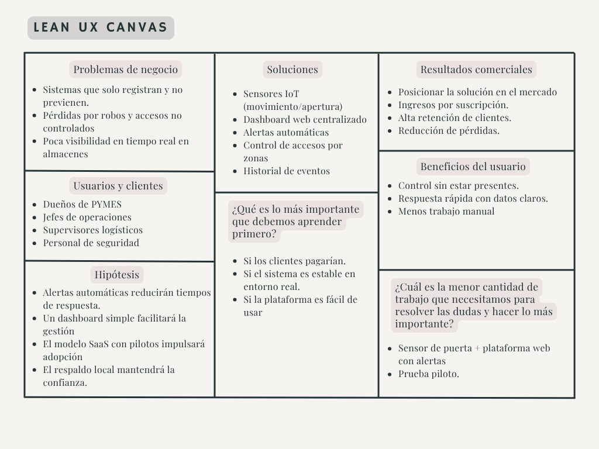

## 1.3. Segmentos objetivos

El modelo de negocio se enmarca en el sector B2B (Business-to-Business), enfocándose en la seguridad de activos críticos y la optimización de la gestión operativa en almacenes. Se han identificado dos segmentos principales que presentan necesidades diferenciadas en cuanto a escalabilidad y profundidad de control:

### Segmento 1: Dueños y Administradores de PYMES (Retail, Tiendas y Pequeños Almacenes)
Este segmento representa a los emprendedores y gerentes de pequeñas y medianas empresas. Son los clientes objetivo para el **Plan Básico**. Por lo general, no cuentan con el presupuesto para mantener un equipo de vigilancia 24/7, pero tienen una necesidad imperiosa de tranquilidad y control sobre su inventario.

**Aspectos demográficos:**
* **Edad:** Entre 25 y 55 años.
* **Ocupación:** Dueños de negocio, gerentes generales o administradores comerciales.
* **Nivel de digitalización:** Usan intensivamente el celular para actividades clave de su negocio (WhatsApp, banca móvil). Buscan *dashboards* simples que no requieran conocimientos técnicos previos.

**Aspectos psicográficos:**
* **Motivaciones:** Obtener tranquilidad mental, mantener el control del negocio a distancia y evitar inversiones costosas o complejas en seguridad tradicional.
* **Intereses:** Soluciones simples, tecnología accesible y herramientas prácticas que faciliten la gestión diaria sin añadir carga operativa.

**Comportamiento y necesidades:**
* Prefieren herramientas intuitivas y valoran la rapidez de configuración.
* Priorizan el uso de la plataforma desde sus dispositivos móviles.
* **Principal dolor:** La merma por robos (internos o externos, como el "robo hormiga").
* Necesitan notificaciones en tiempo real en el celular, especialmente para saber si el local fue abierto fuera del horario establecido.

> **Dato estadistico:** De acuerdo con Gómez et al. (2024), el 73% de las PYMES latinoamericanas carecen de sistemas automatizados de gestión de almacenes, lo cual genera ineficiencias que pueden representar hasta el 25% de sus costos logísticos totales.

---

### Segmento 2: Jefes de Seguridad y Operaciones (Medianas y Grandes Corporaciones)
Este segmento incluye a profesionales que gestionan infraestructuras logísticas complejas para empresas de gran envergadura (fábricas, constructoras, centros de distribución). Son el público objetivo que justificaría la adquisición del **Plan Pro o Empresarial**, ya que su enfoque requiere el cumplimiento de normativas de seguridad industrial.

**Aspectos demográficos:**
* **Edad:** Entre 35 y 60 años.
* **Ocupación:** Jefes de Seguridad Industrial, Supervisores Logísticos, Supply Chain Managers o Jefes de Planta.
* **Nivel de digitalización:** Alto. Acostumbrados a manejar sistemas ERP (SAP, Oracle), generar reportes consolidados y utilizar software de gestión de almacenes (WMS).

**Aspectos psicográficos:**
* **Motivaciones:** Tener control total de las operaciones, reducir las pérdidas a gran escala y optimizar la seguridad en múltiples sedes de forma simultánea.
* **Intereses:** Auditoría constante, trazabilidad de eventos, automatización de procesos y gestión centralizada.

**Comportamiento y necesidades:**
* Buscan soluciones robustas y escalables que puedan crecer con la empresa.
* Prefieren plataformas que ofrezcan facilidades de integración con sus sistemas corporativos existentes.
* **Principal dolor:** La lentitud para auditar incidentes y la falta de control granular.
* Necesitan más que simples alertas: requieren una auditoría completa y trazabilidad detallada de accesos (quién, cuándo y dónde).
* Requieren control de permisos diferenciados por usuario y zona, además de historiales completos para justificar pérdidas y la capacidad de configurar reglas automáticas inteligentes para múltiples almacenes.

> **Dato estadistico:** Simultáneamente, el Internet de las Cosas Industrial (IIoT) permite monitorear condiciones ambientales y ubicación de productos en tiempo real, reduciendo pérdidas por caducidad o daños en un 35% (Ortiz y Paredes-Rodríguez, 2021).

# Capítulo II: Requirements Elicitation & Analysis
## 2.1. Competidores.
### 2.1.1. Análisis competitivo

| Característica | Su Startup | Competidor 1: Ditrack | Competidor 2: Global GPS Perú | Competidor 3: Soluciones Globales |
|--------------|------------|------------------------|-------------------------------|----------------------------------|
| Logo | 

 | 

 | 

 | 

 |
| Overview | Plataforma IoT que integra sensores físicos y software para monitoreo en tiempo real de almacenes y rutas. | Empresa líder en rastreo satelital con larga trayectoria en Perú. | Empresa enfocada en GPS accesible para pymes con planes simples. | Empresas globales con soluciones avanzadas de gestión de flotas e IoT. |
| Perfil | Startup tecnológica enfocada en innovación IoT aplicada a seguridad. | Empresa consolidada con enfoque en monitoreo tradicional. | Empresa pequeña enfocada en soluciones económicas. | Corporaciones tecnológicas con soluciones avanzadas. |
| Ventaja competitiva | Monitoreo inteligente + detección de anomalías + integración almacén + flota. | Experiencia, cumplimiento normativo y monitoreo confiable 24/7. | Bajo costo + facilidad de uso. | Tecnología avanzada, escalabilidad global y analítica. |
| ¿Qué valor ofrece? | Control total, prevención de riesgos y toma de decisiones en tiempo real. | Seguridad confiable y cumplimiento legal. | Ahorro y accesibilidad para pymes. | Optimización operativa y análisis avanzado. |
| Mercado objetivo | Empresas logísticas, almacenes, pymes y medianas empresas. | Grandes flotas, minería y transporte formal. | Pymes de transporte y logística. | Empresas globales y grandes flotas. |
| Estrategias de marketing | Enfoque en innovación, eficiencia y seguridad inteligente. | Posicionamiento como empresa confiable y líder. | Estrategia basada en precios bajos. | Marketing digital global y branding fuerte. |
| Perfil de Producto | Sensores IoT + plataforma web + alertas inteligentes + trazabilidad. | GPS vehicular + monitoreo + reportes. | GPS + plataforma básica + alertas. | GPS + dashboards + cámaras + analítica avanzada. |
| Precios & Costos | Planes mensuales escalonados (Básico, Profesional, Empresarial). | Desde aprox. S/600 mensual por vehículo. | Desde S/550 anuales. | Desde ~$16 USD mensual por activo. |
| Canales de distribución | Web + app móvil propia. | Web + app + instalación física. | Web + WhatsApp + app. | Web + app + integraciones empresariales. |
| Fortalezas | Innovación IoT, integración completa, escalabilidad. | Marca fuerte, experiencia, cumplimiento legal. | Precio competitivo y accesibilidad. | Tecnología avanzada y gran inversión en I+D. |
| Debilidades | Falta de posicionamiento y experiencia. | Menor innovación tecnológica. | Baja diferenciación y alcance limitado. | Costos elevados y menor enfoque local. |
| Oportunidades | Crecimiento del IoT y necesidad de seguridad inteligente. | Integrar nuevas tecnologías. | Expansión a nuevos segmentos. | Expansión en Latinoamérica. |
| Amenazas | Competidores posicionados y barrera de confianza. | Nuevas startups innovadoras. | Alta competencia en precios. | Regulaciones y competencia local. |

### 2.1.2. Estrategias y tácticas frente a competidores

En el mercado actual existen distintas soluciones de seguridad para almacenes, desde sistemas tradicionales solo enfocados en alarmas hasta plataformas avanzadas de videovigilancia. Sin embargo, muchas de estas opciones se limitan a registrar incidentes, sin enfocarse en prevenirlos o analizarlos en tiempo real. Ante esta situación, nuestra propuesta se diferencia al integrar monitoreo en tiempo real, tecnología IoT adaptable y análisis inteligente en una sola plataforma, accesible para empresas de distintos tamaños.

#### Estrategia de diferenciación tecnológica
Nuestra propuesta se posiciona como una solución integral que reúne monitoreo en tiempo real, sensores IoT y análisis inteligente en un solo sistema. En comparación de otros competidores que ofrecen estos servicios por separado, nosotros buscamos simplificar la gestión a través de un dashboard intuitivo que permita controlar sensores, alertas y accesos desde un único lugar.

#### Estrategia de inserción en el mercado
Puesto que existen empresas consolidadas con alta reputación, nuestra entrada al mercado se enfocará en la implementación de pruebas piloto en pequeñas y medianas empresas. Esto nos permitirá demostrar la efectividad del sistema, generar casos de éxito reales y reducir la desconfianza hacia una nueva startup.

#### Estrategia de captación de clientes
Aprovechando la creciente digitalización de las empresas peruanas, ofreceremos un modelo SaaS flexible y escalable. Los planes de suscripción estarán diseñados según la cantidad de almacenes que maneje cada empresa, permitiendo que elijan la opción que mejor se adapte a sus necesidades y presupuesto.

#### Estrategia frente a lo existente
Para empresas que aún utilizan sistemas tradicionales, ya sea por desconfianza o por los elevados costos, nuestra estrategia será demostrar de forma clara los beneficios de la solución, como la facilidad de uso y capacidad preventiva. Buscaremos posicionarnos no solo como una alternativa tecnológica, sino como una inversión rentable que mejora la seguridad y optimiza la operación.

## 2.2. Entrevistas.
### 2.2.1. Diseño de entrevistas
**Primer segmento: Dueños y Administradores de PYMES**

A continuación, se presentan las preguntas dirigidas al segmento de dueños y administradores de pequeñas y medianas empresas, quienes buscan tener mayor control y seguridad sobre sus almacenes sin necesidad de sistemas complejos o costosos.

**Preguntas principales**
1. ¿Te preocupa la seguridad de tu almacén o negocio?
2. ¿Has tenido problemas de robos o pérdidas dentro de tu local?
3. ¿Cómo controlas actualmente quién entra o sale de tu almacén?
4. ¿Te gustaría saber en tiempo real lo que pasa en tu almacén?
5. ¿Qué tan útil sería recibir alertas en tu celular si ocurre algo extraño?
6. ¿Qué tipo de alertas te gustaría recibir? (puertas abiertas, movimiento, fuera de horario, etc.)
7. ¿Te ayudaría poder revisar lo que pasó en el almacén en cualquier momento?
8. ¿Qué tan fácil debería ser usar una app para controlar tu almacén?
9. ¿Qué es lo más importante para ti en un sistema de seguridad?
10. ¿Te daría tranquilidad poder ver todo desde tu celular sin estar presente?
11. ¿Qué problemas te gustaría evitar con una herramienta como esta?
12. ¿Usarías una solución como Locksight en tu negocio?

**Preguntas complementarias**

13. ¿Qué edad tienes?
14. ¿A qué se dedica tu negocio?
15. ¿Cuántas personas trabajan contigo?
16. ¿En qué distrito está tu negocio?
17. ¿Usas aplicaciones en tu celular para tu negocio? ¿Cuáles?
18. ¿Qué tan seguido revisas tu negocio cuando no estás presente?
19. ¿Prefieres usar más el celular o la computadora?
20. ¿Qué tan cómodo te sientes usando tecnología nueva?

**Segundo segmento: Jefes de Seguridad y Operaciones**

A continuación, se presentan las preguntas dirigidas al segmento de jefes de seguridad y operaciones, quienes necesitan controlar almacenes de mayor tamaño, tener registro de accesos y tomar decisiones basadas en información.

**Preguntas principales**
1. ¿Te preocupa la seguridad de los almacenes o instalaciones que supervisas?
2. ¿Qué problemas has tenido con accesos no autorizados o pérdidas?
3. ¿Cómo controlan actualmente quién entra y sale de los almacenes?
4. ¿Te gustaría tener información en tiempo real de lo que ocurre en cada almacén?
5. ¿Qué tan útil sería recibir alertas automáticas ante movimientos sospechosos?
6. ¿Qué tipo de alertas serían más útiles para tu trabajo?
7. ¿Te serviría tener un historial de accesos y eventos del almacén?
8. ¿Qué tan importante es para ti poder revisar información desde cualquier lugar?
9. ¿Qué es lo más importante en un sistema de seguridad para almacenes?
10. ¿Te ayudaría tener todo el control en una sola plataforma?
11. ¿Qué problemas actuales te gustaría solucionar con una herramienta como esta?
12. ¿Crees que una solución así mejoraría la seguridad y control en tu trabajo?
    
**Preguntas complementarias**

13. ¿Cuál es tu cargo dentro de la empresa?
14. ¿En qué tipo de empresa trabajas?
15. ¿Cuántos almacenes o sedes manejan?
16. ¿En qué zonas operan?
17. ¿Qué sistemas o herramientas usan actualmente?
18. ¿Qué tan seguido usas computadora o celular en tu trabajo?
19. ¿Trabajas más en oficina o en campo?
20. ¿Qué tan familiarizado estás con sistemas tecnológicos?

### 2.2.1. Registro de entrevistas
**Primer segmento: Dueños y Administradores de PYMES**

| Nº Entrevista | Datos del entrevistado | Resumen de la entrevista | Timing del video | Evidencia de entrevista |
|--------------|------------------------|--------------------------|------------------|--------------------------|
| 1 | **Nombre:** Carlos Marcelo Mansilla Rivero   **Edad:** 23   **Distrito:** Surquillo   **Ocupación:** Dueño/Administrador de distribuidora mayorista   **Link:** colocar link | El entrevistado administra una distribuidora mayorista y utiliza herramientas digitales para su gestión diaria; su principal problema es la merma y el “robo hormiga”, lo que afecta la rentabilidad del negocio; considera que el control actual es insuficiente, por lo que valora el monitoreo en tiempo real y alertas ante eventos críticos; busca una solución intuitiva, confiable y accesible desde el celular que le brinde mayor control y tranquilidad. | **Inicio:** 0:00   **Duración:** 5:35   **Final:** 5:35 | 

 |
| 2 | **Nombre:** Valeria Alejandra Flores Paz   **Edad:** 28   **Distrito:** San Borja   **Ocupación:** Administradora de tienda de ropa   **Link:** colocar link | La entrevistada administra una tienda de ropa y utiliza exclusivamente su celular para la gestión diaria; su principal problema es el "robo hormiga", lo que le genera preocupación al no tener registro de accesos; considera fundamental recibir alertas en tiempo real en su celular ante aperturas fuera de horario; por ello, busca una aplicación sumamente intuitiva, de rápida instalación y costo accesible que le brinde tranquilidad. | **Inicio:** 5:36   **Duración:** 2:51   **Final:** 8:27 | 

 |
| 3 | **Nombre:** Song Ju Loo   **Edad:** 22   **Distrito:** El Agustino   **Ocupación:** Dueño de tienda mayorista   **Link:** — | El entrevistado, dueño de una tienda mayorista, presenta preocupación por pérdidas de mercadería sin poder identificar su origen; actualmente usa cámaras y confianza en el personal, pero considera el sistema limitado; valora monitoreo en tiempo real, alertas inmediatas y registros históricos; busca una solución simple, accesible desde el celular y que le permita mayor control sin estar presente. | **Inicio:** 8:28   **Duración:** 3:27   **Final:** 11:55 | 

 |
| 4 | **Nombre:** Gloria Celis   **Edad:** 59   **Distrito:** Villa el Salvador   **Ocupación:** Dueña de almacén   **Link:** — | La entrevistada, dueña de un almacén con un equipo de aprox 5 personas, enfrenta pérdidas constantes y falta de control de accesos; depende de métodos manuales y cámaras básicas, por lo que valora monitoreo en tiempo real y alertas inmediatas; busca una solución confiable, simple y accesible desde el celular que le brinde mayor control y tranquilidad. | **Inicio:** 11:56   **Duración:** 5:50   **Final:** 17:46 | 

 |

**Resumen de entrevistas segmento #1**
En general, todas las entrevistas muestran algo bien claro: quienes manejan estos negocios viven con la preocupación constante de pérdidas de mercadería, sobre todo por el “robo hormiga”, y sienten que el control que tienen hoy no es suficiente. Usan cámaras o registros manuales, pero igual les cuesta saber exactamente qué pasa y cuándo ocurre. Por eso, todos coinciden en que necesitan ver lo que sucede en tiempo real y recibir alertas inmediatas para poder reaccionar rápido. También valoran mucho tener un historial que les permita revisar lo ocurrido cuando hay dudas. Al final, lo que buscan es una solución sencilla de usar, que funcione desde el celular y que no sea complicada de implementar, porque más que nada quieren tener mayor control sobre su negocio y sentirse tranquilos incluso cuando no están presentes.

**Segundo segmento: Jefes de Seguridad y Operaciones**

| Nº Entrevista | Datos del entrevistado | Resumen de la entrevista | Timing del video | Evidencia de entrevista |
|--------------|------------------------|--------------------------|------------------|--------------------------|
| 1 | **Nombre:** Joao Jiménez   **Edad:** 26   **Distrito:** San Juan de Lurigancho   **Ocupación:** Encargado de seguridad y planificación   **Link:** colocar link | El entrevistado trabaja en seguridad supervisando almacenes y utilizando métodos tradicionales como guardias, registros manuales y cámaras; enfrenta problemas como accesos fuera de horario y pérdidas difíciles de rastrear, además de la ineficiencia al revisar grabaciones; por ello, valora el monitoreo en tiempo real, alertas precisas y un historial de accesos, buscando una solución confiable que optimice el control y mejore la toma de decisiones. | **Inicio:** 17:47   **Duración:** 7:05   **Final:** 24:52 | 

 |
| 2 | **Nombre:** Carlos Rodrigo Chavez Quispe   **Edad:** 36   **Distrito:** La Molina   **Ocupación:** Supervisor Logístico   **Link:** colocar link | El entrevistado supervisa tres almacenes utilizando sistemas tradicionales desconectados entre sí; su principal problema es rastrear las mermas debido a la naturaleza reactiva de las cámaras actuales; valora críticamente la información en tiempo real para reaccionar ante aperturas no autorizadas o fallas de sensores; por ello, requiere una plataforma centralizada que ofrezca trazabilidad absoluta y reportes consolidados, buscando una solución estable que optimice sus auditorías. | **Inicio:** 24:53   **Duración:** 4:33   **Final:** 29:26 | 

 |
| 3 | **Nombre:** Diego Castillo   **Edad:** 24   **Distrito:** San Juan de Lurigancho   **Ocupación:** Jefe de seguridad y supervisor de almacenes   **Link:** — | El entrevistado, jefe de seguridad en una empresa de logística y distribución, es responsable de supervisar múltiples almacenes, lo que implica un alto nivel de control y toma de decisiones sobre la seguridad operativa. Señala que la seguridad es crítica, ya que cualquier falla impacta directamente en la empresa, y ha enfrentado problemas como accesos no autorizados y pérdidas difíciles de justificar. Actualmente utiliza cámaras, controles de acceso y registros manuales, pero identifica como principal limitación la falta de centralización de la información, lo que genera ineficiencia y pérdida de tiempo en el monitoreo y análisis. Valora especialmente la posibilidad de contar con información en tiempo real, alertas automáticas ante eventos sospechosos (como accesos fuera de horario o movimientos en zonas restringidas) y un historial completo de accesos para auditorías y toma de decisiones. Busca un sistema confiable, claro y centralizado, que le permita supervisar múltiples almacenes desde cualquier lugar, mejorar la trazabilidad y optimizar la gestión de la seguridad, facilitando una respuesta más rápida y efectiva ante incidentes. | **Inicio:** 29:27   **Duración:** 4:34   **Final:** 34:01 | 

 |
| 4 | **Nombre:** Cristina Celis   **Edad:** 61   **Distrito:** Ate   **Ocupación:** Jefa de almacen—   **Link:** — | La entrevistada, jefa de Seguridad/Operaciones en una empresa mediana/grande de logística o retail que gestiona entre 2 y 10 almacenes en Lima y alrededores, enfrenta problemas de accesos fuera de horario, pérdidas difíciles de rastrear y falta de integración entre sistemas (CCTV, controles básicos y registros manuales), lo que limita la visibilidad y retrasa la detección de incidentes; valora altamente el monitoreo en tiempo real, las alertas automáticas (accesos no autorizados, actividad inusual, puertas abiertas) y un historial detallado para auditorías, además de poder acceder a la información desde cualquier lugar, por lo que considera clave una solución unificada, precisa e integrada que mejore la eficiencia, reduzca riesgos y simplifique la gestión operativa.| **Inicio:** 34:02   **Duración:** 4:28   **Final:** 38:30 |  |

**Resumen de entrevistas segmento #2**
En estas entrevistas se repite una idea bastante clara: quienes trabajan en seguridad y supervisión de almacenes lidian todos los días con sistemas poco integrados que les hacen perder tiempo y les quitan visibilidad. Aunque usan cámaras, controles de acceso y registros manuales, igual les cuesta detectar a tiempo accesos fuera de horario o pérdidas, y muchas veces terminan reaccionando tarde porque todo es más reactivo que preventivo. Por eso, valoran mucho poder tener información en tiempo real, recibir alertas precisas apenas ocurre algo sospechoso y contar con un historial claro que les facilite auditorías y decisiones. Al final, lo que buscan es una plataforma centralizada, confiable y fácil de manejar que les permita controlar varios almacenes desde cualquier lugar, reducir riesgos y responder más rápido sin complicarse con sistemas dispersos.

### 2.2.3. Análisis de entrevistas.
## Análisis de entrevistas – Segmento 1: Dueños y Administradores de PYMES

A partir de las 4 entrevistas realizadas a dueños y administradores de PYMES en distintos rubros (distribución, retail y almacenes), se identificaron patrones consistentes en sus características objetivas y subjetivas, evidenciando necesidades claras relacionadas con el control y la seguridad de sus negocios.

### Características objetivas

- El **100% de los entrevistados administra directamente su negocio** (dueños o responsables de operación).
- El **100% utiliza herramientas digitales básicas** (principalmente celular, apps como WhatsApp o sistemas simples de control).
- El **75% depende de métodos tradicionales de seguridad**, como cámaras y registros manuales.
- El **100% ha experimentado pérdidas de mercadería** o situaciones donde no pueden identificar claramente su origen.
- El **100% gestiona equipos de trabajo**, lo que incrementa la necesidad de control de accesos y supervisión.

### Características subjetivas

- El **100% manifiesta preocupación constante por pérdidas de mercadería**, especialmente asociadas al “robo hormiga”.

- El **100% considera que sus sistemas actuales son insuficientes**, debido a:
  - Falta de monitoreo en tiempo real  
  - Dependencia de revisión manual (cámaras o registros)  
  - Dificultad para identificar responsables o momentos exactos de incidentes  

- El **100% valora funcionalidades clave como:**
  - Monitoreo en tiempo real  
  - Alertas inmediatas ante accesos o movimientos sospechosos  
  - Historial o registro de eventos para revisión  

- El **100% busca una solución que sea:**
  - Fácil de usar  
  - Accesible desde el celular  
  - Rápida de implementar  
  - Intuitiva (sin necesidad de capacitación compleja)  

- El **75% prioriza la confiabilidad del sistema**, mostrando rechazo a soluciones con falsas alarmas o fallos.

- El **100% muestra disposición a adoptar nuevas tecnologías**, siempre que:
  - Sean accesibles en costo  
  - No compliquen su operación diaria  
  - Generen valor directo en reducción de pérdidas  

- El **100% asocia este tipo de soluciones con mayor control y tranquilidad**, destacando que el principal beneficio es poder supervisar su negocio sin estar físicamente presente.

## Análisis de entrevistas – Segmento 2: Jefes de Seguridad y Operaciones

A partir de las 4 entrevistas realizadas a jefes de seguridad y supervisores de operaciones en entornos logísticos, se identificaron patrones claros en sus características objetivas y subjetivas, evidenciando necesidades enfocadas en la centralización, eficiencia y control de la seguridad operativa.

### Características objetivas

- El **100% de los entrevistados trabaja en roles de supervisión o gestión de seguridad**, con responsabilidad directa sobre uno o más almacenes.
- El **75% supervisa múltiples almacenes**, lo que incrementa la complejidad del control y monitoreo.
- El **100% utiliza sistemas tradicionales de seguridad**, como cámaras, controles de acceso y registros manuales.
- El **75% trabaja con sistemas no integrados**, lo que dificulta la gestión unificada de la información.
- El **100% ha enfrentado incidentes como accesos no autorizados o pérdidas difíciles de rastrear**.

### Características subjetivas

- El **100% manifiesta frustración por la falta de integración de los sistemas actuales**, lo que genera pérdida de tiempo y menor visibilidad.

- El **100% considera que el monitoreo actual es reactivo e ineficiente**, debido a:
  - Dependencia de revisión manual de cámaras  
  - Falta de alertas en tiempo real  
  - Dificultad para detectar incidentes de forma oportuna  

- El **100% valora funcionalidades clave como:**
  - Monitoreo en tiempo real  
  - Alertas automáticas y precisas  
  - Historial de accesos y eventos para auditorías  

- El **100% busca una solución que sea:**
  - Centralizada (una sola plataforma)  
  - Confiable y sin errores  
  - Accesible desde cualquier lugar  
  - Clara y fácil de usar  

- El **75% prioriza la trazabilidad y generación de reportes**, como apoyo para auditorías y toma de decisiones.

- El **100% muestra disposición a adoptar nuevas tecnologías**, siempre que:
  - Se integren con sus sistemas actuales  
  - Mejoren la eficiencia operativa  
  - Reduzcan tiempos de supervisión  

- El **100% asocia este tipo de soluciones con mayor control, rapidez de respuesta y reducción de riesgos**, destacando que el valor principal está en pasar de un enfoque reactivo a uno preventivo en la gestión de seguridad.

## 2.3. Needfinding
### 2.3.1. User Personas
> Segmento 1

> Segmento 2

### 2.3.2 User Task Matrix
### Segmento 1: Dueños y Administradores de PYMES

| Tarea | Frecuencia | Importancia |
|------|------------|-------------|
| Monitorear el estado de su negocio o almacén cuando no está presente | Often | High |
| Detectar pérdidas o faltantes de mercadería | Often | High |
| Identificar posibles robos o “robo hormiga” | Often | High |
| Revisar registros de accesos o actividad del personal | Sometimes | High |
| Recibir alertas ante eventos sospechosos | Occasionally | High |
| Gestionar su negocio desde el celular | Often | High |
| Tomar decisiones rápidas ante incidentes | Sometimes | High |

---

### Segmento 2: Jefes de Seguridad y Operaciones

| Tarea | Frecuencia | Importancia |
|------|------------|-------------|
| Supervisar múltiples almacenes o puntos de control | Often | High |
| Revisar cámaras o registros de seguridad | Often | High |
| Detectar accesos no autorizados o fuera de horario | Often | High |
| Coordinar acciones ante incidentes de seguridad | Sometimes | High |
| Analizar historial de eventos para auditorías | Occasionally | High |
| Gestionar información dispersa de diferentes sistemas | Often | High |
| Responder rápidamente ante alertas de seguridad | Sometimes | High |

### 2.3.3 User Journey Mapping
> Segmento 1

> Segmento 2

### 2.3.4. Empathy Mapping
> Segmento 1

> Segmento 2

## 2.4. Big Picture Event Storming

En la sesión de Big Picture Event Storming, el equipo identificó los eventos más relevantes del dominio de seguridad inteligente para almacenes, trazando de forma visual el panorama general de la plataforma LockSight. Se representaron los flujos críticos de monitoreo, control de accesos y gestión de alertas, integrando los sistemas externos que interactúan con la solución e identificando dudas, problemas y oportunidades de mejora. Esta primera exploración permitió al equipo alinear el entendimiento del negocio y establecer las bases para un diseño más detallado en etapas posteriores.

### Big Picture Event Storming – Mapa General

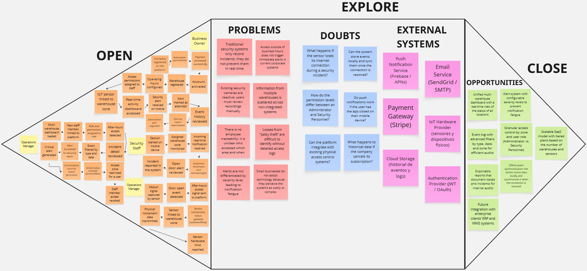

## 2.5. Ubiquitous Language

| Término | Definición |
|--------|-----------|
| Asset (Activo) | Mercadería, inventario o recursos almacenados que son monitoreados y protegidos dentro del sistema. |
| Active Defense Protocol (Protocolo de Defensa Activa) | Conjunto de acciones automáticas (como generación de alertas o bloqueo de accesos) ejecutadas ante una amenaza detectada en el almacén. |
| Interference Detection (Detección de Interferencias) | Identificación de fallas o interrupciones en la comunicación de los dispositivos que afectan el monitoreo del almacén. |
| Live Tracking (Monitoreo en tiempo real) | Visualización continua del estado del almacén y de los eventos que ocurren dentro de la plataforma. |
| Driving Behavior (Comportamiento de actividad) | Análisis del comportamiento dentro del almacén basado en eventos como movimientos, accesos y actividad del personal. |
| Geofence (Geocerca) | Área virtual definida dentro del almacén o zonas específicas que permite detectar accesos o movimientos fuera de los límites establecidos. |
| Health Check (Verificación de Estado) | Confirmación periódica de que los sensores y el sistema se encuentran conectados y operativos. |
| Security Alert (Alerta de Seguridad) | Notificación de alta prioridad ante eventos críticos como accesos no autorizados o actividad sospechosa. |
| Operational Performance (Rendimiento Operativo) | Medición de la eficiencia en la gestión del almacén basada en eventos, tiempos de respuesta y control de accesos. |
=======
La paleta de colores de Locksight está diseñada para transmitir confianza corporativa, tecnología y facilitar la rápida toma de decisiones operativas.

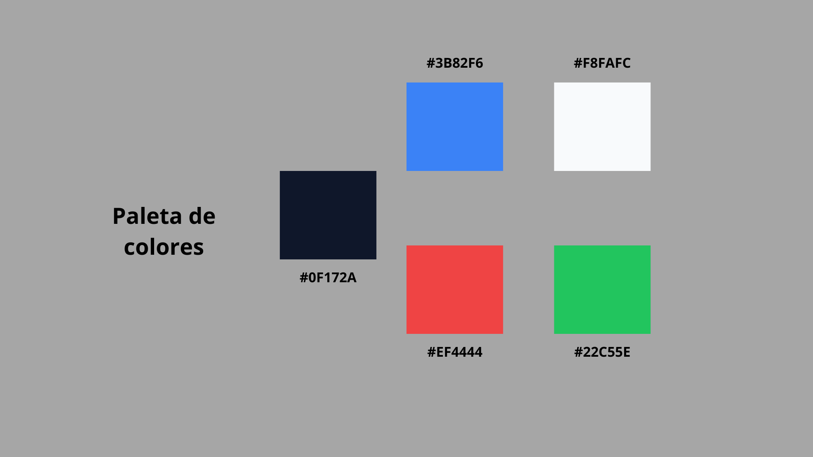

* Azul oscuro (#0F172A): El azul oscuro es el estándar universal en psicología del color para representar seguridad corporativa, estabilidad y confianza
* Azul eléctrico (#3B82F6): Aporta un toque moderno y tecnológico
* Rojo (#EF4444): Es vital para el dashboard. En un sistema de seguridad, el color rojo debe interpretarse de inmediato como peligro.
* Verde (#22C55E): Brinda seguridad al usuario, indicando de un solo vistazo todo fluye con normalidad y los sensores están en orden.
* Blanco humo (#F8FAFC): Permite que la interfaz "respire" y resalta la información sin cansar la vista durante largas jornadas de monitoreo.

**Tonos de Comunicación**

La voz y el tono con el que Locksight se dirige a sus usuarios en la landing page y en la plataforma son fundamentales para establecer confianza y eficacia. 

1. **Profesional y Confiable**
   
   Dado que Locksight maneja la seguridad del patrimonio y los activos de las empresas, la comunicación no puede ser informal ni excesivamente coloquial. Al dirigirnos a gerentes de operaciones y dueños de PYMES, el lenguaje debe demostrar experiencia, seriedad y solidez técnica.
  
2. **Directo y Preventivo**
   
   En situaciones de monitoreo o riesgo, los usuarios no tienen tiempo para leer textos largos. El tono debe ir directo al grano, fomentando la prevención y la acción inmediata. Debe ser instructivo y libre de ambigüedades, lo cual es clave para la interfaz de un dashboard donde una instrucción confusa podría resultar en una brecha de seguridad.

# Capitulo III: Requirements Specification
## 3.1 User Stories
| Epic / Story ID | Título | Descripción | Criterios de Aceptación | Relacionado con (Epic ID) |
|----------------|--------|-------------|--------------------------|---------------------------|
| US01 | Visualizar almacenes registrados | Como dueño de PYME, quiero visualizar mis almacenes registrados para tener control general de mis operaciones. | Given el usuario tiene almacenes registrados, When accede al sistema, Then el sistema muestra la lista de almacenes asociados. Given no tiene almacenes, When accede, Then el sistema muestra un estado vacío. | EP01 |
| US02 | Ver estado de un almacén | Como dueño de PYME, quiero consultar el estado de un almacén para conocer su situación actual. | Given existe un almacén, When el usuario lo selecciona, Then el sistema muestra su estado actual. Given el almacén tiene eventos recientes, When se consulta, Then se muestran dichos eventos. | EP01 |
| US03 | Monitorear actividad en tiempo real | Como jefe de seguridad, quiero monitorear la actividad en tiempo real para detectar incidentes rápidamente. | Given existen eventos en el almacén, When ocurren, Then el sistema los actualiza en tiempo real. Given múltiples eventos, When se generan, Then se visualizan sin retraso significativo. | EP01 |
| US04 | Registrar un nuevo almacén | Como dueño de PYME, quiero registrar un nuevo almacén para gestionarlo dentro del sistema. | Given el usuario ingresa datos válidos, When registra un almacén, Then el sistema lo guarda correctamente. Given datos incompletos, When intenta registrar, Then el sistema rechaza la operación. | EP02 |
| US05 | Configurar horarios de acceso | Como jefe de seguridad, quiero definir horarios de acceso para controlar entradas y salidas. | Given el usuario define un horario, When lo guarda, Then el sistema lo aplica al almacén. Given un acceso fuera de horario, When ocurre, Then se registra como evento. | EP02 |
| US06 | Recibir alertas de acceso fuera de horario | Como jefe de seguridad, quiero recibir alertas cuando haya accesos fuera de horario para reaccionar rápidamente. | Given ocurre un acceso fuera de horario, When el evento es detectado, Then el sistema genera una alerta. Given una alerta generada, When se envía, Then llega al usuario correctamente. | EP03 |
| US07 | Recibir alertas de movimiento sospechoso | Como dueño de PYME, quiero recibir alertas de movimientos sospechosos para prevenir robos. | Given se detecta un movimiento inusual, When el sistema lo identifica, Then genera una alerta. Given la alerta es válida, When se envía, Then el usuario la recibe. | EP03 |
| US08 | Registrar eventos de seguridad | Como jefe de seguridad, quiero registrar eventos de seguridad para mantener control histórico. | Given ocurre un evento, When es detectado, Then el sistema lo almacena. Given eventos registrados, When se consultan, Then se muestran correctamente. | EP04 |
| TS09 | Registrar evento mediante API | Como developer, quiero registrar eventos de seguridad mediante API para integrarlos al sistema. | Given una solicitud válida, When se envía al endpoint, Then el sistema registra el evento. Given datos inválidos, When se envía la solicitud, Then el sistema retorna error. | EP05 |
| US10 | Visualizar historial de eventos | Como jefe de seguridad, quiero visualizar el historial de eventos para analizar incidentes pasados. | Given existen eventos registrados, When el usuario consulta el historial, Then el sistema muestra la lista completa. Given no existen eventos, When se consulta, Then se muestra un estado vacío. | EP04 |
| US11 | Filtrar eventos por tipo | Como jefe de seguridad, quiero filtrar eventos por tipo para facilitar el análisis. | Given existen múltiples tipos de eventos, When el usuario aplica un filtro, Then el sistema muestra solo los eventos correspondientes. Given un filtro aplicado, When se elimina, Then se muestran todos los eventos. | EP04 |
| US12 | Filtrar eventos por fecha | Como jefe de seguridad, quiero filtrar eventos por fecha para revisar periodos específicos. | Given el usuario selecciona un rango de fechas, When aplica el filtro, Then el sistema muestra eventos dentro del rango. Given fechas inválidas, When se aplican, Then el sistema no procesa la consulta. | EP04 |
| US13 | Gestionar múltiples almacenes | Como jefe de seguridad, quiero gestionar múltiples almacenes para tener control centralizado. | Given el usuario tiene varios almacenes, When accede al sistema, Then puede visualizar y seleccionar cualquiera. Given cambia de almacén, When lo selecciona, Then el sistema actualiza la información mostrada. | EP02 |
| US14 | Recibir alertas de puertas abiertas | Como dueño de PYME, quiero recibir alertas cuando una puerta quede abierta para evitar riesgos. | Given una puerta permanece abierta, When se supera el tiempo permitido, Then el sistema genera una alerta. Given la alerta generada, When se envía, Then el usuario la recibe. | EP03 |
| US15 | Consultar detalle de un evento | Como jefe de seguridad, quiero ver el detalle de un evento para entender lo ocurrido. | Given existe un evento, When el usuario lo selecciona, Then el sistema muestra su información detallada. Given el evento no existe, When se consulta, Then el sistema retorna error. | EP04 |
| US16 | Recibir notificaciones en tiempo real | Como jefe de seguridad, quiero recibir notificaciones en tiempo real para actuar inmediatamente. | Given ocurre un evento crítico, When es detectado, Then el sistema envía una notificación inmediata. Given múltiples eventos, When ocurren, Then se notifican sin retraso significativo. | EP03 |
| US17 | Acceder al sistema desde dispositivo móvil | Como dueño de PYME, quiero acceder al sistema desde mi celular para monitorear mi negocio en cualquier momento. | Given el usuario accede desde un dispositivo móvil, When ingresa al sistema, Then la interfaz se adapta correctamente. Given interacción en móvil, When navega, Then las funcionalidades se mantienen operativas. | EP01, EP10 |
| TS18 | Obtener eventos mediante API | Como developer, quiero obtener eventos mediante API para integrarlos en el sistema. | Given una solicitud válida, When se consulta el endpoint, Then el sistema retorna los eventos. Given la solicitud es inválida, When se envía, Then el sistema retorna error. | EP05 |
| US19 | Acceder al sistema | Como dueño de PYME, quiero acceder al sistema para gestionar mis almacenes. | Given el usuario tiene credenciales válidas, When intenta acceder, Then el sistema permite el ingreso. Given credenciales inválidas, When intenta acceder, Then el sistema rechaza el acceso. | EP02, EP09 |
| US20 | Cerrar sesión | Como jefe de seguridad, quiero cerrar sesión para proteger el acceso al sistema. | Given el usuario tiene sesión activa, When cierra sesión, Then el sistema finaliza la sesión. Given sesión cerrada, When intenta acceder a recursos, Then el sistema requiere autenticación. | EP02, EP09 |
| US21 | Visualizar landing page | Como dueño de PYME (visitante), quiero visualizar la landing page para conocer el producto. | Given el usuario accede al sitio, When carga la página, Then el sistema muestra la información del producto. Given contenido disponible, When se visualiza, Then se presenta correctamente. | EP06 |
| US22 | Visualizar video del producto | Como jefe de seguridad (visitante), quiero ver el video del producto para entender su funcionamiento. | Given el video está disponible, When el usuario lo reproduce, Then el sistema lo muestra correctamente. Given el video no carga, When se intenta reproducir, Then el sistema muestra un error. | EP06 |
| US23 | Visualizar información del equipo | Como dueño de PYME (visitante), quiero ver información del equipo para generar confianza en el producto. | Given existe información del equipo, When el usuario accede a la sección, Then el sistema la muestra. Given no hay contenido, When se accede, Then se muestra estado vacío. | EP06 |
| US24 | Contactar desde la landing page | Como jefe de seguridad (visitante), quiero contactar al equipo para resolver dudas. | Given el usuario completa los datos requeridos, When envía el formulario, Then el sistema registra la solicitud. Given datos inválidos, When intenta enviar, Then el sistema rechaza la solicitud. | EP06 |
| US25 | Registrar usuario | Como dueño de PYME, quiero registrarme en el sistema para usar la plataforma. | Given el usuario ingresa datos válidos, When se registra, Then el sistema crea la cuenta. Given datos inválidos, When intenta registrarse, Then el sistema rechaza el registro. | EP02, EP09 |
| US26 | Asociar usuario a almacén | Como jefe de seguridad, quiero asociarme a un almacén para gestionarlo. | Given el usuario tiene permisos, When se asocia a un almacén, Then el sistema registra la relación. Given no tiene permisos, When intenta asociarse, Then el sistema rechaza la acción. | EP02 |
| TS27 | Autenticación de usuario mediante API | Como developer, quiero autenticar usuarios mediante API para controlar el acceso al sistema. | Given credenciales válidas, When se envía la solicitud, Then el sistema retorna autenticación exitosa. Given credenciales inválidas, When se envía, Then el sistema retorna error. | EP05, EP09 |
| US28 | Visualizar dashboard consolidado | Como jefe de seguridad, quiero visualizar un dashboard consolidado para tener una visión general de todos los almacenes. | Given existen múltiples almacenes, When el usuario accede al dashboard, Then el sistema muestra información consolidada. Given no hay datos, When accede, Then se muestra estado vacío. | EP01, EP10 |
| US29 | Priorizar alertas críticas | Como jefe de seguridad, quiero priorizar alertas críticas para atender primero los incidentes más importantes. | Given existen múltiples alertas, When se generan, Then el sistema identifica las críticas. Given alertas críticas, When se visualizan, Then se muestran con prioridad. | EP03 |
| US30 | Marcar alertas como atendidas | Como jefe de seguridad, quiero marcar alertas como atendidas para llevar control de incidentes gestionados. | Given una alerta existe, When el usuario la marca como atendida, Then el sistema actualiza su estado. Given alerta actualizada, When se consulta, Then refleja el nuevo estado. | EP03 |
| US31 | Generar reportes de seguridad | Como jefe de seguridad, quiero generar reportes para analizar el comportamiento de los almacenes. | Given existen datos registrados, When el usuario genera un reporte, Then el sistema produce el reporte. Given no hay datos, When genera el reporte, Then el sistema indica ausencia de información. | EP04 |
| US32 | Acceder desde diferentes ubicaciones | Como jefe de seguridad, quiero acceder al sistema desde cualquier lugar para mantener el control operativo. | Given el usuario tiene conexión, When accede al sistema, Then puede ingresar desde cualquier ubicación. Given acceso remoto, When navega, Then mantiene funcionalidades completas. | EP01, EP10 |
| US33 | Gestionar permisos de acceso | Como dueño de PYME, quiero gestionar permisos de acceso para controlar quién puede ver mis almacenes. | Given el usuario asigna permisos, When guarda los cambios, Then el sistema los aplica. Given permisos insuficientes, When un usuario accede, Then el sistema restringe el acceso. | EP02, EP09 |
| US34 | Integrar servicio externo de notificaciones | Como jefe de seguridad, quiero integrar un servicio externo para recibir notificaciones confiables. | Given el servicio externo está disponible, When ocurre un evento, Then el sistema envía la notificación. Given falla del servicio, When se intenta enviar, Then el sistema maneja el error. | EP05 |
| TS35 | Manejo de errores en API | Como developer, quiero manejar errores en la API para asegurar la estabilidad del sistema. | Given ocurre un error, When se procesa la solicitud, Then el sistema retorna un mensaje de error controlado. Given error inesperado, When ocurre, Then el sistema registra el incidente. | EP05, EP09 |
| US36 | Registrar empresa en la plataforma | Como dueño de PYME, quiero registrar mi empresa con nombre comercial y RUC para vincularla al sistema y activar la gestión de almacenes. | Given el usuario ingresa nombre comercial y RUC válidos, When registra la empresa, Then el sistema crea la entidad Empresa y la asocia al usuario. Given el RUC ya existe en el sistema, When intenta registrar, Then el sistema rechaza el registro duplicado. | EP02, EP07 |
| US37 | Seleccionar plan de suscripción | Como dueño de PYME, quiero seleccionar un plan de suscripción (Básico, Premium, Corporativo) para activar los límites de almacenes y sensores correspondientes. | Given el usuario accede a la sección de planes, When selecciona un plan, Then el sistema registra la suscripción y activa los límites del plan contratado. Given el usuario ya tiene un plan activo, When intenta contratar otro, Then el sistema ofrece la opción de actualizar el plan. | EP07 |
| US38 | Procesar pago de suscripción | Como dueño de PYME, quiero procesar el pago de mi plan de suscripción para mantener el servicio activo y generar un comprobante. | Given el usuario ingresa datos de pago válidos, When confirma el pago, Then el sistema registra el comprobante y activa la suscripción. Given el pago es rechazado, When ocurre el error, Then el sistema notifica el fallo y permite reintentar sin perder la sesión. | EP07 |
| US39 | Gestionar zonas dentro de un almacén | Como jefe de seguridad, quiero crear y configurar zonas dentro de un almacén con su nombre y nivel de riesgo para organizar el monitoreo por áreas. | Given el almacén existe, When el usuario crea una zona con nombre y nivel de riesgo (alto, medio, bajo), Then el sistema la registra y la vincula al almacén. Given la zona tiene sensores asignados, When se consulta, Then muestra el listado de sensores activos en esa zona. | EP08 |
| US40 | Registrar sensor IoT en una zona | Como jefe de seguridad, quiero registrar un sensor IoT asignándolo a una zona del almacén para activar la detección de eventos físicos. | Given el usuario ingresa el tipo de sensor y MAC address, When lo registra en una zona, Then el sistema activa la conexión y registra el sensor como activo. Given la MAC address ya está registrada, When intenta registrar, Then el sistema rechaza el duplicado e indica el conflicto. | EP08 |
| US41 | Ver estado de conexión de sensores IoT | Como jefe de seguridad, quiero consultar el estado de conexión de cada sensor IoT para detectar sensores offline antes de que generen fallos en la detección. | Given existen sensores registrados, When el usuario accede a la vista de sensores, Then el sistema muestra el estado de conexión (activo/inactivo) de cada sensor. Given un sensor pierde conexión, When ocurre, Then el sistema genera automáticamente un evento de tipo SensorDesconectado. | EP08 |
| US42 | Consultar comprobantes de pago | Como dueño de PYME, quiero consultar el historial de comprobantes de pago generados para llevar control de mis transacciones con la plataforma. | Given existen comprobantes registrados, When el usuario accede al historial de pagos, Then el sistema muestra la lista con fecha, monto y estado de cada comprobante. Given no hay comprobantes, When se consulta, Then el sistema muestra un estado vacío con mensaje informativo. | EP07 |
| US43 | Asignar roles a usuarios del sistema | Como dueño de PYME, quiero asignar roles específicos (administrador, jefe de seguridad, operario) a los usuarios de mi empresa para controlar sus permisos dentro del sistema. | Given el usuario tiene rol de administrador, When asigna un rol a otro usuario, Then el sistema aplica los permisos del rol inmediatamente. Given el rol asignado es eliminado, When ocurre, Then el sistema revoca los permisos del usuario y lo notifica. | EP02, EP09 |
| TS44 | Gestionar sensores mediante API | Como developer, quiero exponer endpoints para registrar, actualizar y consultar el estado de los sensores IoT para que el sistema procese eventos físicos en tiempo real. | Given se envía un payload válido con MAC address y tipo de sensor, When se realiza POST /sensores, Then el sistema registra el sensor y retorna su ID. Given el sensor reporta un cambio de estado, When se recibe la señal, Then el sistema actualiza el estado y dispara el evento correspondiente. | EP05, EP08 |
| TS45 | Gestionar suscripciones y pagos mediante API | Como developer, quiero exponer endpoints para crear, consultar y cancelar suscripciones y registrar comprobantes de pago para que el sistema controle los límites del plan contratado. | Given una empresa tiene suscripción activa, When se consulta GET /suscripciones/{empresa_id}, Then el sistema retorna el plan vigente, fecha de vencimiento y límites. Given el pago es confirmado, When se registra, Then el sistema activa o renueva la suscripción y genera el comprobante automáticamente. | EP05, EP07 |
| TS46 | Procesar eventos IoT entrantes mediante API | Como developer, quiero exponer un endpoint para recibir los eventos emitidos por los sensores IoT para que el sistema los evalúe, clasifique y dispare alertas automáticamente. | Given el sensor envía un evento válido (tipo, zona, timestamp), When llega al endpoint POST /eventos/iot, Then el sistema lo clasifica por criticidad y evalúa si corresponde generar una alerta. Given el payload del evento es inválido o incompleto, When llega, Then el sistema retorna error 400 con detalle del campo faltante. | EP05, EP08 |
| TS47 | Gestionar zonas mediante API | Como developer, quiero exponer endpoints para crear, editar y consultar zonas dentro de un almacén para que el sistema organice el monitoreo por área. | Given se envía un payload válido con nombre y nivel de riesgo, When se realiza POST /almacenes/{id}/zonas, Then el sistema crea la zona y la vincula al almacén. Given se solicita GET /almacenes/{id}/zonas, When la solicitud es válida, Then el sistema retorna la lista de zonas con sus sensores asociados. | EP05, EP08 |
| TS48 | Gestionar empresas mediante API | Como developer, quiero exponer endpoints para registrar y consultar empresas para que el sistema las vincule correctamente a usuarios, almacenes y planes de suscripción. | Given se envía un payload válido con nombre comercial y RUC, When se realiza POST /empresas, Then el sistema crea la empresa, la asocia al usuario registrado y retorna el ID generado. Given el RUC ya existe, When se envía la solicitud, Then el sistema retorna error 409 indicando el conflicto de duplicado. | EP05, EP07 |
| US49 | Desactivar almacén | Como dueño de PYME, quiero poder desactivar un almacén para dejar de monitorearlo sin eliminarlo del sistema y conservar su historial. | Given el almacén está activo, When el usuario lo desactiva, Then el sistema cambia su estado a inactivo y deja de procesar eventos de sus sensores. Given el almacén está inactivo, When el usuario consulta el listado, Then el sistema lo muestra con indicador de estado desactivado. | EP02 |
| US50 | Recibir alerta por sensor desconectado | Como jefe de seguridad, quiero recibir una alerta cuando un sensor IoT se desconecte inesperadamente para actuar antes de que quede una zona sin cobertura. | Given un sensor pierde conexión, When el sistema lo detecta, Then genera automáticamente una alerta de tipo SensorOffline con la zona afectada. Given la alerta de sensor offline es generada, When se envía, Then el usuario la recibe por el canal de notificación configurado. | EP03, EP08 |
| US51 | Visualizar nivel de riesgo por zona en el dashboard | Como jefe de seguridad, quiero ver el nivel de riesgo de cada zona en el dashboard para priorizar la atención sobre las áreas más críticas. | Given existen zonas con nivel de riesgo configurado, When el usuario accede al dashboard, Then el sistema muestra cada zona con su indicador de nivel de riesgo (alto, medio, bajo). Given el nivel de riesgo de una zona cambia, When se actualiza, Then el dashboard refleja el cambio sin necesidad de recargar la página. | EP01, EP10 |
| US52 | Consultar resumen de actividad diaria del almacén | Como dueño de PYME, quiero consultar un resumen de la actividad diaria de cada almacén para tener una visión rápida de lo ocurrido sin revisar evento por evento. | Given existen eventos registrados en el día, When el usuario accede al resumen diario del almacén, Then el sistema muestra el total de eventos, alertas generadas y accesos registrados. Given no hay actividad en el día, When se consulta, Then el sistema muestra el resumen con valores en cero. | EP01, EP10 |
| US53 | Configurar canal de notificación preferido | Como dueño de PYME, quiero configurar el canal de notificación preferido (correo, SMS, WhatsApp) para recibir las alertas por el medio que uso habitualmente. | Given el usuario accede a la configuración de notificaciones, When selecciona un canal preferido y lo guarda, Then el sistema envía las alertas futuras por ese canal. Given el canal configurado falla al enviar, When ocurre el error, Then el sistema intenta el canal alternativo y registra el incidente. | EP03 |
| US54 | Consultar alertas activas por almacén | Como jefe de seguridad, quiero consultar las alertas activas de un almacén específico para gestionar los incidentes pendientes. | Given existen alertas activas, When el usuario accede a la vista del almacén, Then el sistema muestra las alertas sin atender ordenadas por criticidad. Given no hay alertas activas, When se consulta, Then el sistema muestra estado vacío. | EP03 |
| US55 | Exportar reporte de seguridad | Como jefe de seguridad, quiero exportar el reporte de seguridad en formato descargable para compartirlo con la gerencia. | Given el reporte fue generado, When el usuario selecciona exportar, Then el sistema produce el archivo descargable. Given el reporte está vacío, When intenta exportar, Then el sistema indica que no hay datos para exportar. | EP04 |
| US56 | Consultar historial de alertas atendidas | Como jefe de seguridad, quiero consultar el historial de alertas ya atendidas para auditar la gestión de incidentes en un período determinado. | Given existen alertas marcadas como atendidas, When el usuario accede al historial de alertas atendidas, Then el sistema muestra la lista con fecha, tipo y usuario que la atendió. Given no hay alertas atendidas en el período, When se consulta, Then el sistema muestra estado vacío. | EP04 |
| US57 | Visualizar testimonios de la comunidad | Como dueño de PYME (visitante), quiero ver testimonios de otros usuarios para generar confianza antes de registrarme. | Given existen testimonios publicados, When el usuario accede a la sección "Amado por la Comunidad", Then el sistema muestra las reseñas de usuarios. Given no hay testimonios, When se accede, Then se muestra estado vacío. | EP06, EP10 |
| US58 | Ver planes y precios desde la landing page | Como dueño de PYME (visitante), quiero ver los planes disponibles y sus precios para elegir el que mejor se adapta a mi empresa. | Given el visitante accede a la sección de planes, When carga la página, Then el sistema muestra los tres planes (Básico, Premium, Corporativo) con precios y beneficios. Given el visitante selecciona un plan, When presiona "Empezar", Then el sistema lo redirige al registro. | EP06, EP07 |
| US59 | Cancelar suscripción activa | Como dueño de PYME, quiero cancelar mi suscripción activa para dejar de ser facturado cuando ya no necesite el servicio. | Given el usuario tiene una suscripción activa, When solicita la cancelación y confirma, Then el sistema registra la cancelación y desactiva el plan al finalizar el período vigente. Given la cancelación es confirmada, When ocurre, Then el sistema genera un evento SuscripcionCancelada y notifica al usuario. | EP07 |
| US60 | Editar o eliminar un sensor IoT registrado | Como jefe de seguridad, quiero editar o eliminar un sensor IoT registrado para mantener actualizado el inventario de sensores activos. | Given el sensor existe en el sistema, When el usuario edita sus datos y guarda, Then el sistema actualiza la información del sensor y genera el evento SensorActualizado. Given el usuario elimina el sensor, When confirma la acción, Then el sistema lo marca como inactivo, desvincula de la zona y genera el evento SensorEliminado. | EP08 |

## Relación de Epics y User Stories – Locksight

### Epic 01: Monitoreo y visualización de almacenes
| Story ID | Título |
|----------|--------|
| US01 | Visualizar almacenes registrados |
| US02 | Ver estado de un almacén |
| US03 | Monitorear actividad en tiempo real |
| US17 | Acceder al sistema desde dispositivo móvil |
| US28 | Visualizar dashboard consolidado |
| US32 | Acceder desde diferentes ubicaciones |
| US51 | Visualizar nivel de riesgo por zona en el dashboard |
| US52 | Consultar resumen de actividad diaria del almacén |

---

### Epic 02: Gestión de usuarios y almacenes
| Story ID | Título |
|----------|--------|
| US04 | Registrar un nuevo almacén |
| US05 | Configurar horarios de acceso |
| US13 | Gestionar múltiples almacenes |
| US19 | Acceder al sistema |
| US20 | Cerrar sesión |
| US25 | Registrar usuario |
| US26 | Asociar usuario a almacén |
| US33 | Gestionar permisos de acceso |
| US36 | Registrar empresa en la plataforma |
| US43 | Asignar roles a usuarios del sistema |
| US49 | Desactivar almacén |

---

### Epic 03: Alertas y seguridad activa
| Story ID | Título |
|----------|--------|
| US06 | Recibir alertas de acceso fuera de horario |
| US07 | Recibir alertas de movimiento sospechoso |
| US14 | Recibir alertas de puertas abiertas |
| US16 | Recibir notificaciones en tiempo real |
| US29 | Priorizar alertas críticas |
| US30 | Marcar alertas como atendidas |
| US50 | Recibir alerta por sensor desconectado |
| US53 | Configurar canal de notificación preferido |
| US54 | Consultar alertas activas por almacén |

---

### Epic 04: Historial, auditoría y reportes
| Story ID | Título |
|----------|--------|
| US08 | Registrar eventos de seguridad |
| US10 | Visualizar historial de eventos |
| US11 | Filtrar eventos por tipo |
| US12 | Filtrar eventos por fecha |
| US15 | Consultar detalle de un evento |
| US31 | Generar reportes de seguridad |
| US55 | Exportar reporte de seguridad |
| US56 | Consultar historial de alertas atendidas |

---

### Epic 05: Integraciones técnicas y API RESTful
| Story ID | Título |
|----------|--------|
| TS09 | Registrar evento mediante API |
| TS18 | Obtener eventos mediante API |
| TS27 | Autenticación de usuario mediante API |
| US34 | Integrar servicio externo de notificaciones |
| TS35 | Manejo de errores en API |
| TS44 | Gestionar sensores mediante API |
| TS45 | Gestionar suscripciones y pagos mediante API |
| TS46 | Procesar eventos IoT entrantes mediante API |
| TS47 | Gestionar zonas mediante API |
| TS48 | Gestionar empresas mediante API |

---

### Epic 06: Landing Page y adquisición de usuarios
| Story ID | Título |
|----------|--------|
| US21 | Visualizar landing page |
| US22 | Visualizar video del producto |
| US23 | Visualizar información del equipo |
| US24 | Contactar desde la landing page |
| US57 | Visualizar testimonios de la comunidad |
| US58 | Ver planes y precios desde la landing page |

---

### Epic 07: Suscripciones y pagos
| Story ID | Título |
|----------|--------|
| US36 | Registrar empresa en la plataforma |
| US37 | Seleccionar plan de suscripción |
| US38 | Procesar pago de suscripción |
| US42 | Consultar comprobantes de pago |
| TS45 | Gestionar suscripciones y pagos mediante API |
| TS48 | Gestionar empresas mediante API |
| US59 | Cancelar suscripción activa |

---

### Epic 08: Gestión de sensores IoT y zonas
| Story ID | Título |
|----------|--------|
| US39 | Gestionar zonas dentro de un almacén |
| US40 | Registrar sensor IoT en una zona |
| US41 | Ver estado de conexión de sensores IoT |
| US50 | Recibir alerta por sensor desconectado |
| TS44 | Gestionar sensores mediante API |
| TS46 | Procesar eventos IoT entrantes mediante API |
| TS47 | Gestionar zonas mediante API |
| US60 | Editar o eliminar un sensor IoT registrado |

---

### Epic 09: Seguridad de acceso e identidad
| Story ID | Título |
|----------|--------|
| US19 | Acceder al sistema |
| US20 | Cerrar sesión |
| US25 | Registrar usuario |
| US33 | Gestionar permisos de acceso |
| US43 | Asignar roles a usuarios del sistema |
| TS27 | Autenticación de usuario mediante API |
| TS35 | Manejo de errores en API |

---

### Epic 10: Experiencia de usuario y accesibilidad
| Story ID | Título |
|----------|--------|
| US17 | Acceder al sistema desde dispositivo móvil |
| US28 | Visualizar dashboard consolidado |
| US32 | Acceder desde diferentes ubicaciones |
| US51 | Visualizar nivel de riesgo por zona en el dashboard |
| US52 | Consultar resumen de actividad diaria del almacén |
| US57 | Visualizar testimonios de la comunidad |
| US58 | Ver planes y precios desde la landing page |

## 3.3. Impact Mapping
### Segmento 1: Dueños y Administradores de PYMES

  

 

  

 

  

---

### Segmento 2: Jefes de Seguridad y Operaciones

  

 

  

 

  

## 3.4. Product Backlog

| # | User Story ID | Título | Descripción | Story Points |
|---|--------------|--------|-------------|--------------|
| 1 | US21 | Visualizar landing page | Como dueño de PYME (visitante), quiero visualizar la landing page para conocer el producto. | 3 |
| 2 | US22 | Visualizar video del producto | Como jefe de seguridad (visitante), quiero ver el video del producto para entender su funcionamiento. | 2 |
| 3 | US23 | Visualizar información del equipo | Como dueño de PYME (visitante), quiero ver información del equipo para generar confianza. | 2 |
| 4 | US24 | Contactar desde la landing page | Como jefe de seguridad (visitante), quiero contactar al equipo para resolver dudas. | 3 |
| 5 | US57 | Visualizar testimonios de la comunidad | Como dueño de PYME (visitante), quiero ver testimonios de otros usuarios para generar confianza antes de registrarme. | 2 |
| 6 | US58 | Ver planes y precios desde la landing page | Como dueño de PYME (visitante), quiero ver los planes disponibles y sus precios para elegir el que mejor se adapta a mi empresa. | 2 |
| 7 | US25 | Registrar usuario | Como dueño de PYME, quiero registrarme en el sistema para usar la plataforma. | 5 |
| 8 | US36 | Registrar empresa en la plataforma | Como dueño de PYME, quiero registrar mi empresa con nombre comercial y RUC para vincularla al sistema y activar la gestión de almacenes. | 5 |
| 9 | US19 | Acceder al sistema | Como dueño de PYME, quiero acceder al sistema para gestionar mis almacenes. | 3 |
| 10 | US37 | Seleccionar plan de suscripción | Como dueño de PYME, quiero seleccionar un plan de suscripción (Básico, Premium, Corporativo) para activar los límites de almacenes y sensores correspondientes. | 5 |
| 11 | US38 | Procesar pago de suscripción | Como dueño de PYME, quiero procesar el pago de mi plan de suscripción para mantener el servicio activo y generar un comprobante. | 8 |
| 12 | US42 | Consultar comprobantes de pago | Como dueño de PYME, quiero consultar el historial de comprobantes de pago generados para llevar control de mis transacciones con la plataforma. | 3 |
| 13 | US59 | Cancelar suscripción activa | Como dueño de PYME, quiero cancelar mi suscripción activa para dejar de ser facturado cuando ya no necesite el servicio. | 3 |
| 14 | US01 | Visualizar almacenes registrados | Como dueño de PYME, quiero visualizar mis almacenes registrados para tener control general. | 5 |
| 15 | US04 | Registrar un nuevo almacén | Como dueño de PYME, quiero registrar un nuevo almacén para gestionarlo. | 5 |
| 16 | US02 | Ver estado de un almacén | Como dueño de PYME, quiero consultar el estado de un almacén. | 3 |
| 17 | US49 | Desactivar almacén | Como dueño de PYME, quiero poder desactivar un almacén para dejar de monitorearlo sin eliminarlo del sistema y conservar su historial. | 3 |
| 18 | US17 | Acceder desde dispositivo móvil | Como dueño de PYME, quiero acceder desde mi celular para monitorear. | 3 |
| 19 | US43 | Asignar roles a usuarios del sistema | Como dueño de PYME, quiero asignar roles específicos (administrador, jefe de seguridad, operario) a los usuarios de mi empresa para controlar sus permisos dentro del sistema. | 5 |
| 20 | US39 | Gestionar zonas dentro de un almacén | Como jefe de seguridad, quiero crear y configurar zonas dentro de un almacén con su nombre y nivel de riesgo para organizar el monitoreo por áreas. | 5 |
| 21 | US40 | Registrar sensor IoT en una zona | Como jefe de seguridad, quiero registrar un sensor IoT asignándolo a una zona del almacén para activar la detección de eventos físicos. | 8 |
| 22 | US41 | Ver estado de conexión de sensores IoT | Como jefe de seguridad, quiero consultar el estado de conexión de cada sensor IoT para detectar sensores offline antes de que generen fallos en la detección. | 5 |
| 23 | US60 | Editar o eliminar un sensor IoT registrado | Como jefe de seguridad, quiero editar o eliminar un sensor IoT registrado para mantener actualizado el inventario de sensores activos. | 3 |
| 24 | US03 | Monitorear actividad en tiempo real | Como jefe de seguridad, quiero monitorear actividad en tiempo real. | 8 |
| 25 | US05 | Configurar horarios de acceso | Como jefe de seguridad, quiero definir horarios de acceso para controlar entradas y salidas. | 5 |
| 26 | US51 | Visualizar nivel de riesgo por zona en el dashboard | Como jefe de seguridad, quiero ver el nivel de riesgo de cada zona en el dashboard para priorizar la atención sobre las áreas más críticas. | 5 |
| 27 | US52 | Consultar resumen de actividad diaria del almacén | Como dueño de PYME, quiero consultar un resumen de la actividad diaria de cada almacén para tener una visión rápida de lo ocurrido sin revisar evento por evento. | 3 |
| 28 | US13 | Gestionar múltiples almacenes | Como jefe de seguridad, quiero gestionar múltiples almacenes. | 8 |
| 29 | US28 | Visualizar dashboard consolidado | Como jefe de seguridad, quiero ver un dashboard general. | 8 |
| 30 | US16 | Recibir notificaciones en tiempo real | Como jefe de seguridad, quiero recibir notificaciones inmediatas. | 5 |
| 31 | US53 | Configurar canal de notificación preferido | Como dueño de PYME, quiero configurar el canal de notificación preferido (correo, SMS, WhatsApp) para recibir las alertas por el medio que uso habitualmente. | 3 |
| 32 | US06 | Alertas de acceso fuera de horario | Como jefe de seguridad, quiero recibir alertas de accesos indebidos. | 5 |
| 33 | US07 | Alertas de movimiento sospechoso | Como dueño de PYME, quiero recibir alertas para prevenir robos. | 5 |
| 34 | US14 | Alertas de puertas abiertas | Como dueño de PYME, quiero recibir alertas de puertas abiertas. | 3 |
| 35 | US50 | Recibir alerta por sensor desconectado | Como jefe de seguridad, quiero recibir una alerta cuando un sensor IoT se desconecte inesperadamente para actuar antes de que quede una zona sin cobertura. | 5 |
| 36 | US29 | Priorizar alertas críticas | Como jefe de seguridad, quiero priorizar alertas importantes. | 5 |
| 37 | US30 | Marcar alertas como atendidas | Como jefe de seguridad, quiero gestionar alertas atendidas. | 3 |
| 38 | US54 | Consultar alertas activas por almacén | Como jefe de seguridad, quiero consultar las alertas activas de un almacén específico para gestionar los incidentes pendientes. | 5 |
| 39 | US08 | Registrar eventos de seguridad | Como jefe de seguridad, quiero registrar eventos. | 5 |
| 40 | US10 | Visualizar historial de eventos | Como jefe de seguridad, quiero revisar historial. | 5 |
| 41 | US11 | Filtrar eventos por tipo | Como jefe de seguridad, quiero filtrar eventos. | 3 |
| 42 | US12 | Filtrar eventos por fecha | Como jefe de seguridad, quiero filtrar por fechas. | 3 |
| 43 | US15 | Consultar detalle de evento | Como jefe de seguridad, quiero ver detalles. | 3 |
| 44 | US31 | Generar reportes de seguridad | Como jefe de seguridad, quiero generar reportes. | 8 |
| 45 | US55 | Exportar reporte de seguridad | Como jefe de seguridad, quiero exportar el reporte de seguridad en formato descargable para compartirlo con la gerencia. | 5 |
| 46 | US56 | Consultar historial de alertas atendidas | Como jefe de seguridad, quiero consultar el historial de alertas ya atendidas para auditar la gestión de incidentes en un período determinado. | 3 |
| 47 | US33 | Gestionar permisos de acceso | Como dueño de PYME, quiero gestionar permisos. | 5 |
| 48 | US26 | Asociar usuario a almacén | Como jefe de seguridad, quiero asociarme a un almacén. | 3 |
| 49 | US20 | Cerrar sesión | Como jefe de seguridad, quiero cerrar sesión. | 2 |
| 50 | US32 | Acceder desde cualquier ubicación | Como jefe de seguridad, quiero acceso remoto. | 3 |
| 51 | US34 | Integrar servicio de notificaciones | Como jefe de seguridad, quiero integrar notificaciones externas. | 8 |
| 52 | TS09 | Registrar evento mediante API | Como developer, quiero registrar eventos vía API. | 5 |
| 53 | TS18 | Obtener eventos mediante API | Como developer, quiero obtener eventos vía API. | 5 |
| 54 | TS27 | Autenticación mediante API | Como developer, quiero autenticar usuarios vía API. | 5 |
| 55 | TS35 | Manejo de errores en API | Como developer, quiero manejar errores. | 5 |
| 56 | TS44 | Gestionar sensores mediante API | Como developer, quiero exponer endpoints para registrar, actualizar y consultar el estado de los sensores IoT para que el sistema procese eventos físicos en tiempo real. | 5 |
| 57 | TS45 | Gestionar suscripciones y pagos mediante API | Como developer, quiero exponer endpoints para crear, consultar y cancelar suscripciones y registrar comprobantes de pago para que el sistema controle los límites del plan contratado. | 5 |
| 58 | TS46 | Procesar eventos IoT entrantes mediante API | Como developer, quiero exponer un endpoint para recibir los eventos emitidos por los sensores IoT para que el sistema los evalúe, clasifique y dispare alertas automáticamente. | 8 |
| 59 | TS47 | Gestionar zonas mediante API | Como developer, quiero exponer endpoints para crear, editar y consultar zonas dentro de un almacén para que el sistema organice el monitoreo por área. | 5 |
| 60 | TS48 | Gestionar empresas mediante API | Como developer, quiero exponer endpoints para registrar y consultar empresas para que el sistema las vincule correctamente a usuarios, almacenes y planes de suscripción. | 5 |

# Capítulo IV: Product Design

## 4.1. Style Guidelines

###  4.1.1. General Style Guidelines

**Logo de LockSight**

El imagotipo de Locksight integra visualmente tres conceptos clave del sector logístico, que son protección, tecnología y entorno operativo. El escudo central representa la seguridad y el resguardo del patrimonio, mientras que los nodos conectados representan a una red de sensores IoT que permiten la transmisión de datos en tiempo real. En la parte inferior, la silueta de estanterías vincula directamente la identidad de la marca con su enfoque principal: el monitoreo inteligente de almacenes.

A nivel tipográfico, el diseño busca transmitir autoridad y modernidad. El uso de una tipografía en negrita para el nombre refuerza la solidez de la marca, mientras que el eslogan “Smart Warehouse Control” comunica de forma directa su propuesta de valor. 

**Tipografía**

Para el desarrollo de la landing page y la plataforma web de Locksight, se ha seleccionado la tipografía Inter.

Inter es una tipografía moderna diseñada específicamente para interfaces de usuario y visualización en pantallas de alta resolución. En el contexto de Locksight, una plataforma enfocada en el monitoreo y la seguridad en tiempo real, la legibilidad se convierte en un factor crítico. Los usuarios, como dueños de negocios y jefes de seguridad, requieren interpretar alertas, datos del dashboard y reportes de forma rápida y sin esfuerzo, incluso desde dispositivos móviles o en situaciones de alta presión. Su diseño limpio y minimalista refuerza una percepción de innovación, tecnología y seriedad corporativa. A diferencia de tipografías más recargadas, Inter prioriza la claridad visual y la funcionalidad, lo que la hace especialmente adecuada para entornos donde la rapidez de lectura y la precisión en la información son esenciales.

**Características de la tipografía**

* Clasificación: Sans-Serif
* Pesos a utilizar

  * Regular 400: Para el cuerpo de texto en la landing page, descripciones largas y el historial de eventos en el dashboard.
  * Medium 500: Para subtítulos secundarios, botones y etiquetas de formularios.
  * Semi-Bold 600: Para destacar nombres de zonas, usuarios y elementos clave en las tablas del sistema.
  * Bold 700: Para los títulos principales (H1, H2), mensajes de alertas críticas y precios en la landing page.

**Paleta de colores**

La paleta de colores de Locksight está diseñada para transmitir confianza corporativa, tecnología y facilitar la rápida toma de decisiones operativas.

* Azul oscuro (#0F172A): El azul oscuro es el estándar universal en psicología del color para representar seguridad corporativa, estabilidad y confianza
* Azul eléctrico (#3B82F6): Aporta un toque moderno y tecnológico
* Rojo (#EF4444): Es vital para el dashboard. En un sistema de seguridad, el color rojo debe interpretarse de inmediato como peligro.
* Verde (#22C55E): Brinda seguridad al usuario, indicando de un solo vistazo todo fluye con normalidad y los sensores están en orden.
* Blanco humo (#F8FAFC): Permite que la interfaz "respire" y resalta la información sin cansar la vista durante largas jornadas de monitoreo.

**Tonos de Comunicación**

La voz y el tono con el que Locksight se dirige a sus usuarios en la landing page y en la plataforma son fundamentales para establecer confianza y eficacia. 

1. **Profesional y Confiable**
   
   Dado que Locksight maneja la seguridad del patrimonio y los activos de las empresas, la comunicación no puede ser informal ni excesivamente coloquial. Al dirigirnos a gerentes de operaciones y dueños de PYMES, el lenguaje debe demostrar experiencia, seriedad y solidez técnica.
  
2. **Directo y Preventivo**
   
   En situaciones de monitoreo o riesgo, los usuarios no tienen tiempo para leer textos largos. El tono debe ir directo al grano, fomentando la prevención y la acción inmediata. Debe ser instructivo y libre de ambigüedades, lo cual es clave para la interfaz de un dashboard donde una instrucción confusa podría resultar en una brecha de seguridad.

###  4.1.2. Web Style Guidelines
Para el desarrollo de las interfaces web de Locksight, se adoptará el lenguaje de diseño Material Design junto con la biblioteca de componentes PrimeVue. Esta elección permite construir interfaces responsivas mediante un sistema de grillas fluidas, adaptando la visualización del dashboard y del landing page a distintos dispositivos. De esta manera, se asegura que los administradores puedan monitorear sus almacenes de forma cómoda y eficiente en todo momento.

En cuanto a la interacción y la estructura visual, se emplearán tarjetas con ligeras elevaciones para organizar la información proveniente de los sensores IoT, favoreciendo una interfaz clara y ordenada. De igual manera, los elementos interactivos, como botones y alertas flotantes, utilizarán una paleta de colores semántica previamente definida, proporcionando un feedback visual inmediato que facilite la interpretación de eventos y la toma de decisiones operativas dentro del sistema.

## 4.2. Information Architecture
En esta sección se definen las decisiones y fundamentos que orientan la organización del contenido dentro de las interfaces web de Locksight. El objetivo principal es facilitar la adaptación de los usuarios, como dueños de negocios y jefes de seguridad, permitiéndoles acceder de manera rápida y sencilla a la información de sus almacenes, alertas y reportes. Para ello, se plantea una estructuración lógica basada en sistemas de organización, etiquetado, búsqueda y navegación, que optimizan la experiencia de uso y reducen el esfuerzo cognitivo.

### 4.2.1. Organization Systems
Para la interfaz principal de Locksight, tanto en el dashboard web como en su versión móvil, se ha optado por un sistema de organización que prioriza el acceso rápido a la información crítica. Dado que la plataforma está orientada a la seguridad de almacenes, se busca que gerentes y dueños de negocio puedan comprender de forma inmediata el estado general del sistema, especialmente en situaciones que requieren una respuesta rápida.

Se adopta una organización jerárquica, ya que permite estructurar la información según su nivel de importancia e inmediatez. Este enfoque facilita que la capa superior muestre siempre un resumen del estado de las instalaciones, como alertas activas o el estado de los sensores, mientras que los niveles inferiores agrupan información más detallada, como el historial de accesos, la gestión de usuarios, las zonas del almacén y la configuración de dispositivos. Complementariamente, se emplea una organización secuencial en procesos críticos que requieren pasos controlados, como la incorporación de nuevos sensores, la creación de perfiles de usuario o la suscripción a planes. En estos casos, el sistema permite retroceder entre pasos para verificar la información antes de confirmar una acción.

En cuanto a la categorización del contenido, el dashboard agrupa la información en función de objetos de negocio, como Sensores, Eventos, Usuarios y Sucursales, lo que facilita la localización de funcionalidades. Asimismo, el módulo de eventos y alertas, se organiza de manera cronológica, mostrando la actividad más reciente en la parte superior, con el fin de asegurar una respuesta oportuna ante cualquier incidente.

### 4.2.2. Labeling Systems

Esta sección se centra en la forma en que se nombran los grupos de información dentro de Locksight. El objetivo es que las etiquetas sean precisas, consistentes y alineadas a un entorno corporativo. En un contexto de seguridad logística, es fundamental que el usuario comprenda de inmediato el significado de cada sección, especialmente al momento de auditar un almacén.

En este sentido, se han definido etiquetas claras y estandarizadas, como “Dashboard” en lugar de “Pantalla de resumen”, “Sensores” en lugar de “Dispositivos conectados”, “Auditoría” en lugar de “Registro de lo que pasó” y “Usuarios” en lugar de “Personas que usan el sistema”. De igual manera, se ha establecido que las etiquetas de la navegación principal no excedan entre dos y tres palabras, con el fin de mantenerlas simples, directas y fáciles de escanear visualmente, incluso en situaciones de presión. Esto también garantiza su correcta adaptación a pantallas móviles. En el landing page, se emplean etiquetas breves y directas como “Solución”, “Planes” y “Contacto”.

Por último, las etiquetas están diseñadas para facilitar una asociación lógica entre los distintos niveles de información. Aquellas que representan módulos principales funcionan como contenedores de contenido más específico.

### 4.2.3. SEO Tags and Meta Tags

En esta sección se definen los SEO Tags y Meta Tags que serán implementados en las principales páginas de la experiencia de LockSight, tanto en la Landing Page como en la Web Application. Estos elementos permiten mejorar el posicionamiento del producto en motores de búsqueda y facilitar su descubrimiento por parte de profesionales del sector logístico y de seguridad.

**Landing Page:**

| Elemento | Valor |
|----------|------|
| Title | LockSight | Seguridad Inteligente para Almacenes con IoT en Tiempo Real |
| Meta Description | Plataforma inteligente de seguridad para almacenes que permite monitorear accesos, detectar anomalías y prevenir pérdidas mediante sensores IoT y alertas en tiempo real. |
| Meta Keywords | seguridad logística, monitoreo de almacenes, IoT almacenes, control de accesos, prevención de robos internos, trazabilidad logística, seguridad empresarial |
| Author | Equipo LockSight - UPC Ingeniería de Software |

**Web Application**

| Elemento | Valor |
|----------|------|
| Title | Dashboard de Seguridad | LockSight |
| Meta Description | Sistema de monitoreo de almacenes que permite gestionar sensores, visualizar eventos, auditar accesos y detectar incidentes en tiempo real. |
| Meta Keywords | dashboard seguridad, monitoreo IoT, sensores inteligentes, auditoría de accesos, control de almacenes, alertas en tiempo real |
| Author | Equipo LockSight - UPC Ingeniería de Software |

### 4.2.4. Searching Systems

En esta sección se describen los mecanismos de búsqueda que ofrece LockSight para ayudar al usuario a encontrar información dentro del sistema, evitando que se sienta perdido frente al volumen de datos generados por sensores y eventos.

El sistema permite realizar búsquedas dentro de los principales módulos del producto, facilitando la localización de información relevante de manera rápida y precisa.

**Opciones de búsqueda**

- Búsqueda de sensores por nombre o tipo.
- Búsqueda de eventos registrados (alertas, accesos, anomalías).
- Búsqueda de registros de auditoría.
- Búsqueda por sucursal o zona del almacén.

**Filtros de búsqueda**

| Filtro | Descripción |
|--------|------------|
| Fecha | Permite delimitar la búsqueda en un rango de tiempo específico |
| Tipo de evento | Permite filtrar por alertas, accesos o incidentes |
| Estado del sensor | Permite identificar sensores activos, inactivos o con fallas |
| Ubicación | Permite filtrar por zonas o sucursales |

**Presentación de resultados**

- Los resultados se muestran en listas organizadas por fecha o relevancia.
- Cada resultado incluye información como tipo de evento, ubicación y hora.
- Se utilizan indicadores visuales para diferenciar estados (alerta, normal, fallo).
- Los resultados se visualizan dentro del contexto del módulo donde se realiza la búsqueda.

**Características del sistema**

- Permite búsquedas rápidas dentro de cada módulo.
- Reduce la sobrecarga de información mediante filtros específicos.
- Presenta resultados claros y fáciles de interpretar.
- Facilita la identificación de eventos críticos en el sistema.

### 4.2.5. Navigation Systems

En esta sección se describen las acciones y técnicas de navegación que permiten guiar a los usuarios a través del Landing Page y la Web Application de LockSight, facilitando el cumplimiento de sus objetivos dentro del sistema.

El sistema de navegación está diseñado para que el usuario pueda recorrer el contenido de manera clara, desde el acceso inicial hasta la interacción con los distintos módulos del producto.

**Tipos de navegación**

| Tipo | Descripción |
|------|------------|
| Navegación global | Menú principal que permite acceder a secciones clave como Solución, Planes, Contacto y acceso al sistema |
| Navegación jerárquica | Organización por niveles que permite pasar de vistas generales a específicas (Dashboard → Sucursal → Zona → Evento) |
| Navegación local | Opciones dentro de cada módulo como Sensores, Auditoría, Usuarios y Configuración |
| Navegación contextual | Acciones disponibles según la sección, como visualizar detalles o revisar eventos |

**Recorrido del usuario**

- En la Landing Page:
  - Inicio → Información de la solución → Beneficios → Planes → Registro/Login

- En la Web Application:
  - Dashboard → Selección de sucursal → Visualización de sensores y eventos → Revisión de alertas o auditoría

**Características**

- Permite una navegación clara y estructurada.
- Facilita el acceso rápido a los módulos principales.
- Reduce la cantidad de pasos para acceder a información crítica.
- Se adapta a diferentes dispositivos (desktop y mobile).

## 4.3. Landing Page UI Design
En esta sección se presenta la propuesta de diseño de interfaz de usuario para el landing page de Locksight desde la versión desktop como la mobile. El objetivo es materializar las decisiones de arquitectura de la información y los lineamientos visuales en una experiencia digital clara y estructurada.

A través de este diseño, se busca captar la atención del segmento objetivo y guiarlo de manera progresiva desde el primer impacto visual hasta la conversión final. Todo ello se desarrolla bajo una estética limpia, corporativa y centrada en la usabilidad, asegurando una interacción intuitiva y coherente en cada etapa del recorrido del usuario.
### 4.3.1. Landing Page Wireframe
**Explicación para Desktop**

  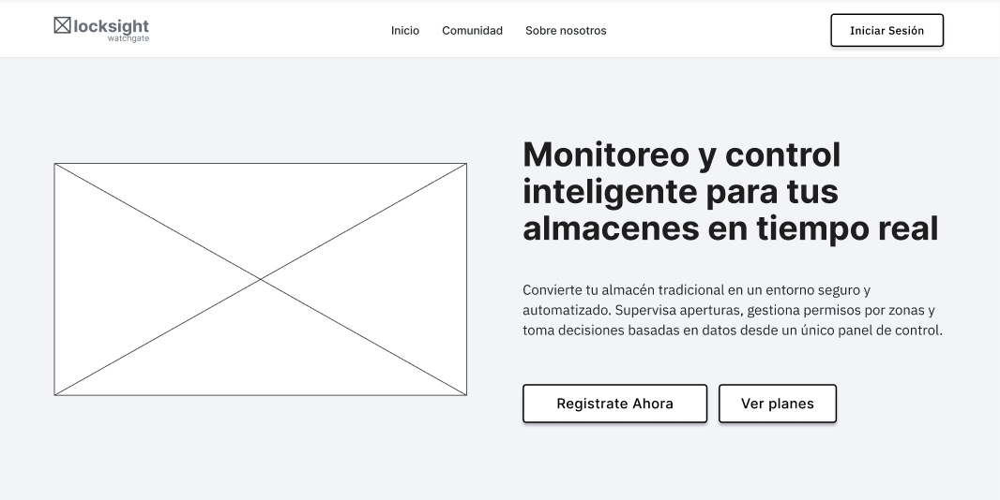
  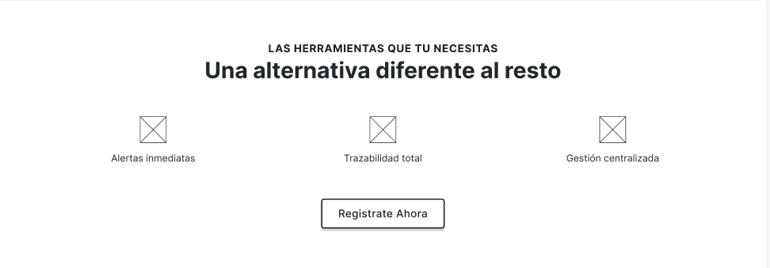
  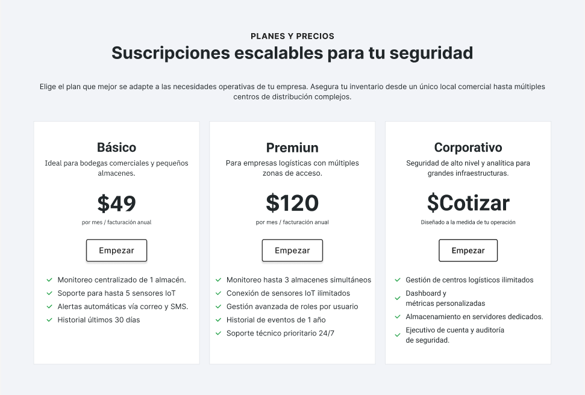
  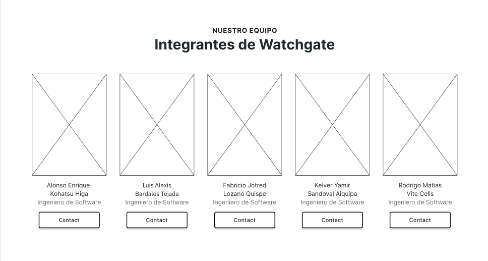
  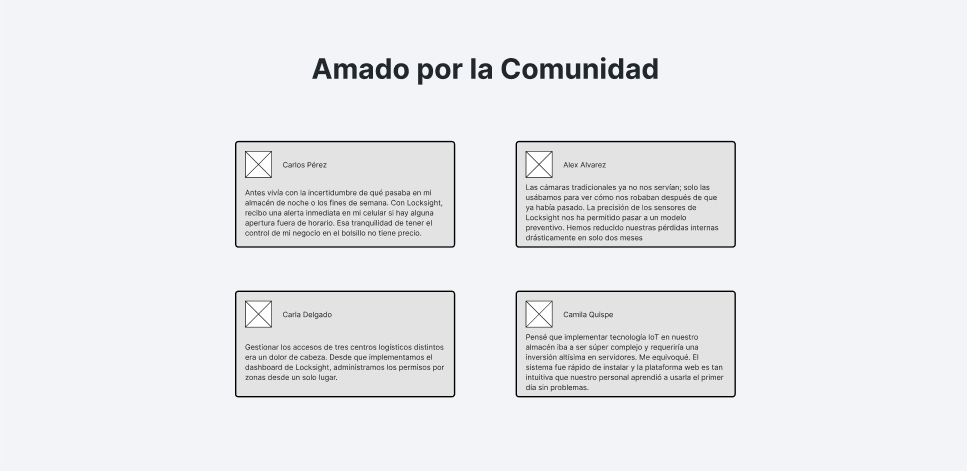
  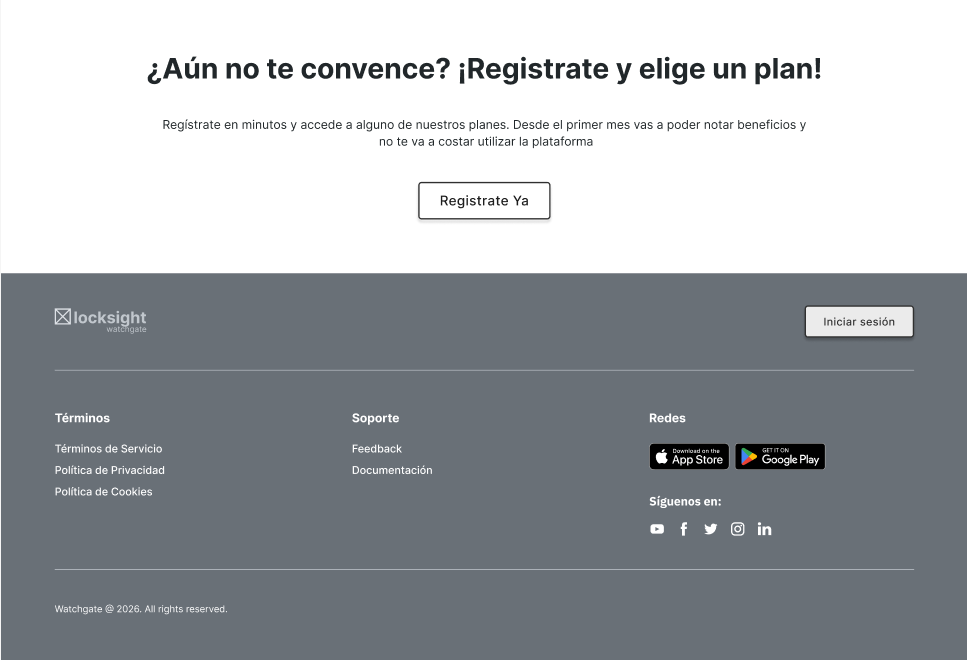

El diseño de la versión de escritorio está estructurado para guiar al usuario a través de un recorrido narrativo y persuasivo. Cuando se abre en el navegador se abre con un hero section que sigue el patrón de lectura en “F”, integrando una barra de navegación clara y un área principal donde se destaca la propuesta de valor junto con llamadas a la acción, visibles y directas. A medida que el usuario se desplaza en la landing, se presentan las principales características del servicio en una disposición de tres columnas, donde se resaltan sus pilares diferenciales, que son alertas inmediatas, trazabilidad total y gestión centralizada. Luego de esto, la sección de suscripciones escalables utiliza tarjetas comparativas, facilitando la evaluación y elección según el perfil de cada empresa.

Para reforzar la credibilidad, un aspecto clave en soluciones de seguridad, la parte inferior de la página incorpora elementos que dan seguridad al usuario. Entre ellos se incluye una sección dedicada al equipo, que aporta cercanía y transparencia y una cuadrícula de testimonios, que valida la propuesta mediante experiencias de usuarios. Estos elementos contribuyen a generar confianza en potenciales clientes.

Al final la experiencia termina con un último bloque de conversión, donde invita al usuario a registrarse, diseñado para incentivar la acción del usuario. El recorrido se cierra con un footer corporativo bien estructurado, que reúne enlaces legales, soporte, redes sociales y accesos a la aplicación móvil, asegurando que el usuario siempre disponga de una siguiente acción clara dentro de la plataforma.

**Explicación para Mobile**

  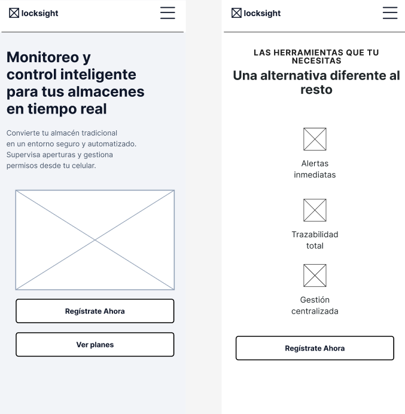  
  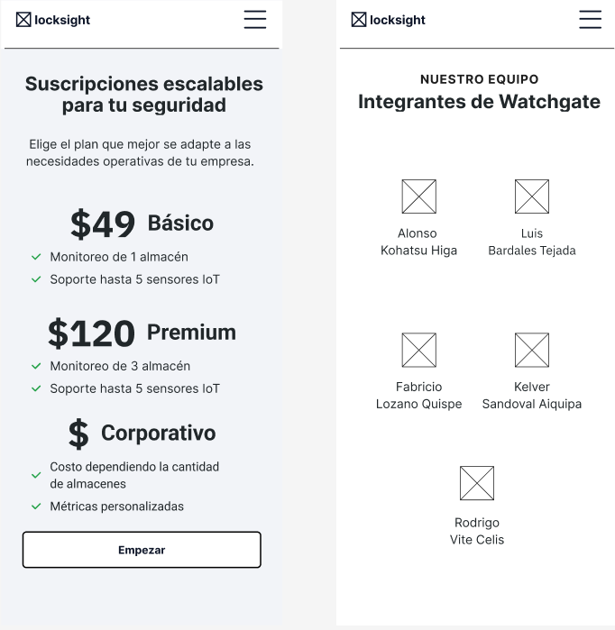  
  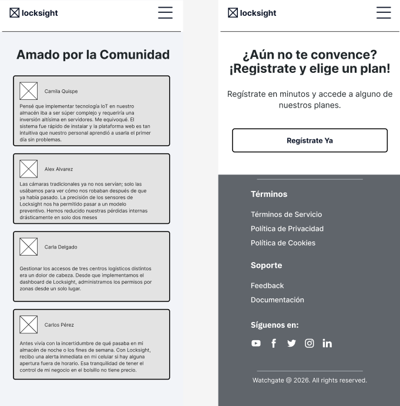

En la versión móvil del landing page, la experiencia se replantea para priorizar la lectura vertical y la interacción táctil. Se adopta un diseño apilado que reorganiza los elementos en una secuencia clara, adaptada a pantallas reducidas. La navegación se simplifica mediante un menú de hamburguesa, liberando espacio visual y evitando distracciones. En este contexto, el hero section no solo mantiene la propuesta de valor, sino que la presenta de forma más directa, en donde el mensaje principal aparece primero, seguido del soporte visual y al final, los botones de acción, los cuales ocupan todo el ancho de la pantalla para facilitar su uso con el pulgar.

A medida que el usuario avanza, el contenido se distribuye en bloques independientes que priorizan la claridad y evitan la sobrecarga visual. Las secciones de características, planes y testimonios se presentan de forma progresiva, permitiendo una comprensión gradual sin necesidad de desplazamientos laterales. Del mismo modo, elementos como el equipo se ajustan dinámicamente al ancho del dispositivo. La experiencia se cierra con un footer organizado en formato vertical, donde los enlaces se presentan con suficiente separación para asegurar una navegación precisa, manteniendo la coherencia y usabilidad hasta el final del recorrido.

### 4.3.2. Landing Page Mock-up

**Explicación para Desktop**

  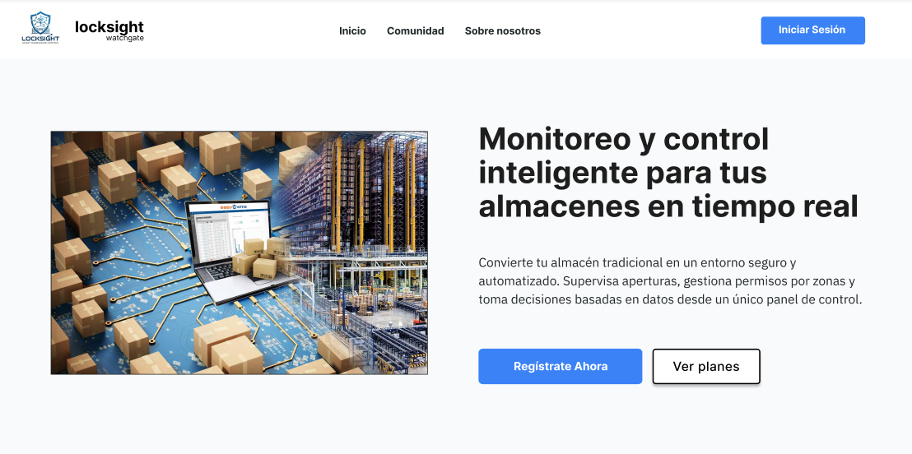
  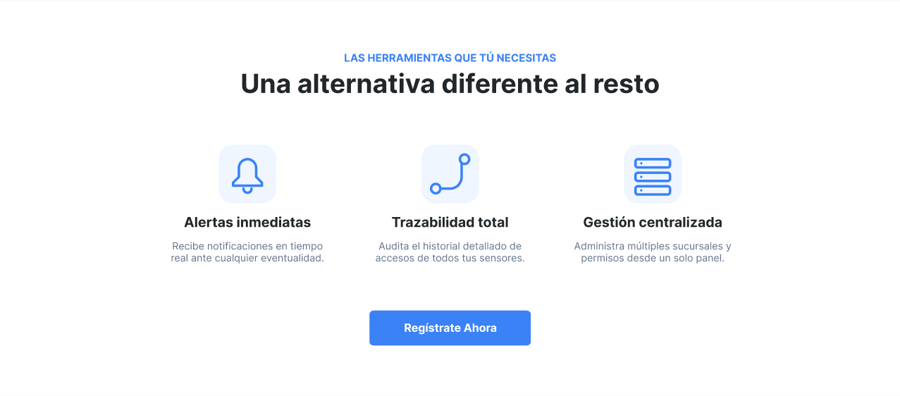
  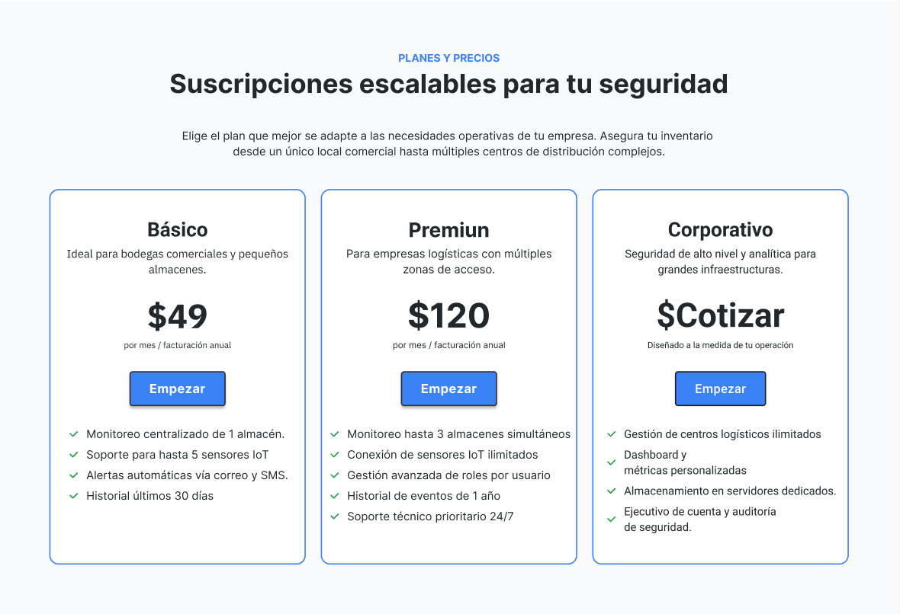
  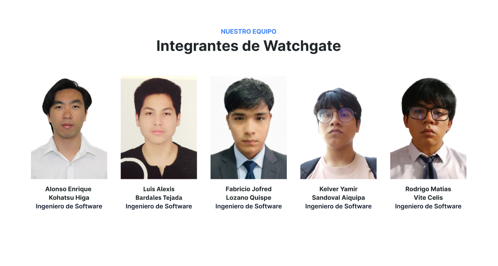
  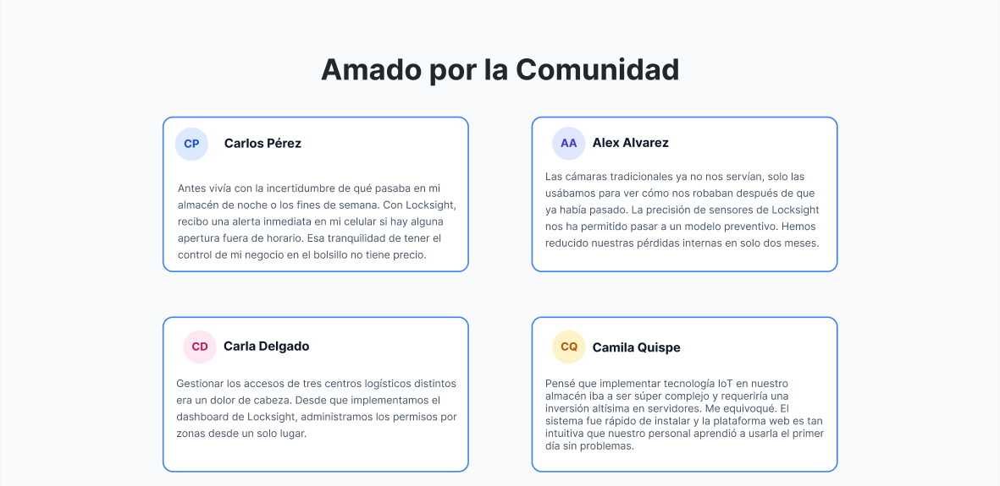
  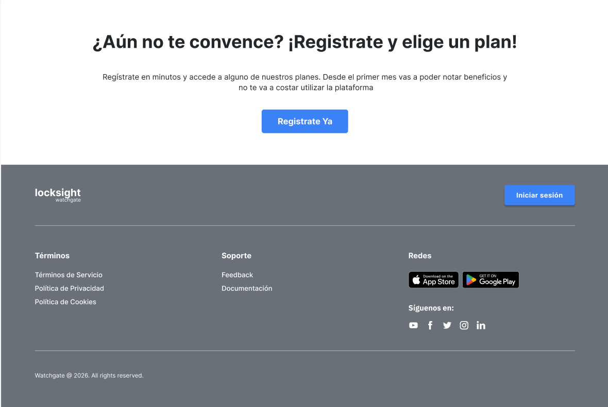

El diseño de la landing page para la versión desktop de Locksight presenta una estructura clara y ordenada, iniciando con una sección principal que resalta el monitoreo inteligente en tiempo real y ofrece accesos directos para registrarse o revisar los planes disponibles. A partir de ahí, la navegación continúa de forma fluida hacia una sección organizada en tres columnas, donde se explican las funcionalidades clave como las alertas inmediatas y la trazabilidad de eventos.

**Explicación para Mobile**

  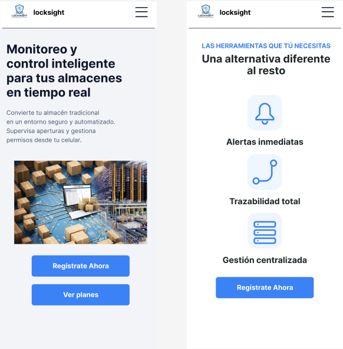  
  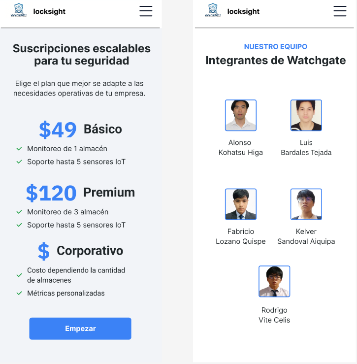  
  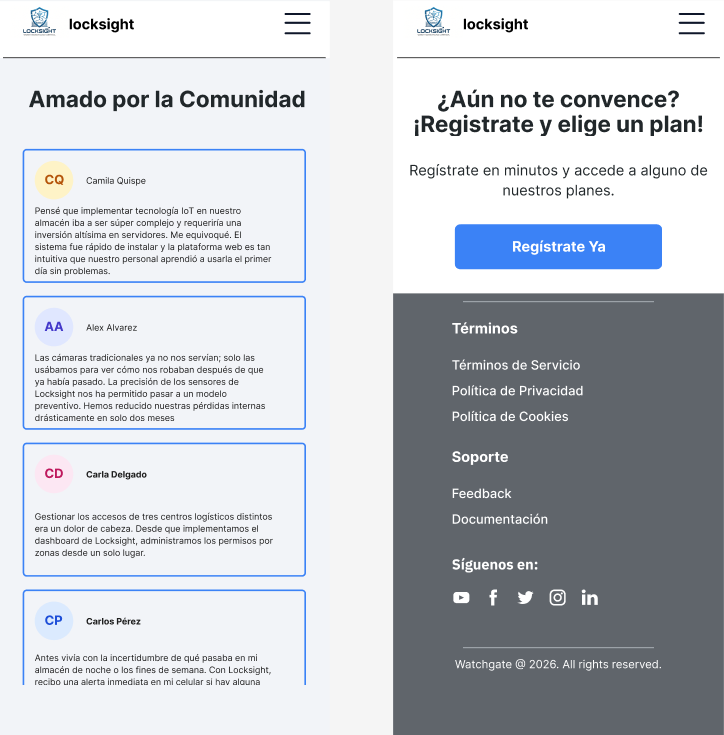

La versión mobile adapta la landing page a un formato de desplazamiento vertical, ofreciendo una experiencia más fluida y enfocada en pantallas pequeñas. La navegación superior se simplifica mediante un menú hamburguesa, manteniendo como prioridad la propuesta de valor y los principales llamados a la acción. 

Para aprovechar mejor el espacio, las secciones de características, planes de suscripción y equipo se reorganizan en un diseño de una sola columna, lo que mejora la legibilidad y facilita la interacción táctil. 

## 4.4. Web Applications UX/UI Design
El diseño de la experiencia de usuario (UX) y de la interfaz (UI) de la plataforma Locksight se ha centrado en la operatividad bajo presión. Entendemos que un jefe de seguridad o un dueño de negocio entra a la aplicación web buscando respuestas rápidas: "¿Está todo cerrado?", "¿Hubo alguna alerta?". Por ello, la UX prioriza la visibilidad de los estados de los sensores y la facilidad para auditar eventos pasados. La UI, basada en Material Design, utiliza una estética limpia y profesional que reduce la carga cognitiva, permitiendo que el usuario identifique anomalías mediante el uso estratégico de colores semánticos (rojo para alertas, verde para estados seguros).

### 4.4.1. Web Applications Wireframes
En esta sección se presentan los wireframes diseñados para la versión mobile de la plataforma. Estos modelos estructurales establecen la arquitectura de la información, la jerarquía visual y los flujos de interacción principales sin la distracción de elementos gráficos complejos. Los wireframes detallan la experiencia del usuario administrador a través de los módulos críticos del sistema, como lo es el dashboard de monitoreo de almacenes, la gestión del inventario de dispositivos IoT, el control de accesos del personal y el ecosistema de facturación. El objetivo de esta etapa es validar la usabilidad y la eficiencia de las tareas operativas antes de transicionar al diseño de alta fidelidad.

**Desktop**

  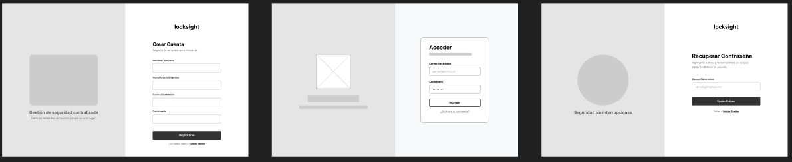

**Mobile**

  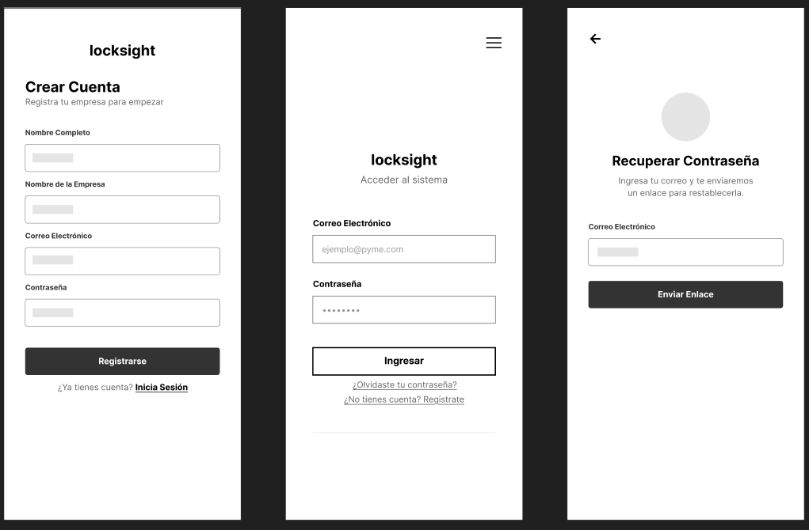

1. User Goal: Acceso al sistema

  Permitir a los dueños de PYMES y administradores registrar su empresa, ingresar a la plataforma de forma segura y recuperar sus credenciales en caso de olvido

  En el diseño del flujo de acceso, la arquitectura de información sigue un modelo de navegación lineal que guía al usuario paso a paso, evitando distracciones innecesarias. Se emplean campos de texto amplios y una tipografía sans-serif de alto contraste, lo que mejora la legibilidad y refuerza principios como la alineación y la simplicidad visual.

  Pantallas de flujo

  * Formulario inicial donde el usuario registra sus datos personales, los de su empresa y crea una contraseña para iniciar su prueba gratuita
  * Pantalla de login estándar para usuarios que ya tienen una cuenta.
  * Interfaz sencilla donde el usuario ingresa su correo electrónico para recibir un enlace de restablecimiento de acceso

**Desktop**

  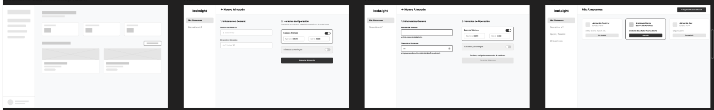

**Mobile**

  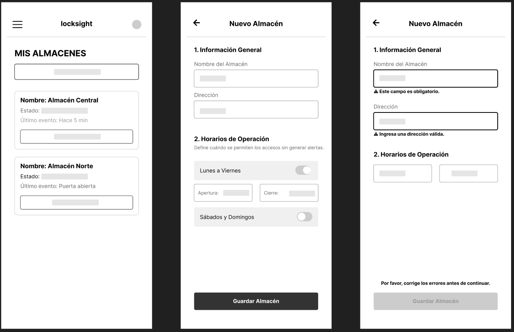  
  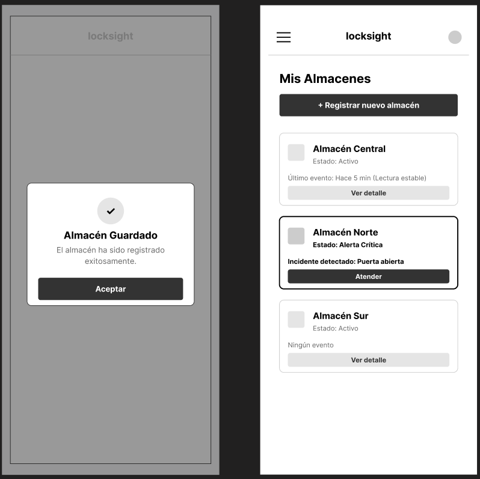

2. User Goal: Monitoreo y gestión de almacenes

  Proveer un panel de control para visualizar el estado de todas las sucursales en tiempo real y permitir la configuración de nuevos locales operativos

  Para el panel principal de almacenes, la arquitectura de información sigue un modelo jerárquico basado en cards, lo que permite visualizar y entender rápidamente el estado de múltiples sucursales. Se aplica el principio de contraste para resaltar claramente los estados de “Alerta Crítica” frente a los estados normales, facilitando una lectura rápida y priorizada de la información.

  Otro aspecto de la información crítica no depende únicamente del color, ya que se complementa con etiquetas en texto y elementos destacados. Los botones de acción también cuentan con áreas táctiles amplias, lo que mejora la accesibilidad para usuarios con dificultades motrices.

  Pantallas de flujo

  * Lista principal que muestra el estado en tiempo real de cada sucursal registrada
  * Formulario para registrar una nueva sucursal y establecer sus horarios de operación automáticos
  * Estado del formulario que resalta visualmente en rojo los campos obligatorios faltantes o con formato incorrecto
  * Ventana emergente que confirma que el nuevo almacén ha sido guardado y está listo para monitorearse

**Desktop**

  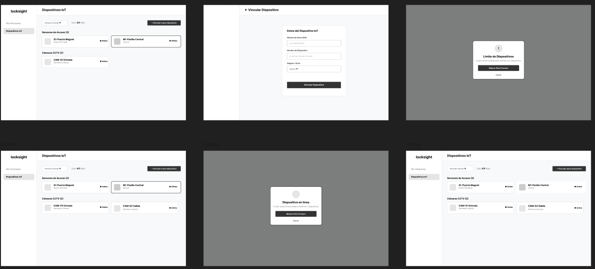

**Mobile**

  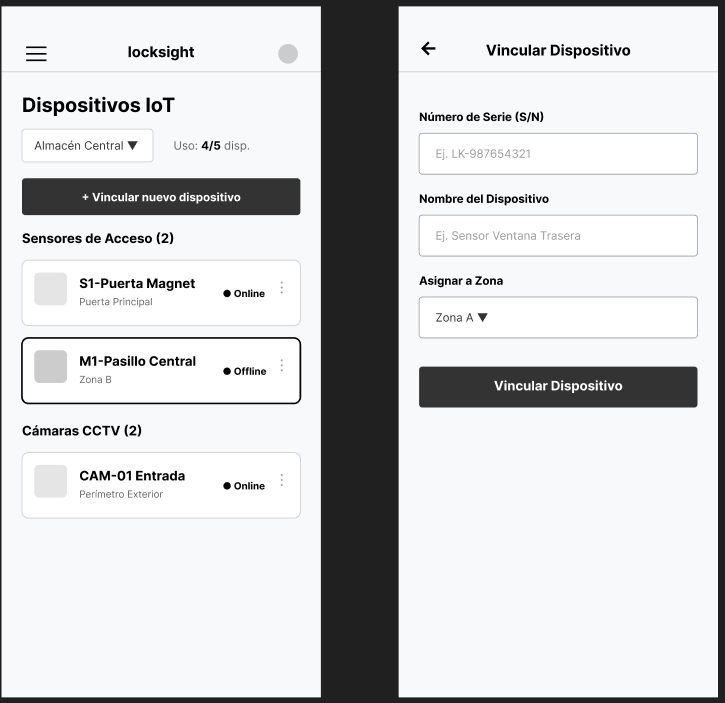  
  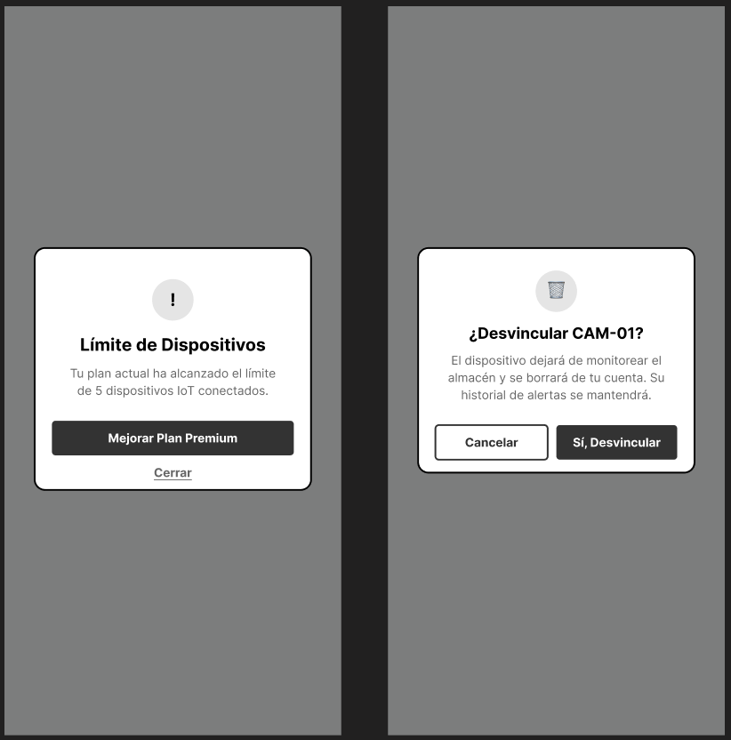

3. User Goal: Administración de dispositivos IoT

  Facilitar la vinculación de nuevo hardware de seguridad a zonas específicas, visualizar su estado de conexión y controlar los límites de uso

  La vinculación y gestión de dispositivos se diseña con el objetivo de reducir la carga cognitiva, agrupando el hardware por categorías para facilitar su identificación y acceso. Se aplica el principio de proximidad de Gestalt para organizar de forma clara la información de cada dispositivo junto a su estado de conexión, mientras que el uso de modales superpuestos permite realizar acciones sin perder el contexto de la pantalla principal. Desde un enfoque inclusivo, los formularios y acciones críticas, como la desvinculación, presentan alto contraste y botones con descripciones claras y directas (“Sí, desvincular” y “Cancelar”), evitando ambigüedades y mejorando la comprensión para todo tipo de usuarios.

  Pantallas de flujo

  * Inventario visual del hardware conectado, indicando si están Online/Offline y mostrando el uso actual de la cuota del plan
  * Formulario para ingresar el número de serie de un equipo nuevo y asignarlo a una zona del almacén
  * Ventana emergente de éxito que confirma la correcta sincronización del nuevo sensor con el sistema.
  * Ventana emergente de advertencia que bloquea la vinculación cuando el usuario ha alcanzado el límite de hardware permitido por su plan

**Desktop**

  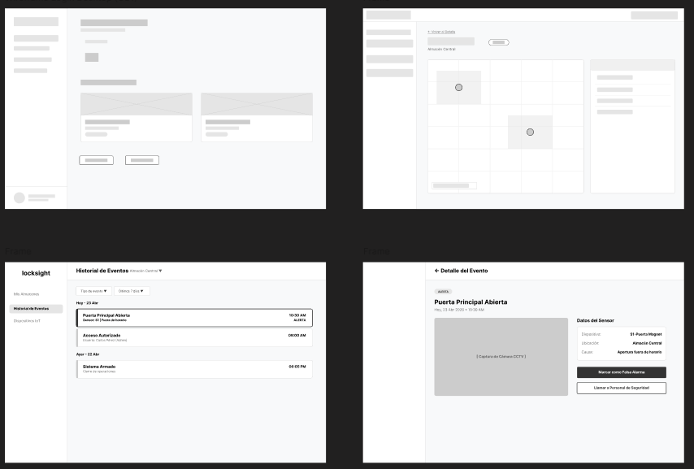

**Mobile**

  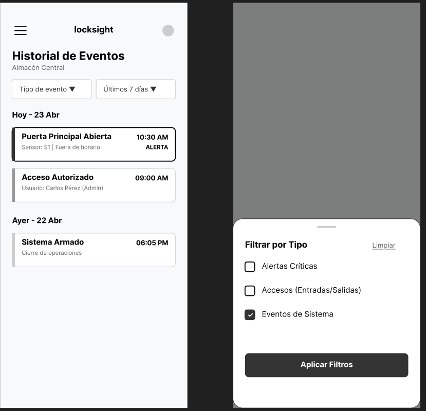  
  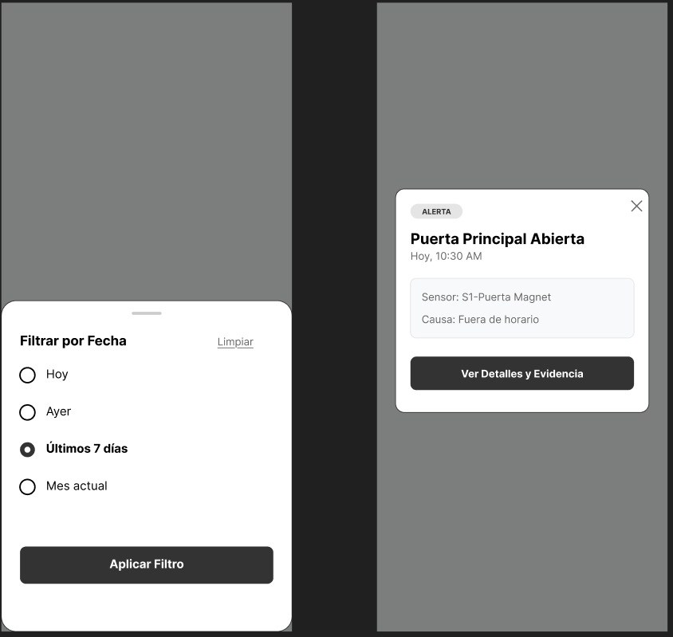

4. User Goal: Registro de eventos e incidentes

  Permitir al usuario revisar la bitácora de actividad del sistema, buscar eventos mediante filtros y acceder al detalle de las alertas críticas.

  Dado que el historial maneja grandes volúmenes de datos, su arquitectura de información se organiza de forma secuencial y con opciones de filtrado claras para facilitar la búsqueda. Se aplica una jerarquía visual donde la hora y la gravedad del incidente destacan en el primer nivel de lectura, permitiendo identificar rápidamente eventos críticos.

  Pantallas de flujo

  * Lista cronológica detallada de todas las actividades del almacén, diferenciando alertas de accesos normales o de sistema
  * Menús desplegables que permiten filtrar el historial por "Tipo de evento" o "Rango de fechas"
  * Ventana emergente que muestra el resumen inmediato de un incidente crítico sin salir de la vista actual

**Desktop**

  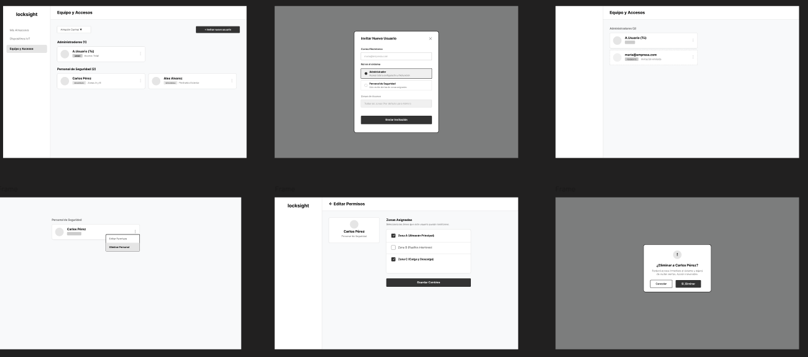

**Mobile**

  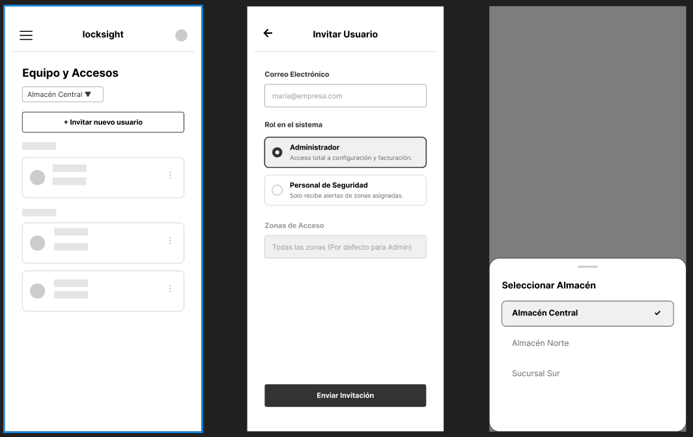  
  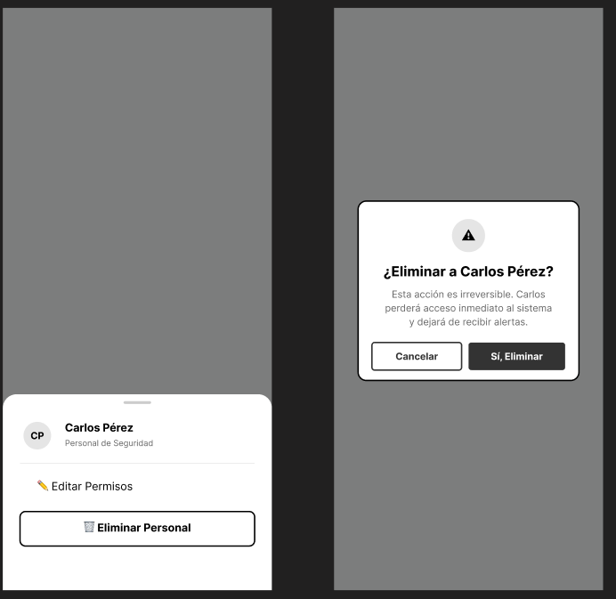

5. User Goal: Gestión de personal y accesos

  Controlar de forma segura qué empleados tienen acceso a la plataforma, invitar nuevos miembros y delimitar qué zonas pueden monitorear

  Este módulo utiliza una arquitectura de información facetada que separa claramente los roles de administrador y personal de seguridad, reduciendo el riesgo de errores en la asignación de permisos. Se aplica el principio de repetición en las tarjetas de usuario para mantener un orden visual consistente y fácil de seguir, mientras que elementos como los badges de roles emplean variaciones tonales sutiles para diferenciarlos sin sobrecargar la interfaz. Desde un enfoque inclusivo, la edición de permisos se apoya en interruptores visuales grandes acompañados de texto claro y confirmatorio, además de un diseño tolerante a errores que evita cambios accidentales, especialmente en usuarios con dificultades motoras.

  Pantallas de flujo

  * Panel central que lista al equipo de trabajo, separando claramente a los Administradores del Personal de Seguridad
  * Formulario para enviar una invitación por correo asignando un rol de sistema específico a un nuevo miembro
  * Panel de configuración con opciones para habilitar o deshabilitar el acceso de un guardia a zonas específicas
  * Ventana emergente de advertencia destructiva para revocar definitivamente el acceso de un empleado a la plataforma.

**Desktop**

  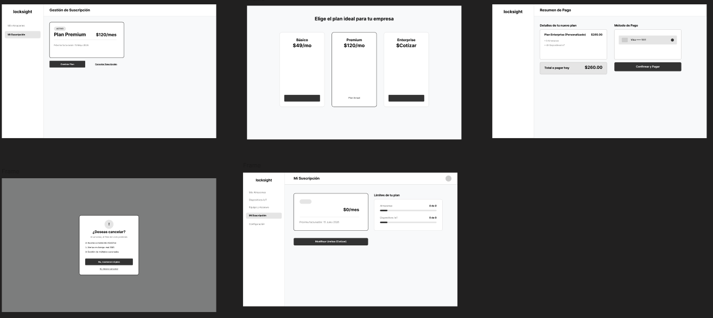

**Mobile**

  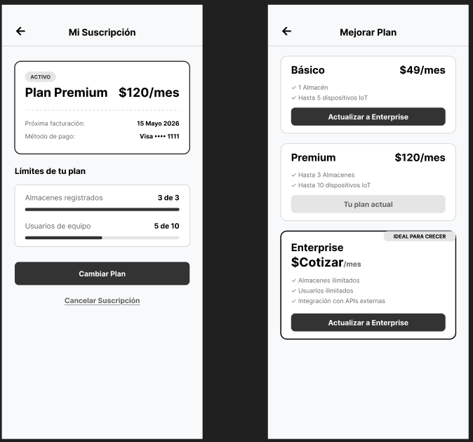  
  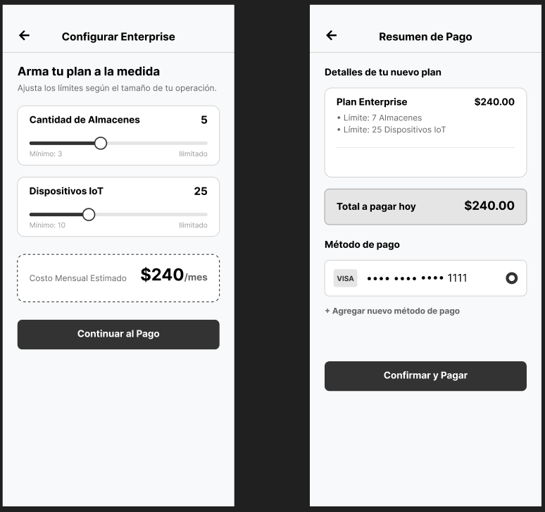  
  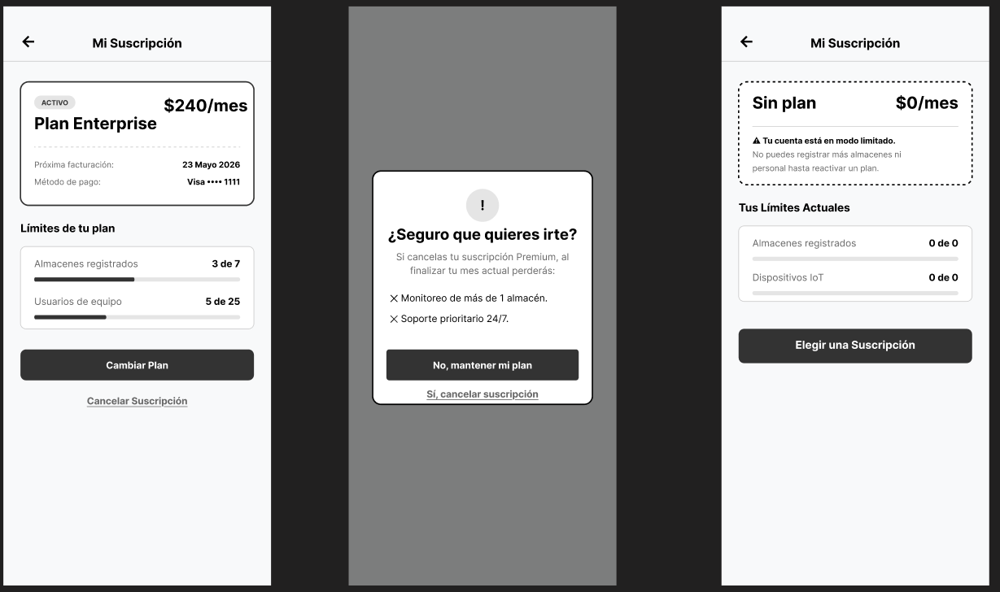

6. User Goal: Administración de suscripción y facturación

  Permitir a la empresa escalar sus operaciones mejorando su plan, personalizar límites a medida o gestionar la cancelación del servicio

  El flujo de facturación guía al usuario desde la comparación de planes hasta el pago mediante una arquitectura de información progresiva. Además, se incorporan elementos interactivos como sliders y resúmenes de pago claros que facilitan la comprensión del proceso. Desde el enfoque inclusivo, se prioriza la legibilidad financiera mediante tipografías grandes para los montos y textos simples, evitando jerga técnica. Esto permite que usuarios con distintos niveles de conocimiento o limitaciones visuales comprendan fácilmente la información y tomen decisiones con mayor confianza.

  Pantallas de flujo

  * Panel de resumen con el plan actual, fecha de próximo cobro y barras de progreso que muestran los límites consumidos
  * Pantalla comparativa de beneficios y precios entre los diferentes planes ofrecidos
  * Interfaz de cotizador interactivo con controles deslizables para elegir la cantidad exacta de almacenes e IoT necesarios.
  * Pantalla de checkout que detalla el costo total, prorrateos y permite confirmar el método de pago con tarjeta
  * Ventana emergente retención que advierte al usuario sobre las funcionalidades clave que perderá si decide cancelar
  * Ventana emergente de confirmación de transacción aprobada y notificación de actualización de los límites del plan
  * Vista del dashboard en estado "sin plan" cuando la cuenta no posee una suscripción activa, bloqueando nuevas acciones

**Desktop**

  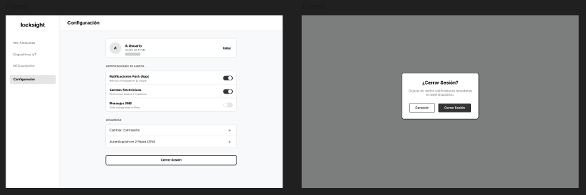

**Mobile**

  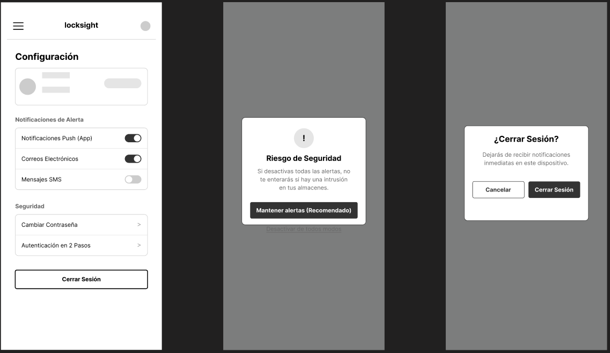

7. User Goal: Configuración de cuenta y notificaciones

  Dar control al usuario sobre sus credenciales de seguridad y los canales por los cuales desea recibir alertas

  La sección de configuración organiza las preferencias mediante una arquitectura categórica, aplicando el principio de agrupamiento para mantener juntas las opciones relacionadas y facilitar su comprensión. Se utilizan controles estándar y líneas divisorias sutiles que ordenan la interfaz sin recargarla, manteniendo una experiencia limpia y clara.
  
  Pantallas de flujo

  * Menú de ajustes con interruptores para activar o desactivar notificaciones Push, Email y SMS.
  * Ventana emergente que advierte al usuario las consecuencias si intenta silenciar por completo las notificaciones del sistema
  * Ventana emergente de confirmación que avisa sobre la pausa de recepción de alertas Push en el dispositivo actual al salir de la cuenta

### 4.4.2. Web Applications Wireflow Diagrams
El Wireflow es un artefacto que combina la estructura de los wireframes con la lógica de un diagrama de flujo. Su importancia radica en que permite visualizar no solo qué elementos hay en cada pantalla, sino cómo el usuario se desplaza entre ellas para completar un proceso. Para Locksight, esto es vital porque el sistema debe ser capaz de guiar al usuario desde la recepción de una alerta hasta la resolución del incidente en el menor número de pasos posible. En esta sección se detalla la arquitectura de navegación, mostrando los caminos que conectan el panel de control con los módulos de configuración de sensores y revisión de historiales.

1. User Goal: Acceso al sistema
  
  El flujo visual comienza con un nodo de inicio que lleva a la pantalla de presentación. Luego se presenta un rombo de decisión que evalúa si el usuario posee credenciales. De esa decisión se desprenden dos ramas, una que va hacia el registro de nueva empresa y otra hacia el inicio de sesión tradicional, ambas terminan en la validación y finalizando en el acceso al dashboard.
  

    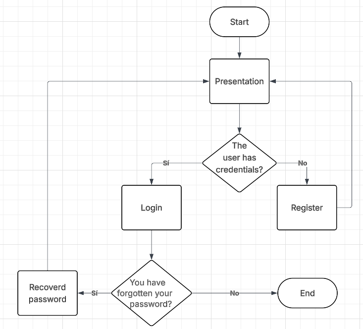
  

  **El happy path**

  Inicio de la aplicación => El administrador abre la plataforma web o móvil.

  Pantalla principal => Se muestra directamente la vista de inicio de sesión.

  Decisión: "¿El usuario tiene una cuenta?"

  En el happy path suponemos que el usuario ya es un cliente registrado.

  Ingreso de datos => El usuario completa los campos de correo electrónico y contraseña en el formulario.

  Autenticación => El usuario hace clic en el botón Ingresar y el sistema valida las credenciales correctamente en la base de datos

  Fin del flujo de acceso => El usuario entra de manera exitosa a la aplicación y aterriza directamente en el dashboard de Mis Almacenes para comenzar a monitorear

  

    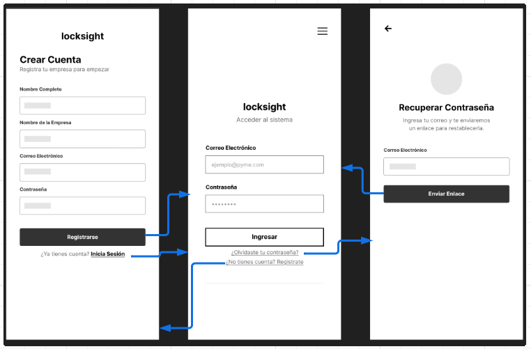
  

2. User Goal: Monitoreo y gestión de almacenes
   
   Este flujo ilustra cómo un administrador registra una nueva sucursal desde el panel principal. El usuario completa un formulario con datos y horarios operativos, en caso la información es incorrecta, el sistema bloquea el avance y muestra alertas preventivas. Al validar correctamente los datos, se confirma el registro mediante una ventana emergente de éxito y se redirige al usuario de vuelta al dashboard, donde el nuevo almacén ya aparece activo y listo para su monitoreo.
  

    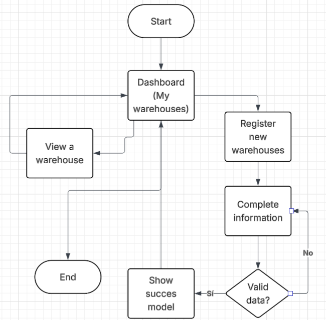
  

  **El happy path**

  Inicio => El usuario se encuentra en el dashboard de "Mis Almacenes"

  Acción => Clic en el botón "+ Registrar nuevo almacén"

  Ingreso de datos => Llena el formulario sin cometer errores

  Guardar => Clic en el botón "Guardar Almacén".

  Validación interna => El sistema verifica que todo es correcto

  Confirmación => Aparece la ventana emergente con el mensaje "Almacén Guardado".

  Fin => El usuario regresa al dashboard y visualiza la nueva sucursal en la lista

  

    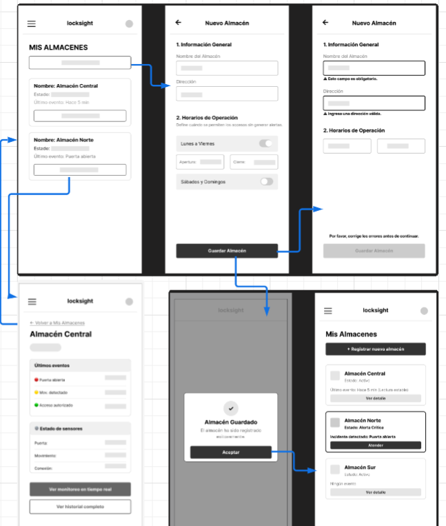
  

   
3. User Goal: Administración de dispositivos IoT
   
   Este flujo describe el proceso de gestión de hardware de seguridad en el sistema. Desde el panel principal de dispositivos, el usuario puede intentar agregar un sensor o cámara nueva. El sistema realiza una validación preventiva de la cuota del plan, si se alcanzó el límite, bloquea la acción con una ventana informativo. Si existe cupo disponible, el usuario accede al formulario donde ingresa el número de serie y la zona para registrar y sincronizar el equipo. De igual manera, el módulo permite desvincular hardware obsoleto, acción protegida por una ventana de advertencia para evitar eliminaciones accidentales.

  

    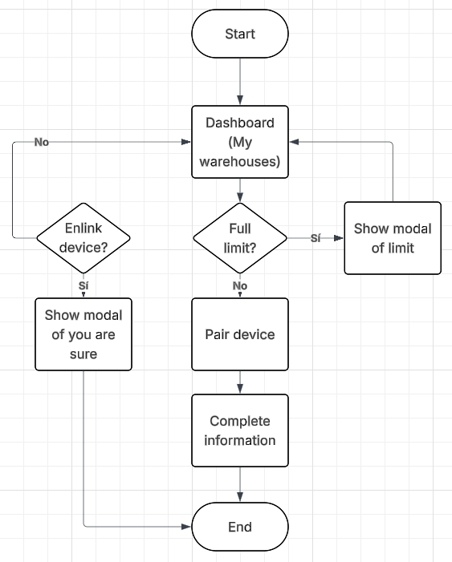
  

   
  **El happy path**

  Inicio => El usuario se encuentra en la vista principal de "Dispositivos IoT"

  Acción de registro => Hace clic en el botón oscuro "Vincular nuevo dispositivo"

  Validación interna => El sistema verifica que el usuario tiene cupo disponible en su plan.

  Ingreso de datos => El sistema despliega el formulario y el usuario ingresa el Número de Serie, Nombre y asigna una Zona.

  Guardar en el botón "Vincular Dispositivo"

  Fin del flujo => El sistema sincroniza el equipo y devuelve al usuario al dashboard, donde el nuevo sensor ya figura en la lista con el indicador nuevo indicador

  

    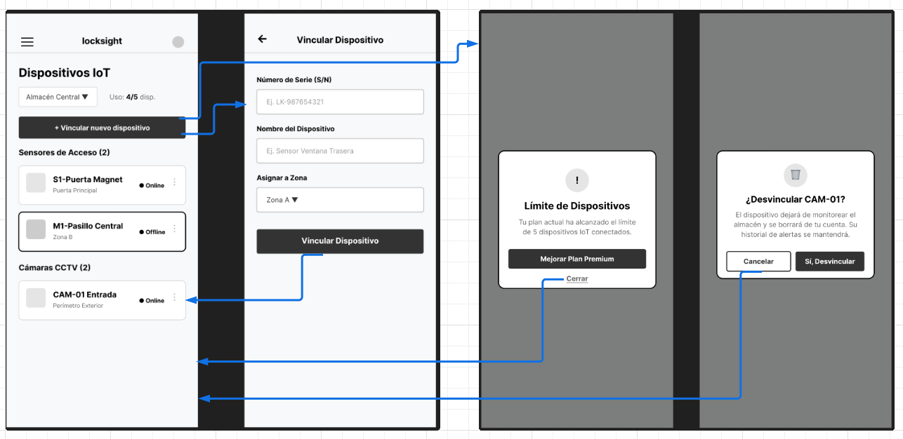
  

   
4. User Goal: Registro de eventos e incidentes

  Este flujo ilustra cómo un usuario audita la actividad del sistema mediante el historial de eventos. Desde la vista principal, el administrador puede utilizar filtros inferiores para acotar la lista cronológica por tipo de alerta o rango de fechas, facilitando la búsqueda. Al localizar un evento específico, el usuario puede seleccionarlo para desplegar una ventana que brinda información rápida y detallada del incidente sin perder su contexto en la lista principal.

  

    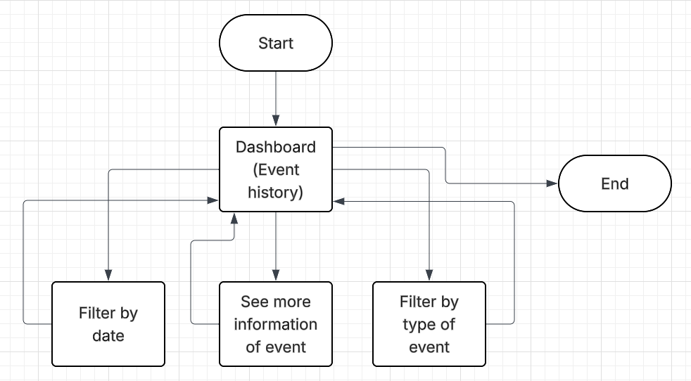
  

   
  **El happy path**

  Inicio => El usuario ingresa a la vista del "Historial de Eventos".

  Interacción => El usuario hace clic en el botón superior "Tipo de evento".

  Filtrado => Se despliega el menú inferior correspondiente, el usuario selecciona sus opciones y presiona "Aplicar Filtros".

  Actualización => El menú se cierra y la lista principal se actualiza mostrando solo los resultados relevantes.

  Selección => El usuario hace clic sobre una tarjeta de la lista.

  Fin del flujo => El sistema despliega la ventana central mostrando el resumen rápido del evento seleccionado.

  

    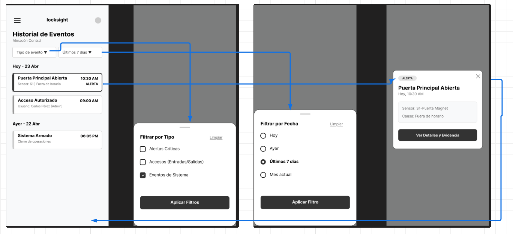
  

5. User Goal: User Goal: Gestión de personal y accesos

  Este flujo ilustra el proceso de administración de usuarios en la plataforma. Desde el panel "Equipo y Accesos", el administrador puede añadir nuevos miembros abriendo un formulario donde ingresa el correo y asigna el nivel de permisos. Además, el administrador puede gestionar al personal existente seleccionando el menú de opciones en la tarjeta de un empleado. Desde allí, puede abrir un menú inferior para eliminarlo, acción que requiere confirmación mediante una ventana emergente de advertencia para evitar la revocación accidental de accesos, garantizando así un control seguro del equipo.

  

    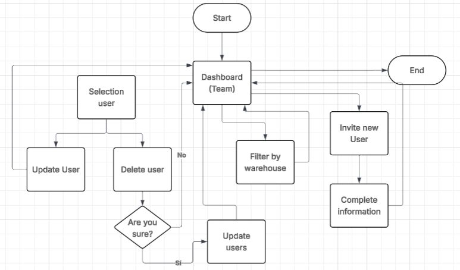
  

   
  **El happy path**

  Inicio => El usuario ingresa a la vista del "Historial de Eventos".

  Inicio => El usuario administrador ingresa a la vista "Equipo y Accesos".

  Acción => Hace clic en el botón superior "+ Invitar nuevo usuario".

  Ingreso de datos => El sistema muestra el formulario, el administrador escribe el correo electrónico y selecciona el "Rol en el sistema".

  Confirmación => Hace clic en el botón oscuro "Enviar Invitación".

  Fin del flujo => El sistema procesa la solicitud, envía el correo al invitado y devuelve al administrador a la lista actualizada, donde el nuevo usuario aparece en estado "Pendiente".

  

    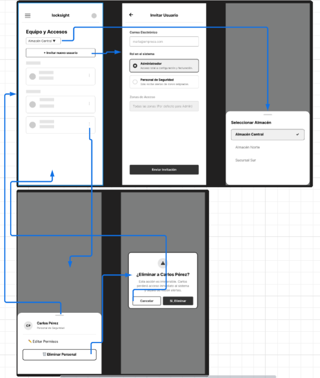
  

6. User Goal: Administración de suscripción y facturación

  Este flujo describe cómo un usuario administra la facturación y escalabilidad de su cuenta. Desde el panel principal de suscripción, el administrador puede optar por cancelar su servicio o mejorar su plan actual. Si decide actualizar, navega por un catálogo comparativo y accede a un cotizador interactivo para el plan Enterprise, donde ajusta sus límites de almacenes y dispositivos de forma dinámica. Por último el usuario revisa el resumen de pago con los montos prorrateados y confirma la transacción, logrando que el sistema actualice inmediatamente los límites operativos de su cuenta.

  

    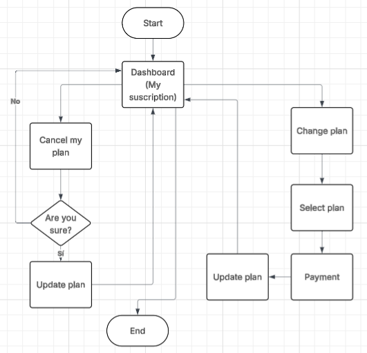
  

   
  **El happy path**

  Inicio => El administrador ingresa a la vista "Mi Suscripción".

  Acción => Hace clic en el botón principal "Cambiar Plan".

  Selección => En el catálogo de "Mejorar Plan", revisa las opciones y hace clic en "Actualizar a Enterprise".

  Configuración => Utiliza los controles deslizantes para establecer la cantidad exacta de Almacenes y Dispositivos IoT que necesita, y presiona "Continuar al Pago".

  Pago => Revisa el detalle del "Resumen de Pago", valida su tarjeta y hace clic en el botón oscuro "Confirmar y Pagar".

  Fin del flujo => La plataforma procesa el cobro y redirige al usuario de vuelta al panel "Mi Suscripción", donde ahora se visualiza el plan Enterprise activo junto con las nuevas barras de límites extendidos.

  

    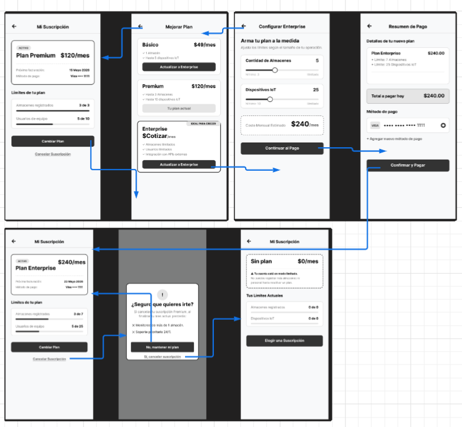
  

7. User Goal: Configuración de cuenta y notificaciones

  Este flujo ilustra la gestión de preferencias y seguridad de la cuenta del usuario. Desde el panel principal de configuración, el administrador interactúa con los canales de notificaciones o selecciona la opción para salir de la plataforma. El sistema integra validaciones preventivas antes de ejecutar acciones definitivas, como si el usuario intenta silenciar las alertas, se le advierte del riesgo operativo mediante un pop up, de manera similar al intentar finalizar su sesión, se exige una confirmación explícita para evitar cierres accidentales y garantizar que el usuario comprenda que dejará de recibir alertas inmediatas en ese dispositivo.

  

    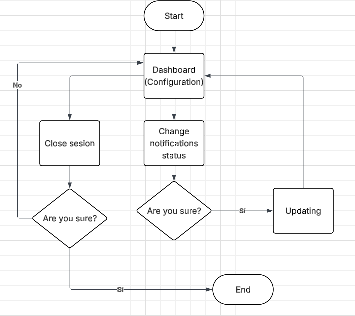
  

   
  **El happy path**

  Inicio => El usuario ingresa a la vista principal de Configuración.

  Acción => Hace clic en el botón inferior con el texto "Cerrar Sesión".

  Advertencia => El sistema detecta el intento de salida y despliega el modal de confirmación para evitar un cierre por error táctil.

  Confirmación => El usuario hace clic en el botón oscuro "Cerrar Sesión" dentro de la ventana.

  Fin del flujo => La plataforma cierra la sesión de forma segura y redirige automáticamente al usuario a la pantalla inicial de inicio de sesión.

  

    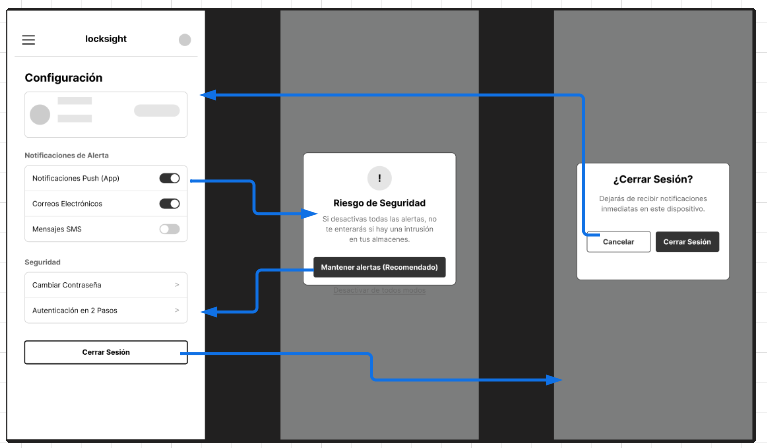
  

### 4.4.3. Web Applications Mock-ups

**Desktop**

  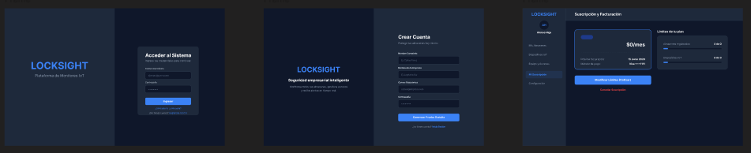  
  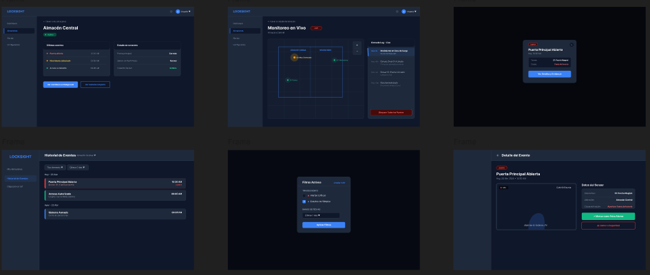  
  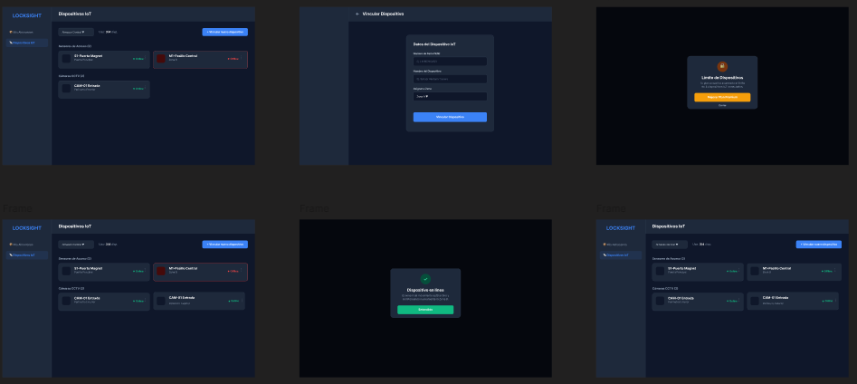  
  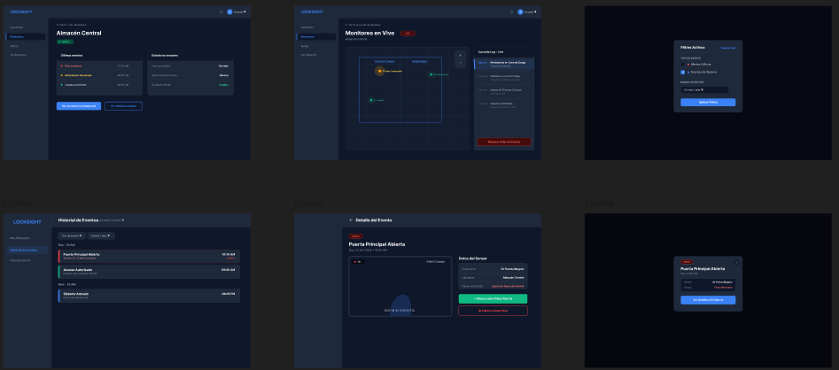  
  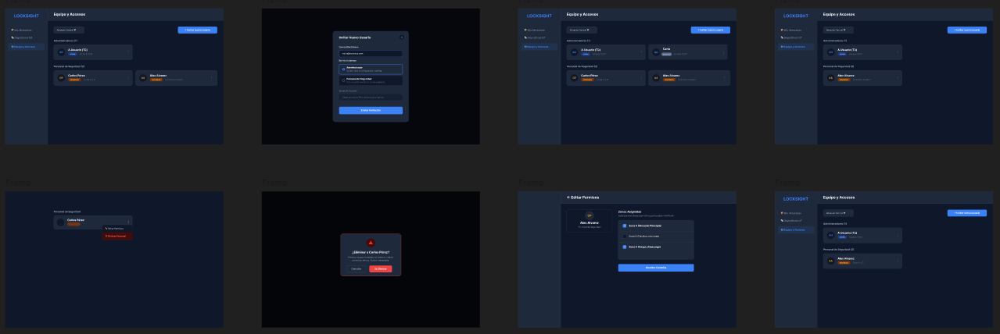  
  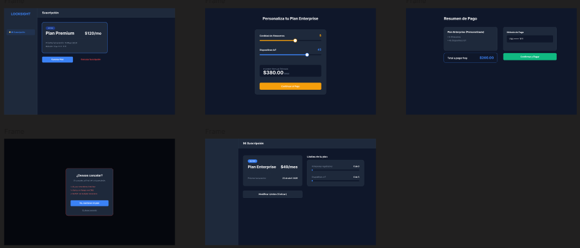  
  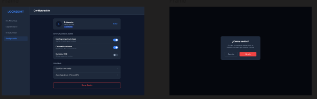

Los mockups de la versión de escritorio presentan un sistema de diseño moderno y coherente, con una paleta de colores oscuros que ayuda a reducir la fatiga visual durante largos periodos de monitoreo. La arquitectura de información se organiza a través de una barra lateral persistente que facilita la navegación entre módulos clave como el panel de almacenes, el historial de eventos y la configuración. Además, el uso consistente de tipografías legibles y componentes estandarizados, como tarjetas y botones en tonos azules, permite mantener una jerarquía visual clara y fácil de seguir.

Con respecto a usabilidad e inclusión, la interfaz prioriza la prevención de errores y la retroalimentación constante. Las acciones críticas están protegidas mediante ventanas emergentes con alertas de alto contraste que advierten sobre sus consecuencias, mientras que los estados del sistema combinan iconos y texto para asegurar una comprensión clara. Esto permite que la información sea accesible para distintos tipos de usuarios y garantiza que tanto los flujos principales como los de error sean intuitivos.

**Mobile**

  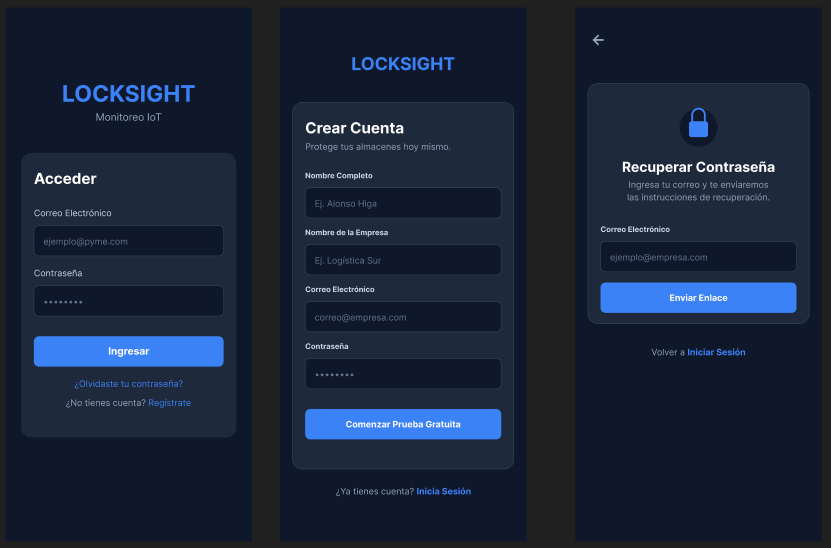  
  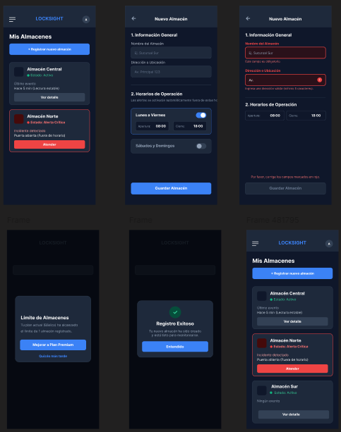  
  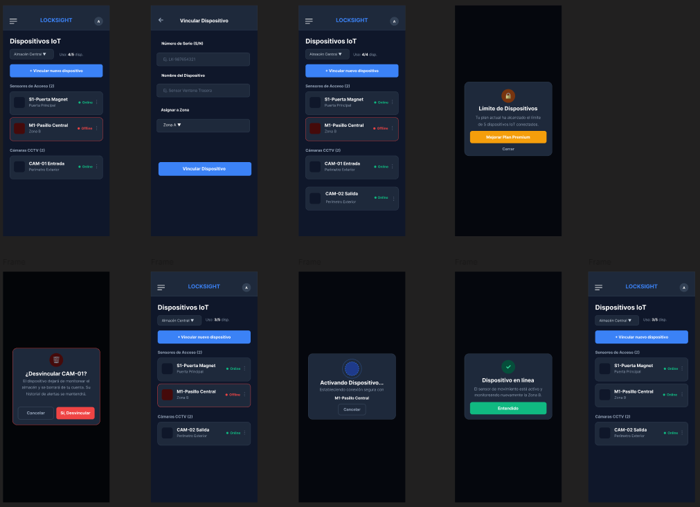  
  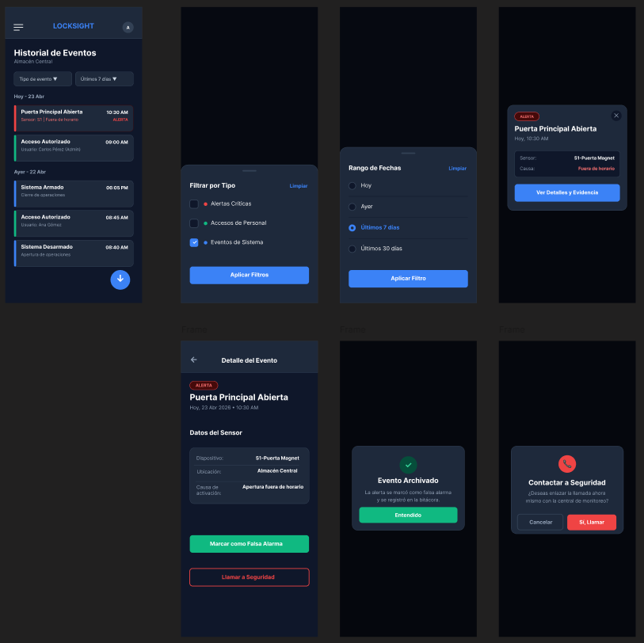  
  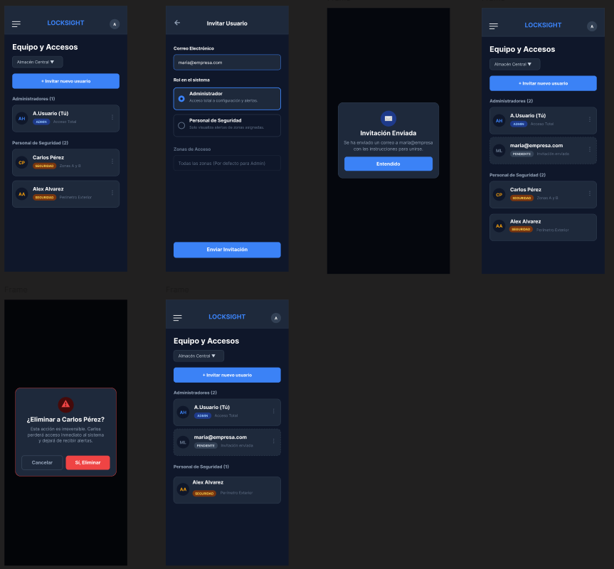  
  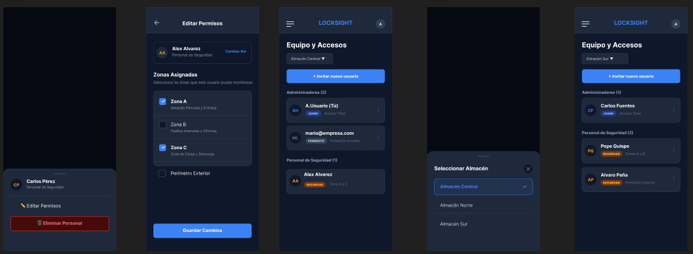  
  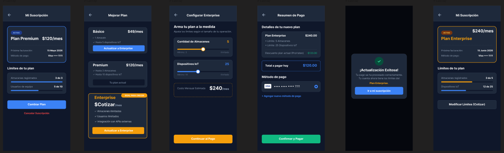  
  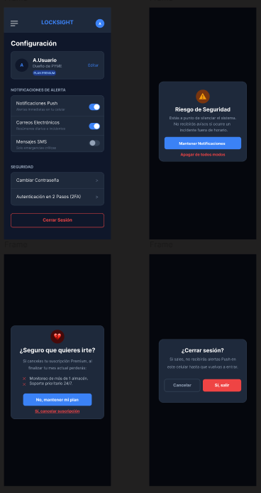

La versión móvil mantiene coherencia con el diseño de escritorio, conservando el modo oscuro para asegurar comodidad visual y una experiencia profesional en cualquier contexto. La arquitectura de información se adapta a pantallas pequeñas mediante una barra de navegación inferior persistente, facilitando el acceso con el pulgar a módulos clave como Almacenes, Dispositivos IoT e Historial. Además, los tamaños de texto, tarjetas y áreas táctiles han sido optimizados para cumplir con estándares de accesibilidad, permitiendo una interacción fluida incluso en movimiento o con una sola mano.

A nivel interactivo, se priorizan patrones propios del entorno móvil, como el uso de bottom sheets para opciones secundarias y modales para confirmaciones críticas, evitando menús complejos. También, se incorporan indicadores visuales claros para estados del sistema, lo que permite identificar alertas de forma inmediata. Este enfoque no solo responde a las limitaciones del dispositivo, sino que mejora la experiencia general al ofrecer navegación intuitiva, retroalimentación constante y un diseño accesible para distintos tipos de usuarios.

### 4.4.4. Web Applications User Flow Diagrams
Mientras que el wireflow se enfoca en el diseño de las pantallas, el User Flow o Diagrama de Flujo de Usuario se centra en el proceso de toma de decisiones de la persona que opera Locksight. Este diagrama ayuda a comprender el camino lógico que sigue un Administrador o Jefe de Seguridad para alcanzar un objetivo específico, como puede ser la auditoría de un acceso no autorizado. Al desglosar cada acción y punto de decisión, podemos identificar posibles fricciones en la experiencia y asegurar que el sistema responda de manera coherente a las necesidades operativas de la empresa, garantizando que el flujo de información sea siempre claro y directo.

#### **User Goal 1: Acceso e Inicio en el Sistema**

Marcelo, interactúa con la aplicación para registrarse o acceder a su cuenta mediante un flujo claro y sin fricciones. Si es su primera vez, sigue la ruta de registro completando sus datos comerciales para iniciar, en cambio sí ya cuenta con credenciales, ingresa directamente con su correo y contraseña para acceder al panel principal. El sistema en caso sea necesario cuenta con un proceso de recuperación de contraseña que le permite restablecer su acceso de forma segura a través de un enlace enviado a su correo electrónico, garantizando continuidad sin bloqueos.

  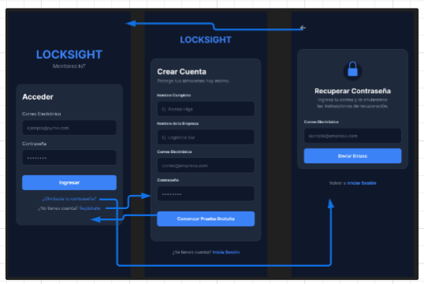

**El happy path:** Inicio de sesión exitoso

Inicio => Marcelo abre la aplicación móvil y visualiza la pantalla de Acceso.

Decisión => El sistema le presenta las opciones y Marcelo determina que ya tiene una cuenta activa

Ingreso de datos => Marcelo escribe su correo electrónico y su contraseña en los campos correspondientes.

Acción => Presiona el botón azul Ingresar

Fin del flujo => El sistema valida las credenciales y Marcelo entra exitosamente al panel de monitoreo de sus almacenes

**El unhappy path:** Recuperación de Contraseña

Inicio => Marcelo abre la aplicación móvil, pero no recuerda su contraseña para ingresar al sistema

Acción => Al estar bloqueado en la pantalla de Acceso, Marcelo presiona el enlace "¿Olvidaste tu contraseña?"

Navegación => El sistema lo redirige a la vista de "Recuperar Contraseña"

Ingreso de datos => Marcelo escribe el correo electrónico asociado a su cuenta de empresa en el campo de texto

Confirmación => Presiona el botón oscuro "Enviar Enlace".

Fin del flujo => El sistema procesa la solicitud y envía las instrucciones de restablecimiento al correo de Marcelo para que pueda recuperar su acceso de forma segura

#### **User Goal 2: Registro y Monitoreo de Almacenes**

Como Jefe de Seguridad, Diego Castillo quiere registrar nuevas sucursales y ver el estado de todos los almacenes de la empresa en una sola plataforma para detectar rápidamente cualquier incidente

En este escenario, Diego necesita agregar una nueva sucursal al sistema de Locksight desde el panel principal. El flujo le solicita datos básicos y horarios de operación, incorporando validaciones en tiempo real para evitar errores. Además, el sistema controla los límites del plan, mostrando una alerta si ya alcanzó la cantidad máxima de almacenes permitidos.

  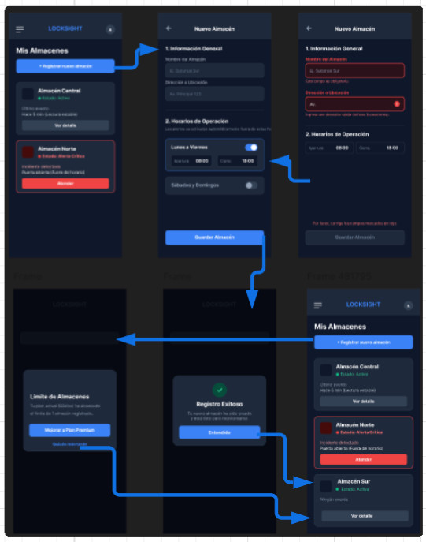

**El happy path:** Registro de almacen exitoso

Inicio => Diego ingresa a la aplicación y se encuentra en la vista principal de "Mis Almacenes"

Acción => Presiona el botón azul principal "Registrar nuevo almacén"

Navegación => El sistema le permite el paso y despliega la pantalla del formulario "Nuevo Almacén"

Ingreso de datos => Diego completa correctamente todos los campos, escribiendo el Nombre del Almacén, la Dirección y configurando los Horarios de Operación mediante los controles interactivos

Confirmación => Hace clic en el botón inferior "Guardar Almacén"

Fin del flujo => El sistema valida que la información es correcta, muestra la ventana emergente de "Registro Exitoso" y al presionar "Entendido", Diego vuelve al dashboard actualizado donde la nueva sucursal ya aparece lista para ser monitoreada.

**El unhappy path:** Límite de Plan Alcanzado

Inicio => Diego ingresa a la aplicación y se encuentra en la vista principal de "Mis Almacenes"

Acción => Presiona el botón azul principal "Registrar nuevo almacén"

Intercepción => El sistema verifica la suscripción actual y detecta que la empresa ya alcanzó el límite máximo de almacenes permitidos.

Notificación => En lugar de abrir el formulario, el sistema despliega la ventana emergente "Límite de Almacenes", bloqueando el proceso de registro

Fin del flujo => Diego se topa con un bloqueo funcional y debe tomar una decisión => presionar "Mejorar a Plan Premium" para escalar la cuenta de la empresa, o presionar "Quizás más tarde" para cancelar la acción y regresar al dashboard sin realizar cambios

#### **User Goal 3: Gestión de Dispositivos IoT**

Como Jefe de Seguridad, Diego Castillo quiere registrar, vincular y administrar los sensores y cámaras de cada almacén para mantener una vigilancia centralizada y recibir alertas en tiempo real.

En este escenario, Diego gestiona los dispositivos desde el panel de IoT, donde visualiza su estado si estan online u offline. Puede vincular nuevos equipos ingresando sus datos, siempre que su plan lo permita, de lo contrario el sistema bloquea la acción y sugiere una mejora. También puede eliminar dispositivos, acción que está protegida con una confirmación para evitar errores.

  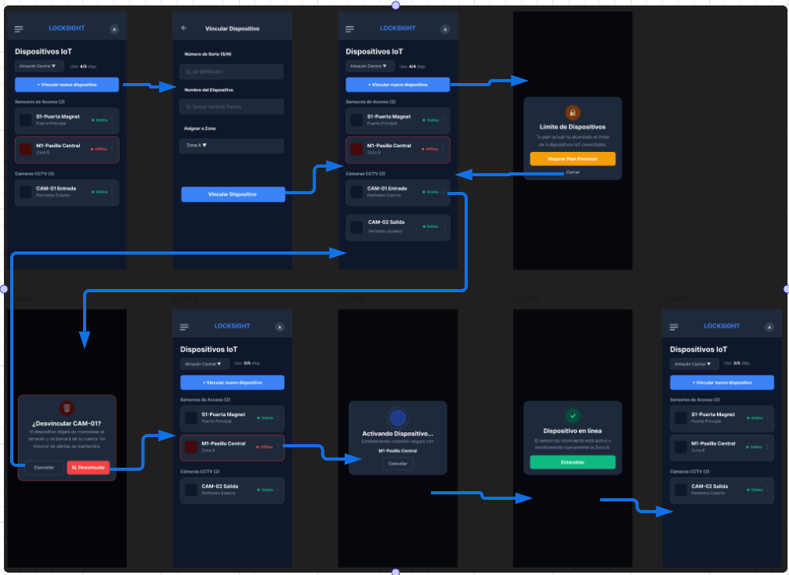

**El happy path:** Vinculación de dispositivo exitosa

Inicio => Diego ingresa a la vista de "Dispositivos IoT", donde visualiza la lista de sensores y cámaras del almacén seleccionado

Acción => Presiona el botón azul principal "Vincular nuevo dispositivo"

Navegación => Al tener cupo disponible, el sistema le permite el paso y lo dirige al formulario "Vincular Dispositivo".

Ingreso de datos => Diego ingresa el Número de Serie, asigna un nombre descriptivo y selecciona la Zona correspondiente

Procesamiento => Hace clic en el botón inferior "Vincular Dispositivo". El sistema despliega una ventana de espera con el mensaje "Activando Dispositivo..." mientras establece la conexión segura

Fin del flujo => Se muestra el mensaje de confirmación "Dispositivo en línea" y al presionar "Entendido", Diego regresa al panel principal donde el nuevo sensor ya aparece listado, activo y sumado al contador de uso

**El unhappy path:** Límite de Dispositivos Alcanzado

Inicio => Diego ingresa a la vista de "Dispositivos IoT" con la intención de agregar una nueva cámara

Acción => Presiona el botón azul "Vincular nuevo dispositivo"

Intercepción => El sistema verifica los parámetros de la suscripción y detecta que se ha alcanzado la cantidad máxima de hardware permitido por su plan actual.

Notificación => En lugar de mostrar el formulario, el sistema despliega la ventana "Límite de Dispositivos", bloqueando el proceso de vinculación.

Fin del flujo => Diego debe tomar una decisión, presionar el botón "Mejorar Plan Premium" para adquirir más capacidad o presionar "Cerrar" para cancelar la acción y mantener su límite actual.

#### **User Goal 4: Auditoría de Eventos e Incidentes**

Como Jefe de Seguridad, Diego Castillo quiere ver un registro cronológico detallado de todas las actividades del almacén y poder filtrar la información rápidamente para investigar cualquier alerta o intrusión.

En este escenario Diego audita una alerta desde el historial de eventos usando filtros para encontrarla por tipo o fecha. Al ubicar una alerta crítica revisa un resumen y luego el detalle con la evidencia del sensor. Después de evaluarla debe decidir si la descarta como falsa alarma o si la escala contactando al equipo de seguridad mediante una confirmación.

  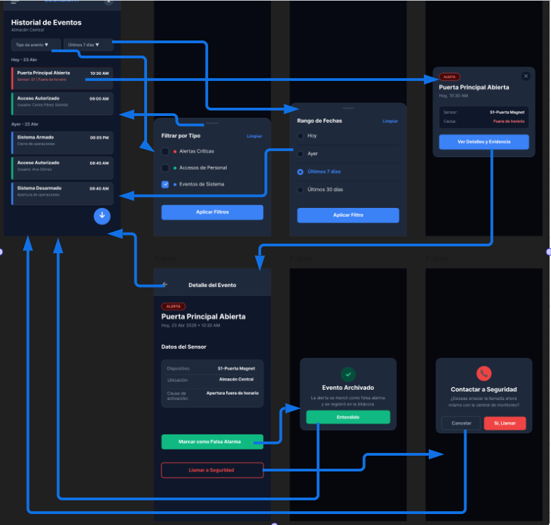

**El happy path:** Auditoría y Escalamiento de Incidente

Inicio => Diego ingresa a la vista de "Historial de Eventos", donde observa la lista cronológica de actividades

Acción => Hace clic en la tarjeta de la alerta crítica "Puerta Principal Abierta" marcada en rojo.

Vista Rápida => El sistema despliega la ventana superpuesto con el resumen del evento. Diego presiona el botón azul "Ver Detalles y Evidencia"

Análisis => El sistema lo dirige a la pantalla "Detalle del Evento", donde Diego revisa la información específica del sensor y la causa de activación

Decisión => Al confirmar que es un incidente real, Diego presiona el botón con borde rojo "Llamar a Seguridad".

Fin del flujo => El sistema despliega la ventana de advertencia "Contactar a Seguridad". Diego presiona el botón rojo "Sí, Llamar" para enlazar la comunicación con la central de monitoreo

#### **User Goal 5: Gestión de Equipo y Accesos**

Como dueño de distribuidora Marcelo Mansilla quiere invitar a su personal al sistema y asignar permisos específicos para delegar el monitoreo sin perder el control de la seguridad

En este escenario Marcelo agrega a un nuevo miembro desde el panel de accesos donde visualiza administradores y personal de seguridad. Inicia la invitación completando un formulario con el correo del empleado y definiendo su nivel de permisos para mantener el control operativo.

El flujo también permite gestionar al equipo actual ya que puede actualizar accesos por zonas o eliminar usuarios cuando sea necesario. Estas acciones están protegidas con confirmaciones claras para evitar errores y asegurar que ningún permiso se modifique por accidente.

  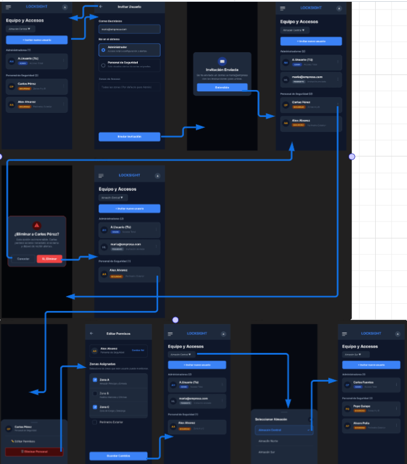

**El happy path:** Invitación de usuario exitosa

Inicio => Marcelo ingresa a la vista de Equipo y Accesos donde observa la lista de su personal activo.

Acción => Presiona el botón azul principal "+ Invitar nuevo usuario"

Navegación => El sistema despliega el formulario "Invitar Usuario".

Ingreso de datos => Marcelo escribe el correo electrónico del empleado y selecciona el rol de Personal de Seguridad

Confirmación => Presiona el botón inferior "Enviar Invitación"

Fin del flujo => El sistema despliega la ventana "Invitación Enviada" y al presionar Entendido Marcelo regresa al panel actualizado donde el nuevo correo aparece con la etiqueta Pendiente.

**El unhappy path:** Eliminación de Personal

Inicio => Marcelo decide retirar el acceso de un ex empleado.

Acción => Selecciona el menú del usuario y presiona el botón rojo Eliminar Personal.

Advertencia => El sistema bloquea la pantalla con una ventana de confirmación informando que la acción es irreversible

Fin del flujo => Marcelo presiona el botón rojo "Sí Eliminar" y el sistema remueve al usuario de la lista de accesos.

#### **User Goal 6: Suscripción y Facturación**

Como dueño de distribuidora Marcelo Mansilla quiere gestionar la facturación de su cuenta y ampliar los límites de su plan para escalar su negocio sin interrupciones.

En este escenario Marcelo accede al panel de suscripción para mejorar su plan al notar que está cerca del límite actual. Selecciona una opción superior y ajusta la capacidad según sus necesidades mediante un cotizador interactivo. Luego continúa al pago donde el sistema aplica los ajustes correspondientes y procesa la transacción.El flujo finaliza con la actualización inmediata de los nuevos límites en su cuenta, permitiéndole seguir operando sin restricciones y con mayor capacidad de crecimiento.

  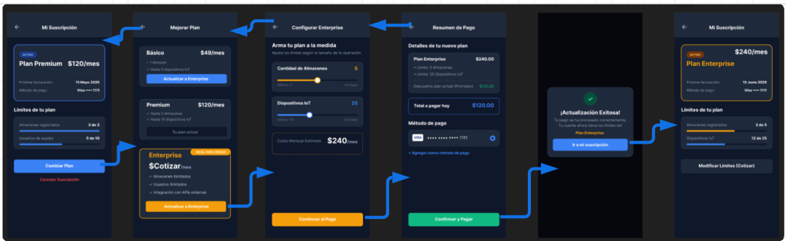

**El happy path:** Actualización a Plan Enterprise

Inicio => Marcelo ingresa a la vista "Mi Suscripción" donde revisa su plan actual y nota que sus límites están al máximo

Acción => Presiona el botón azul "Cambiar Plan".

Selección => El sistema muestra el catálogo de planes y Marcelo presiona el botón amarillo "Actualizar a Enterprise"

Configuración => En la pantalla Configurar Enterprise Marcelo usa los controles deslizantes para establecer 5 almacenes y 25 dispositivos y presiona el botón naranja Continuar al Pago.

Pago => El sistema muestra el Resumen de Pago con el total calculado Marcelo valida su tarjeta y presiona el botón verde Confirmar y "Pagar"

Fin del flujo => Aparece la ventana "Actualización Exitosa" con un check verde y al presionar el botón azul Ir a mi suscripción Marcelo regresa al dashboard donde ya visualiza sus nuevos límites operativos extendidos listos para usar

#### **User Goal 7: Configuración de cuenta y notificaciones**

Como dueño de distribuidora Marcelo Mansilla quiere gestionar las preferencias de sus notificaciones y la seguridad de su cuenta para asegurar que recibe alertas críticas sin distracciones innecesarias.

En este escenario Marcelo interactúa con el panel de Configuración donde puede activar o desactivar notificaciones Push correos o SMS. El sistema incorpora validaciones preventivas. Si Marcelo intenta apagar todas las alertas el sistema despliega un modal advirtiendo el riesgo de seguridad. De igual manera sí decide salir de la plataforma la acción de cerrar sesión requiere una confirmación explícita para evitar cierres accidentales y la pérdida de monitoreo en su dispositivo móvil.

  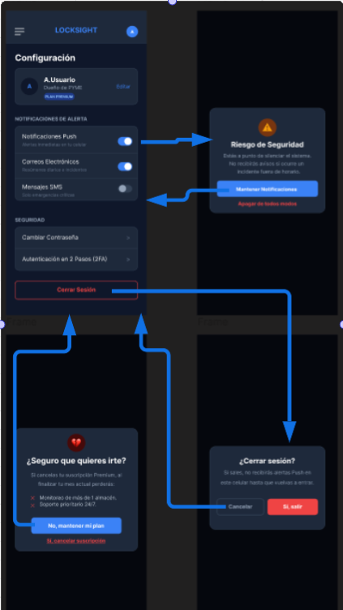

**El happy path:** Cierre de sesión seguro

Inicio => Marcelo ingresa a la vista principal de "Configuración"

Acción => Toca el botón con borde rojo "Cerrar Sesión" ubicado en la parte inferior de la pantalla

Advertencia => El sistema detecta el intento de salida y despliega el modal emergente ¿Cerrar sesión? para prevenir un toque accidental

Confirmación => Marcelo presiona el botón rojo Sí salir.

Fin del flujo => La plataforma finaliza la sesión de forma segura y redirige a Marcelo a la pantalla inicial de acceso

## 4.5. Web Applications Prototyping
El prototipado de la aplicación web es la etapa donde se materializa la interacción de Locksight de manera funcional antes de pasar al desarrollo. Este artefacto, desarrollado en la herramienta Figma, permite simular el comportamiento real de la plataforma, desde el inicio de sesión hasta la recepción de una alerta inteligente. El objetivo es validar el flujo de navegación y la usabilidad, asegurando que el sistema sea comprensible y que los administradores puedan acceder a sus reportes y cámaras sin fricciones.

**Version Desktop**

  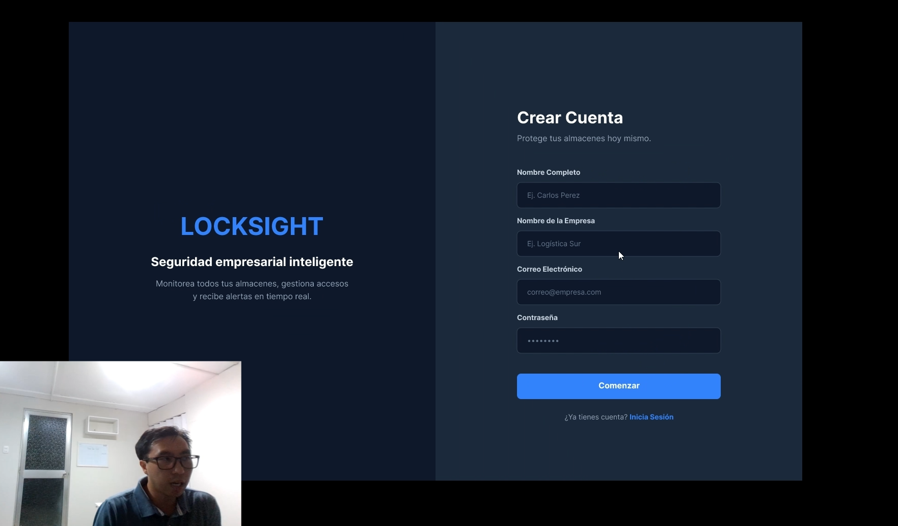

link: https://upcedupe-my.sharepoint.com/:v:/g/personal/u202416276_upc_edu_pe/IQDillIMnJnPQLW5JrvB9BY8AY2LlKTZ636r3Ljzqpku1tA?nav=eyJyZWZlcnJhbEluZm8iOnsicmVmZXJyYWxBcHAiOiJPbmVEcml2ZUZvckJ1c2luZXNzIiwicmVmZXJyYWxBcHBQbGF0Zm9ybSI6IldlYiIsInJlZmVycmFsTW9kZSI6InZpZXciLCJyZWZlcnJhbFZpZXciOiJNeUZpbGVzTGlua0NvcHkifX0&e=4Ogfam

**Version Mobile**

  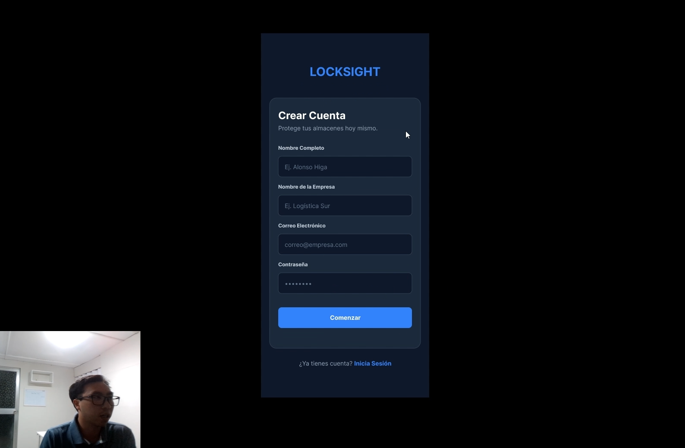

link: https://upcedupe-my.sharepoint.com/:v:/g/personal/u202416276_upc_edu_pe/IQCfW_b3VmGhSIjF7rQDbtkPAZKYeF5M-mMwFxVv6BLr9tI?nav=eyJyZWZlcnJhbEluZm8iOnsicmVmZXJyYWxBcHAiOiJPbmVEcml2ZUZvckJ1c2luZXNzIiwicmVmZXJyYWxBcHBQbGF0Zm9ybSI6IldlYiIsInJlZmVycmFsTW9kZSI6InZpZXciLCJyZWZlcnJhbFZpZXciOiJNeUZpbGVzTGlua0NvcHkifX0&e=6q8KR4

## 4.6. Domain-Driven Software Architecture
La arquitectura de software orientada al dominio (DDD) es el enfoque de diseño que estructura Locksight en torno a los procesos clave del negocio de seguridad y almacenamiento. Este método permite que el software refleje con precisión las reglas de negocio, como la gestión de permisos por zonas o la activación automática de alertas. Al aplicar DDD, logramos un sistema robusto, escalable y fácil de mantener, donde cada componente técnico está alineado con los objetivos de seguridad y eficiencia operativa de nuestros clientes.

### 4.6.1. Design-Level Event Storming

  

**Company Registration:**

  

**Subscription & Billing:**

  

**Warehouse Management:**

  

**Sensor Integration:**

  

**User & Access Management:**

  

**Security Alerts:**

  

**Reports Section:**

  

### 4.6.2. Software Architecture Context Diagram

  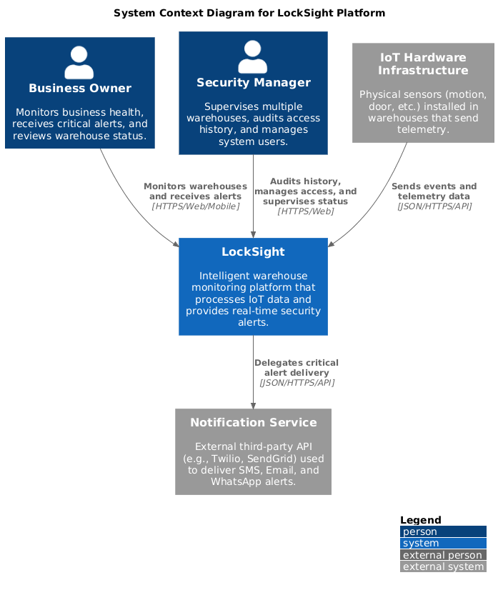

### 4.6.3. Software Architecture Container Diagrams.

  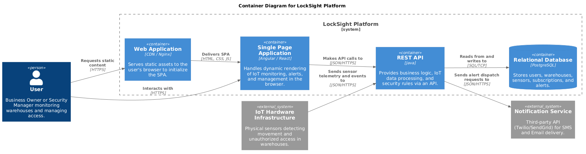

### 4.6.4 Software Architecture Components Diagrams.

  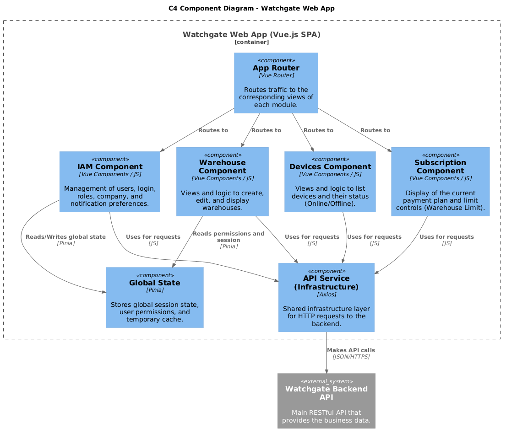

## 4.7. Software Object-Oriented Design
El diseño orientado a objetos es fundamental para estructurar Locksight de manera modular. A través de este diseño, definimos las clases y métodos que dan vida a las funcionalidades, aprovechando principios de reutilización de código y mantenimiento. Esto nos permite modelar entidades del mundo real (sensores, usuarios, almacenes) dentro del código de forma lógica, facilitando que el sistema crezca y se adapte a nuevas necesidades de seguridad industrial sin comprometer la estabilidad actual.
### 4.7.1. Class Diagrams

  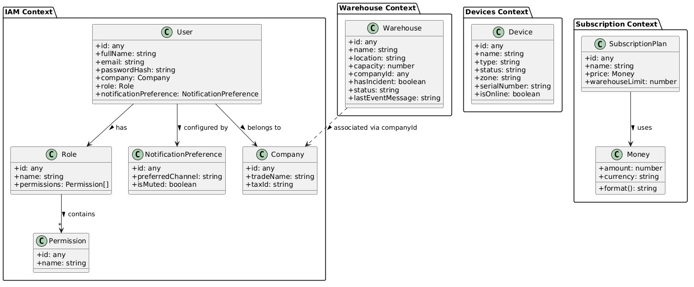

## 4.8. Database Design
El diseño de la base de datos proporciona la estructura necesaria para almacenar y gestionar toda la información operativa de Locksight de forma segura y eficiente. Se ha modelado un esquema relacional que organiza las tablas, relaciones y restricciones necesarias para garantizar la integridad de los datos de sensores, historiales de acceso y perfiles de usuario. Un diseño de base de datos sólido permite que el sistema responda con rapidez ante consultas históricas y guarde cada evento de seguridad con precisión milimétrica.

### 4.8.1. Database Diagrams

  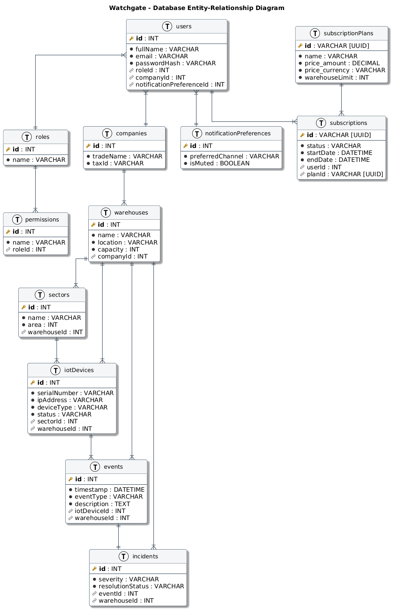

# Capítulo V: Product Implementation, Validation & Deployment. 
## 5.1. Software Configuration Management. 
### 5.1.1. Software Development Environment Configuration. 
# Project Management

| Producto | Propósito | Ruta |
|----------|----------|------|
| GitHub Projects | Planificación y seguimiento de issues, user stories y tareas del equipo. | https://github.com |

---

# Requirements Management

| Producto | Propósito | Ruta |
|----------|----------|------|
| GitHub | Gestión de requerimientos mediante Issues y documentación versionada del proyecto. | https://github.com |
| Markdown | Documentación estructurada de requerimientos dentro del repositorio. | Integrado en GitHub |

---

# Product UX/UI Design

| Producto | Propósito | Ruta |
|----------|----------|------|
| Figma | Diseño de wireframes, mockups y prototipos de la interfaz de usuario. | https://figma.com |
| UXPressia | Plataforma para diseñar la experiencia del cliente (Customer Journey Mapping), incluyendo User Personas, mapas de empatía y Customer Journey Maps. | https://uxpressia.com/ |
| Miro | Lienzo virtual colaborativo para investigación, brainstorming y organización de ideas mediante mapas mentales. | https://miro.com/ |
| PlantUML | Herramienta de código abierto para crear diagramas UML a partir de texto (casos de uso, clases y esquemas técnicos). | https://plantuml.com/ |

---

# Software Development

Se refiere al marco de trabajo y metodologías empleadas para la creación de productos digitales. Define los procesos y actividades del ciclo de vida del software.

| Producto | Descripción | Ruta |
|----------|------------|------|
| GitHub | Plataforma de alojamiento y colaboración que permite gestionar el control de versiones y el trabajo en equipo. | https://github.com |
| Visual Studio Code | Editor de código fuente ligero y extensible desarrollado por Microsoft. | https://code.visualstudio.com/ |
| HTML | Lenguaje de marcado estándar para estructurar contenido web. | https://developer.mozilla.org/es/docs/Web/HTML |
| CSS | Lenguaje de estilos para definir la presentación visual de páginas web. | https://developer.mozilla.org/es/docs/Web/CSS |

---

# Software Testing

Proceso de evaluación del sistema para garantizar el cumplimiento de requisitos mediante validación y verificación.

| Herramienta | Descripción | Ruta |
|-------------|------------|------|
| Gherkin | Lenguaje DSL para definir comportamientos mediante escenarios (Given, When, Then). | https://cucumber.io/docs/gherkin/ |
| GitHub Pages | Servicio de hosting estático para desplegar landing pages y aplicaciones web directamente desde repositorios. | https://pages.github.com/ |

### 5.1.2. Source Code Management. 
En esta sección se describe la gestión del código fuente (SCM, por sus siglas en inglés: Source Code Management), la cual permite registrar, organizar y controlar los cambios realizados durante el desarrollo del proyecto en los distintos repositorios.

Este sistema de control de versiones facilita el seguimiento de las modificaciones hechas por cada integrante del equipo, asegurando un historial claro y ordenado del progreso del software. Para este propósito, se utilizará GitHub como plataforma central para la administración de repositorios y colaboración entre desarrolladores.

El equipo trabajará con repositorios independientes para cada componente del sistema, los cuales se detallan a continuación:

| Component                  | Repository                                                                 |
|---------------------------|-----------------------------------------------------------------------------|
| Project Report            | https://github.com/upc-pre-202610-1asi0730-12144-watchgate/watchgate-report |
| Landing Page              | https://github.com/upc-pre-202610-1asi0730-12144-watchgate/watchgate-website |
| Web Services              | https://github.com/upc-pre-202610-1asi0730-12144-watchgate/watchgate-platform |
| Frontend Web Application  | https://github.com/upc-pre-202610-1asi0730-12144-watchgate/watchgate-webapp |
| mock-api                  | https://github.com/upc-pre-202610-1asi0730-12144-watchgate/mock-api | 

---

### GitFlow

GitFlow es un modelo de trabajo basado en el uso de ramas dentro de Git, ampliamente adoptado en proyectos de desarrollo de software. Fue propuesto por Vincent Driessen y permite estructurar de manera eficiente el ciclo de vida del desarrollo, facilitando la incorporación de nuevas funcionalidades y la corrección de errores.

Este enfoque organiza el trabajo mediante distintas ramas, lo que ayuda a mantener una separación clara entre el desarrollo activo, las versiones en preparación y el código listo para producción.

#### Main Branches

- **main:**  
  Es la rama principal del repositorio. Contiene las versiones finales y estables del sistema que están listas para ser desplegadas en producción.

- **develop:**  
  Se deriva de la rama `main` y funciona como la base de integración donde se consolidan las funcionalidades desarrolladas antes de su liberación.

---

#### Support Branches

- **Feature:**  
  Se crea a partir de `develop` y se utiliza para implementar nuevas funcionalidades. Una vez completada, se integra nuevamente en la rama `develop`.

---

### Conventional Commits

Se empleará la convención Conventional Commits para estructurar los mensajes de los commits, permitiendo una mejor comprensión del historial de cambios y facilitando la automatización de procesos.
**Tipos utilizados:**

- **feat:** incorporación de nuevas funcionalidades  
- **fix:** corrección de errores  
- **docs:** modificaciones en la documentación  
- **style:** cambios de formato o estilo sin impacto en la lógica  
- **refactor:** mejoras internas del código sin añadir funcionalidades ni corregir errores  
- **test:** creación o modificación de pruebas  
- **chore:** tareas menores de configuración o mantenimiento  

**Ejemplos:**
- docs(chapter-02): improve clarity and wording
- docs(chapter-02): add big picture event storming in README.md
- docs(chapter-02): add user journey mapping and empathy mapping
- docs(chapter-02): add interview analysis
- docs(chapter-02): add interview summary

- assets: add image big picture event storming
- assets: add image big picture color legends
- assets: add logo upc

- docs(chapter-02): add as-is scenario mapping
- docs(chapter-02): add user personas and user task matrix

Los tipos utilizados son: `feat`, `fix`, `docs`, `style`, `refactor`, `test`, `chore`. Ejemplos aplicados en el proyecto:

- `feat(sensors): add endpoint to register IoT sensor`
- `fix(alerts): correct timezone offset in alert timestamp`
- `docs(readme): update sprint 1 deployment evidence section`
- `chore(deps): upgrade PrimeVue to latest version`

---
### 5.1.3. Source Code Style Guide & Conventions

Para garantizar coherencia, legibilidad y mantenibilidad en todos los repositorios del proyecto Locksight, el equipo adoptó las siguientes guías de estilo y convenciones de codificación. Todos los identificadores, comentarios y documentación en el código se redactan en inglés.

**HTML & CSS**

Se adoptaron las convenciones de [W3Schools HTML Style Guide](https://www.w3schools.com/html/html5_syntax.asp) y [Google HTML/CSS Style Guide](https://google.github.io/styleguide/htmlcssguide.html). Entre las reglas principales se aplican:

- Uso de minúsculas para todos los nombres de elementos y atributos HTML.
- Atributos entre comillas dobles.
- Indentación de 2 espacios.
- Clases CSS nombradas con kebab-case (ej. `sensor-card`, `alert-banner`).
- Evitar estilos en línea; toda declaración de estilos se centraliza en archivos `.css` o dentro del bloque `<style>` del componente Vue correspondiente.
- Cada elemento `` debe incluir el atributo `alt` para cumplir con los requisitos de accesibilidad (a11y).

**JavaScript**

Se sigue la [Google JavaScript Style Guide](https://google.github.io/styleguide/jsguide.html) y las [MDN JavaScript guidelines](https://developer.mozilla.org/en-US/docs/MDN/Guidelines/Code_guidelines/JavaScript). Las reglas aplicadas incluyen:

- Uso de `const` para variables que no se reasignan y `let` para las que sí.
- Nombres de variables y funciones en camelCase (ej. `fetchSensorData`, `alertList`).
- Nombres de clases y constructores en PascalCase.
- Punto y coma obligatorio al final de cada sentencia.
- Funciones flecha para callbacks.
- Evitar `var` en todo el código base.

**Vue Framework**

Se sigue la [Vue Style Guide oficial](https://vuejs.org/style-guide/) (prioridad A y B). Las convenciones aplicadas incluyen:

- Nombres de componentes en PascalCase en los archivos (ej. `SensorCard.vue`, `AlertList.vue`).
- Uso de la Options API para componentes simples y la Composition API con `<script setup>` para componentes de mayor complejidad.
- Props siempre definidas con su tipo y valor por defecto cuando aplica.
- Uso de PrimeVue como biblioteca de componentes UI, siguiendo su sistema de temas basado en Material Design.
- Los archivos `.vue` están organizados por bounded context dentro del directorio `src/`.

**C# y ASP.NET Core**

Se aplican las [C# Coding Conventions de Microsoft](https://docs.microsoft.com/en-us/dotnet/csharp/fundamentals/coding-style/coding-conventions) y las [Microsoft ASP.NET Core Coding Guidelines](https://github.com/dotnet/aspnetcore/wiki/Engineering-guidelines#coding-guidelines). Las principales reglas adoptadas son:

- Nombres de clases, métodos y propiedades públicas en PascalCase (ej. `SensorRepository`, `GetAlertsByWarehouse`).
- Nombres de variables locales y parámetros en camelCase (ej. `sensorId`, `alertList`).
- Interfaces con prefijo `I` (ej. `ISensorRepository`).
- Uso de archivos separados por clase; una clase por archivo.
- Inyección de dependencias mediante el contenedor de IoC de ASP.NET Core.
- Los bounded contexts se organizan como carpetas independientes dentro del proyecto API (ej. `Monitoring`, `Alerts`, `AccessControl`, `Subscriptions`).

**Gherkin (Acceptance Criteria)**

Para los criterios de aceptación se aplican las [Gherkin Conventions for Readable Specifications de SpecFlow](https://specflow.org/gherkin/gherkin-conventions-for-readable-specifications/):

- Uso de `Given`, `When`, `Then` y `And` en inglés.
- Una sola acción por paso `When`.
- Escenarios con nombres descriptivos del comportamiento esperado.
- Datos de ejemplo representados con tablas Gherkin cuando corresponda.

**Conventional Commits**

Todos los mensajes de commit siguen la especificación de [Conventional Commits](https://www.conventionalcommits.org/).

### 5.1.4. Software Deployment Configuration

Creación de la Landing Page:
Se crea un repositorio (watchgate-website) desde upc-pre-202610-1asi0730-12144-watchgate organization

Agregamos a los miembros del equipo

Habilitamos GitHub Pages en branch main y ruta "/(root)".
## 5.2. Landing Page, Services & Applications Implementation

Esta sección registra y explica el proceso de implementación, pruebas y despliegue de los productos digitales de Locksight organizados por Sprint. Durante el Sprint 1, el equipo centró sus esfuerzos en la implementación y despliegue de la primera versión funcional de la Landing Page, que representa la primera forma de contacto del modelo de negocio con los segmentos objetivo.

### 5.2.1. Sprint 1

#### 5.2.1.1. Sprint Planning 1

En esta sección se documenta el Sprint Planning Meeting del Sprint 1, en el que el equipo Watchgate estableció el objetivo del sprint, definió el alcance de trabajo y distribuyó las tareas entre los integrantes para lograr la primera versión desplegada de la Landing Page de Locksight.

| Sprint # | Sprint 1 |
|---|---|
| **Sprint Planning Background** | |
| Date | 2026-04-07 |
| Time | 06:00 PM |
| Location | Reunión virtual vía Discord |
| Prepared By | Bardales Tejada, Luis Alexis |
| Attendees (to planning meeting) | Bardales Tejada, Luis Alexis / Higa Kohatsu, Alonso Enrique / Lozano Quispe, Fabricio Jofred / Sandoval Aiquipa, Kelber Yamir / Vite Celis, Rodrigo Matias |
| Sprint 1 – 1 Review Summary | Al ser el primer sprint, no existe sprint anterior que revisar. El equipo partió de los artefactos definidos en los capítulos I al IV: User Stories, Product Backlog, Style Guidelines, Wireframes y Mockups del Landing Page. |
| Sprint 1 – 1 Retrospective Summary | Al ser el primer sprint, no existe retrospectiva previa. El equipo acordó mantener comunicación continua vía Discord, realizar revisiones de código mediante Pull Requests y respetar los acuerdos de convenciones de código definidos en 5.1.3. |
| **Sprint Goal & User Stories** | |
| Sprint 1 Goal | Our focus is on delivering a fully deployed Landing Page that communicates Locksight's value proposition to potential users. We believe it delivers the first professional touchpoint of the product to warehouse owners and security managers. This will be confirmed when visitors can navigate all sections of the Landing Page, understand the product's features, view the pricing plans, and access the registration call-to-action from a deployed public URL. |
| Sprint 1 Velocity | 20 Story Points |
| Sum of Story Points | 19 Story Points |

---

#### 5.2.1.2. Aspect Leaders and Collaborators

Para este Sprint 1, el alcance se centra íntegramente en el desarrollo y despliegue de la Landing Page. Los aspectos identificados corresponden a las secciones funcionales y de contenido del sitio estático, organizadas de manera que cada integrante asuma liderazgo sobre un aspecto mientras colabora en los demás.

| Team Member (Last Name, First Name) | GitHub Username | Hero & Navbar (L/C) | Features & About (L/C) | Pricing & Testimonials (L/C) | Team & Contact (L/C) | Deployment & QA (L/C) |
|---|---|---|---|---|---|---|
| Bardales Tejada, Luis Alexis | AlexisBardales | L | C | C | C | C |
| Higa Kohatsu, Alonso Enrique | AlonsoHiga | C | L | C | C | C |
| Lozano Quispe, Fabricio Jofred | FabricioZz15 | C | C | L | C | C |
| Sandoval Aiquipa, Kelber Yamir | Kyesei | C | C | C | L | C |
| Vite Celis, Rodrigo Matias | rodriznnn | C | C | C | C | L |

---

#### 5.2.1.3. Sprint Backlog 1

El objetivo principal del Sprint 1 es desplegar la primera versión funcional de la Landing Page de Locksight, que comunique la propuesta de valor a los segmentos objetivo e incluya los call-to-action correspondientes hacia la Web Application.

| Sprint # | Sprint 1 | | | | | | |
|---|---|---|---|---|---|---|---|
| **User Story** | | **Work-Item / Task** | | | | | |
| Id | Title | Id | Title | Description | Estimation (Hours) | Assigned To | Status |
| US21 | Visualizar landing page | T01 | Estructura HTML base del Landing Page | Crear el archivo `index.html` con la estructura semántica completa (header, main, sections, footer) | 3 | Bardales Tejada, Luis Alexis | Done |
| US21 | Visualizar landing page | T02 | Estilos globales y variables CSS | Definir variables de color, tipografía y espaciado en `:root` siguiendo el Design System de Locksight | 2 | Bardales Tejada, Luis Alexis | Done |
| US21 | Visualizar landing page | T03 | Sección Hero y barra de navegación | Implementar el hero section con headline, subheadline, CTAs y la navbar con menú responsive (hamburguesa para mobile) | 4 | Bardales Tejada, Luis Alexis | Done |
| US21 | Visualizar landing page | T04 | Sección Features (características del producto) | Implementar la sección de tres columnas con íconos y descripción de las funcionalidades clave de Locksight | 3 | Higa Kohatsu, Alonso Enrique | Done |
| US23 | Visualizar información del equipo | T05 | Sección About / Equipo | Implementar la sección que presenta a los integrantes del startup con foto, nombre y rol | 3 | Higa Kohatsu, Alonso Enrique | Done |
| US58 | Ver planes y precios desde landing page | T06 | Sección Pricing con planes de suscripción | Implementar tarjetas comparativas de los planes Básico, Premium y Corporativo con sus precios y CTAs de registro | 4 | Lozano Quispe, Fabricio Jofred | Done |
| US57 | Visualizar testimonios de la comunidad | T07 | Sección Testimonials | Implementar la cuadrícula de testimonios de usuarios con citas y datos de los entrevistados | 3 | Lozano Quispe, Fabricio Jofred | Done |
| US24 | Contactar desde la landing page | T08 | Sección Contact / Footer | Implementar el formulario de contacto y el footer con enlaces legales, redes sociales e información de la empresa | 3 | Sandoval Aiquipa, Kelber Yamir | Done |
| US22 | Visualizar video del producto | T09 | Integración de video del producto en Landing Page | Incrustar el video About-the-Product (YouTube embed) en la sección correspondiente del Landing Page | 2 | Sandoval Aiquipa, Kelber Yamir | Done |
| US21 | Visualizar landing page | T10 | Responsividad completa (Mobile & Desktop) | Aplicar media queries y ajustes responsive para garantizar correcta visualización en dispositivos móviles y desktop | 3 | Vite Celis, Rodrigo Matias | Done |
| US21 | Visualizar landing page | T11 | Despliegue en GitHub Pages y verificación | Configurar GitHub Pages sobre la rama `main`, verificar despliegue y validar todos los enlaces y assets en el entorno producción | 2 | Vite Celis, Rodrigo Matias | Done |

---

#### 5.2.1.4. Development Evidence for Sprint Review

Durante el Sprint 1, el equipo trabajó de forma colaborativa en el repositorio de la Landing Page, aplicando GitFlow con ramas por feature y mensajes de commit siguiendo la convención de Conventional Commits. A continuación se presentan los commits más relevantes relacionados con la implementación.

| Repository           | Branch | Commit ID        | Commit Message                          | Commit Message Body                                   | Commited On (Date) |
|---------------------|--------|------------------|------------------------------------------|--------------------------------------------------------|--------------------|
| watchgate-website   | main   | feat:responsive  | feat: responsive view added              | Improved mobile experience for landing.                | Apr 24, 2026       |
| watchgate-website   | main   | feat:i18n        | feature: i18n foundation                 | Added JSON processors for translation.                 | Apr 20, 2026       |
| watchgate-report    | main   | docs:cap4        | docs(chapter4): add diagrams             | Added C4, Class and DB diagrams.                       | Apr 17, 2026       |
| watchgate-report    | main   | docs:ux          | docs(chapter-02): add user personas      | Documentation of user profiles.                        | Apr 15, 2026       |
| watchgate-report    | main   | docs:startup     | docs: update startup description         | Detailed profile of WatchGate.                         | Apr 10, 2026       |

#### 5.2.1.5. Execution Evidence for Sprint Review

Al concluir el Sprint 1, el equipo logró desplegar la primera versión funcional de la Landing Page de Locksight en un entorno público accesible. La página presenta la propuesta de valor del producto de forma clara y estructurada, cubriendo todas las secciones planificadas en el Sprint Backlog: Hero, Navbar, Features, About, Pricing, Testimonials, Contact y Footer. La experiencia es consistente tanto en desktop como en dispositivos móviles.

A continuación se presentan capturas de las principales vistas implementadas:

**Video de navegación del Sprint 1:**

URL del video: [[Insertar URL del video de navegación en Microsoft Stream]](https://upcedupe-my.sharepoint.com/:v:/g/personal/u202414356_upc_edu_pe/IQBMnFr65jhxQqjrQ0R2KXCpAZgkuS2fbShhgwj5YgAR69w?nav=eyJyZWZlcnJhbEluZm8iOnsicmVmZXJyYWxBcHAiOiJTdHJlYW1XZWJBcHAiLCJyZWZlcnJhbFZpZXciOiJTaGFyZURpYWxvZy1MaW5rIiwicmVmZXJyYWxBcHBQbGF0Zm9ybSI6IldlYiIsInJlZmVycmFsTW9kZSI6InZpZXcifX0%3D&e=zBAbct)

---

#### 5.2.1.6. Services Documentation Evidence for Sprint Review

Durante el Sprint 1, el alcance estuvo centrado en el desarrollo e implementación de la Landing Page como sitio estático. En este sprint no se implementaron endpoints de Web Services ni se generó documentación OpenAPI, dado que el backend RESTful API de Locksight se desarrollará a partir del Sprint 2.

No obstante, como preparación para los sprints siguientes, el equipo definió la estructura base del repositorio de Web Services (`watchgate/locksight-web-services`) con la configuración inicial del proyecto ASP.NET Core, la estructura de bounded contexts y la configuración del entorno de desarrollo.

#### 5.2.1.7. Software Deployment Evidence for Sprint Review

El despliegue de la Landing Page se llevó a cabo mediante GitHub Pages. Se configuraron adecuadamente los registros CNAME y el archivo *index.html*, garantizando la disponibilidad inmediata del sitio bajo el dominio del proyecto.

#### 5.2.1.8. Team Collaboration Insights during Sprint

Durante el Sprint 1, los cinco integrantes del equipo Watchgate participaron activamente en la implementación de la Landing Page. Cada miembro lideró el aspecto asignado según la Leadership-and-Collaboration Matrix, realizando commits directamente desde sus cuentas de GitHub hacia sus ramas feature correspondientes, y luego integrando mediante Pull Requests hacia `main`.

Se aplicó GitFlow de forma consistente: se crearon ramas con la convención `feature/<nombre-de-seccion>` y se realizó el merge únicamente tras revisión del código por al menos un integrante del equipo.

### 5.2.2. Sprint 2

Durante el Sprint 2, el equipo Watchgate enfocó sus esfuerzos en el desarrollo parcial de la Web Application (Frontend) de Locksight, utilizando Vue.js. El objetivo principal fue implementar el Bounded Context de Identity and Access Management (IAM) para el control de acceso, así como el Bounded Context de Warehouse Management para permitir a los usuarios visualizar y registrar almacenes en la plataforma.

#### 5.2.2.1. Sprint Planning 2

En esta sección se documenta el Sprint Planning Meeting del Sprint 2, donde el equipo revisó los resultados del Sprint 1, estableció los nuevos objetivos centrados en la aplicación web interactiva y asignó las tareas correspondientes.

| Sprint # | Sprint 2 |
|---|---|
| **Sprint Planning Background** | |
| Date | 2026-13-05 |
| Time | 07:00 PM |
| Location | Reunión virtual vía Discord |
| Prepared By | Sandoval Aiquipa, Kelber Yamir |
| Attendees (to planning meeting) | Bardales Tejada, Luis Alexis / Higa Kohatsu, Alonso Enrique / Lozano Quispe, Fabricio Jofred / Sandoval Aiquipa, Kelber Yamir / Vite Celis, Rodrigo Matias |
| Sprint 2 – 1 Review Summary | Se revisó el despliegue exitoso de la Landing Page (Sprint 1). Se validó que el feedback brindado se haya tomado en cuenta  mejorando o enriqueciendo el reporta, además de la nueva aplicación web que se desarrollará en este sprint. |
| Sprint 2 – 1 Retrospective Summary | El equipo identificó que se necesita una mayor estandarización en la creación de componentes en Vue.js para evitar duplicidad de código. Se acordó implementar una carpeta de componentes compartidos (UI Kit) antes de iniciar las vistas principales. |
| **Sprint Goal & User Stories** | |
| Sprint 2 Goal | Our focus is to deliver the foundational structure of the Locksight Web Application, implementing authentication flows (Login/Register) and initial warehouse management (Dashboard and branch creation). We believe this will allow users to access a secure environment and visualize the general state of their infrastructure. This will be validated once a user can successfully register, log in, view the consolidated dashboard, and register a new warehouse on the platform. |
| Sprint 2 Velocity | 26 Story Points |
| Sum of Story Points | 26 Story Points |

#### 5.2.2.2. Aspect Leaders and Collaborators

Para este Sprint 2, el trabajo se dividió en módulos clave de la Web Application. Cada integrante asumió el liderazgo de un componente o Bounded Context en el Frontend, colaborando con los demás para la integración mediante Vue Router y la gestión de estado.

| Team Member (Last Name, First Name) | GitHub Username | IAM Module (Auth) (L/C) | Warehouse Module (L/C) | Dashboard & UI (L/C) | Routing & State (L/C) | API Integration/Mocks (L/C) |
|---|---|---|---|---|---|---|
| Bardales Tejada, Luis Alexis | AlexisBardales | C | C | C | L | C |
| Higa Kohatsu, Alonso Enrique | AlonsoHiga | C | L | C | C | C |
| Lozano Quispe, Fabricio Jofred | FabricioZz15 | C | C | C | C | L |
| Sandoval Aiquipa, Kelber Yamir | Kyesei | L | C | C | C | C |
| Vite Celis, Rodrigo Matias | rodriznnn | C | C | L | C | C |

#### 5.2.2.3. Sprint Backlog 2

Las User Stories seleccionadas para este sprint se descompusieron en tareas técnicas de desarrollo (Frontend) orientadas a la creación de vistas, validación de formularios y componentes en Vue.js.

| Sprint # | Sprint 2 | | | | | | |
|---|---|---|---|---|---|---|---|
| **User Story** | | **Work-Item / Task** | | | | | |
| Id | Title | Id | Title | Description | Estimation (Hours) | Assigned To | Status |
| US25 | Registrar usuario | T01 | Vista de Registro (Register View) | Maquetar la vista de creación de cuenta y estructurar el formulario interactivo en Vue | 4 | Sandoval Aiquipa, Kelber Yamir | Done |
| US25 | Registrar usuario | T02 | Validación de Formulario de Registro | Implementar validaciones de campos (correo, contraseña segura, roles) antes del submit | 3 | Sandoval Aiquipa, Kelber Yamir | Done |
| US19 | Acceder al sistema | T03 | Vista de Login y Auth Guard | Desarrollar la vista de inicio de sesión e implementar protección de rutas en Vue Router | 5 | Bardales Tejada, Luis Alexis | Done |
| US28 | Visualizar dashboard consolidado | T04 | Layout Principal y Navbar interno | Crear el layout del sistema (Sidebar y Topbar) para usuarios autenticados | 4 | Vite Celis, Rodrigo Matias | Done |
| US28 | Visualizar dashboard consolidado | T05 | Dashboard Summary Components | Crear tarjetas de resumen (KPIs) de sensores activos y alertas recientes | 5 | Vite Celis, Rodrigo Matias | Done |
| US01 | Visualizar almacenes registrados | T06 | Vista de Lista de Almacenes | Implementar la tabla o cuadrícula (Cards) para renderizar los almacenes asociados al usuario | 5 | Higa Kohatsu, Alonso Enrique | Done |
| US04 | Registrar un nuevo almacén | T07 | Formulario de Nuevo Almacén | Crear el modal o vista dedicada para el registro de sucursales con captura de datos | 4 | Higa Kohatsu, Alonso Enrique | Done |
| Todas | Integración | T08 | Mock de Servicios (JSON/API) | Desarrollar servicios simulados (mocks) para proveer datos a las vistas mientras se culmina la API REST | 5 | Lozano Quispe, Fabricio Jofred | Done |

#### 5.2.2.4. Development Evidence for Sprint Review

Durante el Sprint 2, el equipo trabajó en el repositorio `watchgate-webapp`, integrando Vue.js y manejando el control de versiones a través de la rama `develop`. A continuación, se detallan los commits más relevantes del sprint.

| Repository | Branch | Commit ID | Commit Message | Commit Message Body | Committed On (Date) |
|---|---|---|---|---|---|
| watchgate-webapp | develop | 4d9bb6b | feat(iam): add i18n support to iam module | Added internationalization support | May 12, 2026 |
| watchgate-webapp | develop | c968fb5 | feat(iam): update user registration | Updated registration flow | May 12, 2026 |
| watchgate-webapp | develop | 90d36d4 | feat(iam): add some bounded context directory | Initial directory setup | May 13, 2026 |
| watchgate-webapp | develop | bd4e5cb | feat(iam): add some bounded context directory | Directory structure update | May 14, 2026 |
| watchgate-webapp | develop | 0a664c9 | feat(iam): add i18n support to iam module | Added i18n to IAM | May 14, 2026 |

#### 5.2.2.5. Execution Evidence for Sprint Review

En esta entrega, el equipo logró implementar la estructura core de la Web Application. Los usuarios ahora pueden navegar por el sistema, registrarse, iniciar sesión y acceder al panel de control para visualizar y gestionar almacenes.

A continuación, se presentan las capturas de la aplicación en funcionamiento:

  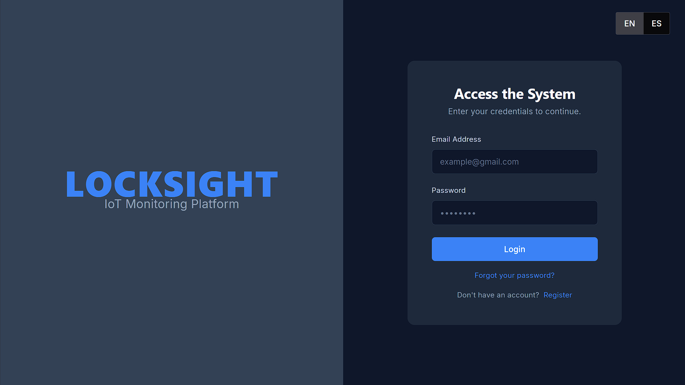

  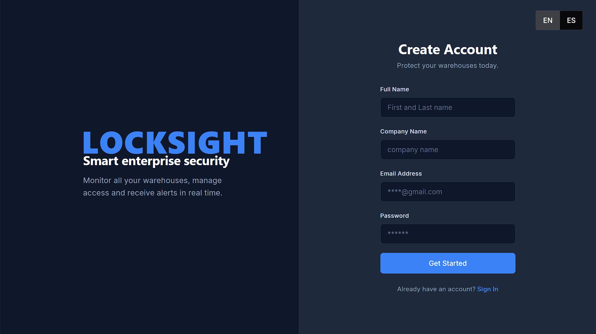

  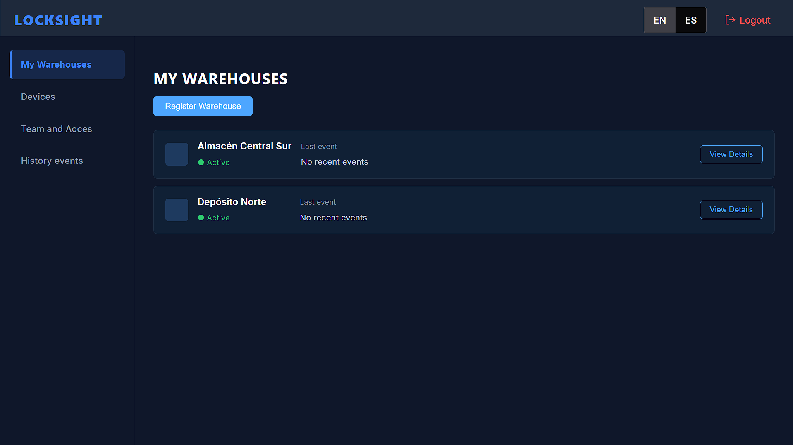

  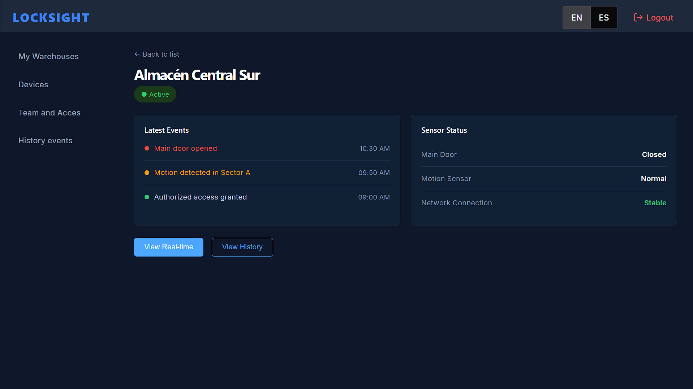

**Video de navegación del Sprint 2:**

URL del video: [NAVEGACIÓN DEL SPRINT 2](https://upcedupe-my.sharepoint.com/:v:/g/personal/u202418645_upc_edu_pe/IQAgZR1OWtMYQJbNAhf5C6_0AZAakhsJIfMCBFytiqNUEnc?nav=eyJyZWZlcnJhbEluZm8iOnsicmVmZXJyYWxBcHAiOiJTdHJlYW1XZWJBcHAiLCJyZWZlcnJhbFZpZXciOiJTaGFyZURpYWxvZy1MaW5rIiwicmVmZXJyYWxBcHBQbGF0Zm9ybSI6IldlYiIsInJlZmVycmFsTW9kZSI6InZpZXcifX0%3D&e=URbqw1)

#### 5.2.2.6. Services Documentation Evidence for Sprint Review

Durante el Sprint 2, a la par del desarrollo del Frontend interactivo en Vue.js, el equipo de Backend continuó estructurando la RESTful API en ASP.NET Core enfocada en los Bounded Contexts de Identity and Access Management (IAM) y Warehouse Management. 

Para asegurar el progreso continuo en la Web Application sin bloqueos de dependencia, el equipo implementó servicios simulados (Mock APIs) empleando archivos locales en formato JSON. Esta estrategia permitió mapear la estructura de datos que se espera recibir del backend real (como la lista de almacenes, roles de usuario y métricas iniciales del dashboard) y enlazar las vistas. Paralelamente se preparo para la integración final y consumo de datos reales en el Sprint 3.

#### 5.2.2.7. Software Deployment Evidence for Sprint Review

El despliegue de la Web Application se llevó a cabo configurando un entorno de despliegue completamente separado del Landing Page para mantener la independencia técnica de ambos productos. 

Se configuró el entorno para procesar los artefactos generados por el build de Vue.js (`dist`), asegurando que las rutas protegidas del sistema funcionen adecuadamente en producción. La última versión estable, fusionada en la rama `main` del repositorio `watchgate-webapp`, se encuentra pública y operativa para que los usuarios puedan interactuar con la plataforma y validar los flujos de inicio de sesión y visualización de almacenes.

#### 5.2.2.8. Team Collaboration Insights during Sprint

Durante el Sprint 2, los cinco integrantes del equipo Watchgate mantuvieron una colaboración dinámica y altamente estructurada.

El equipo respetó el flujo de trabajo GitFlow de manera rigurosa. Todo el código nuevo se integró a la rama `develop` exclusivamente mediante Pull Requests. Esta práctica no solo permitió la revisión de código cruzada (Code Review) entre los miembros, sino que también minimizó los merge conflicts del trabajo en los mismos componentes de Vue.js. Los mensajes de commit dejaron un historial de desarrollo limpio, rastreable y alineado con los estándares del proyecto.

## 5.3 Validation Interviews
### 5.3.1 Diseño de entrevistas
**Primer segmento: Persona natural**

A continuación, se presentan las preguntas dirigidas al segmento de personas naturales, compuesto por individuos que buscan proteger su vehículo, conocer su ubicación en tiempo real y recibir alertas básicas de seguridad mediante una solución tecnológica como GOD’s Tracker.

**Preguntas principales**
1.	¿Te preocupa que puedan robar tu vehículo? ¿Por qué? 
2.	¿Has tenido alguna experiencia con robo o intento de robo? 
3.	¿Qué haces actualmente para proteger tu vehículo? 
4.	¿Te gustaría saber en todo momento dónde está tu vehículo? 
5.	¿Qué tan útil sería para ti recibir alertas en tu celular si algo pasa con tu vehículo? 
6.	¿Qué tipo de alertas te gustaría recibir? (movimiento, robo, ubicación, etc.) 
7.	¿Qué tan fácil te gustaría que sea usar una app para ver tu vehículo? 
8.	¿Confiarías en un sistema que usa GPS para rastrear tu vehículo? ¿Por qué? 
9.	¿Qué es lo más importante para ti en un sistema de seguridad vehicular?
10.	¿Qué te haría sentir más seguro usando este tipo de producto? 
11.	¿Usarías una aplicación para controlar tu vehículo desde el celular? 
12.	¿Recomendarías un sistema así a otras personas?

**Preguntas complementarias**

13.	¿Qué edad tienes?
14.	¿A qué te dedicas?
15.	¿Qué tipo de vehículo tienes?
16.	¿En qué distrito vives o sueles moverte más? 
17.	¿Qué tanto usas aplicaciones en tu celular? 
18.	¿Prefieres usar más el celular o la computadora?

**Segundo segmento: Empresas**

A continuación, se presentan las preguntas dirigidas al segmento empresarial, compuesto por empresas de transporte, logística y otros sectores que requieren monitoreo, control y análisis avanzado de sus flotas vehiculares.

**Preguntas principales**
1.	¿Te preocupa la seguridad de los vehículos o la carga con la que trabajas?
2. ¿Has vivido o visto problemas de robos o pérdidas en el trabajo?
3. ¿Cómo saben actualmente dónde están los vehículos durante el día?
4. ¿Te gustaría poder ver la ubicación de los vehículos en tiempo real?
5. ¿Qué tan útil sería recibir alertas si un vehículo se desvía o se detiene mucho tiempo?
6. ¿Qué información te ayudaría más en tu trabajo sobre los vehículos?
7. ¿Te serviría tener un historial de recorridos o rutas?
8. ¿Qué tan fácil debería ser usar una app o sistema de monitoreo?
9. ¿Qué es lo más importante para ti en un sistema de este tipo?
10. ¿Te ayudaría tener todo el control en una sola plataforma?
11. ¿Qué problemas te gustaría solucionar con una herramienta como esta?
12. ¿Crees que un sistema así mejoraría tu trabajo o el de tu empresa?
    
**Preguntas complementarias**

13. ¿Cuál es tu puesto o función dentro de la empresa?
14. ¿En qué tipo de empresa trabajas? (transporte, logística, etc.)
15. ¿Trabajas directamente con vehículos? ¿Cómo?
16. ¿En qué zonas sueles trabajar o movilizarte?
17. ¿Qué herramientas o apps usas en tu trabajo actualmente?
18. ¿Qué tan seguido usas celular o computadora en tu trabajo?

### 5.3.2. Registro de entrevistas
## Segmento 1: Persona natural

| Nº Entrevista | Datos del entrevistado | Resumen de la entrevista | Evidencia de entrevista |
|--------------|------------------------|--------------------------|--------------------------|
| 1 | **Nombre:** Luis Lopez   **Edad:** 25   **Distrito:** San Borja   **Link:** colocar link | El entrevistado, trabajador en logística y usuario frecuente de su vehículo, muestra alta preocupación por el robo, reforzada por un intento previo. Considera que las medidas actuales como la alarma y precaución son insuficientes, evidenciando la necesidad de una solución más completa. Valora el monitoreo en tiempo real y las alertas inmediatas (movimiento sospechoso, intento de robo y ubicación), alineándose con la propuesta de GuardiAnts. Prioriza una app simple, rápida y fácil de usar desde el celular, destacando la precisión y confiabilidad del GPS como factores clave. Su perfil digital y disposición a recomendar la solución refuerzan el potencial de adopción del producto. | 

 |
| 2 | **Nombre:** Enrique Castillo   **Edad:** 22   **Distrito:** Magdalena   **Link:** colocar link | Enrique, un estudiante de 22 años que se mueve por varias zonas de Lima, considera que sí usaría una app de seguridad vehicular sencilla que le permita ver la ubicación de su auto en tiempo real y recibir alertas ante situaciones sospechosas, especialmente por experiencias cercanas de intento de robo. | 

 |
| 3 | **Nombre:** Juana Quispe   **Edad:** 47   **Distrito:** El Agustino   **Link:** colocar link | La entrevistada, comerciante independiente, evidencia una alta preocupación por la inseguridad vehicular debido al contexto actual de delincuencia en Lima y a experiencias previas de intento de robo y manipulación de su vehículo mientras realizaba sus actividades laborales. Actualmente no cuenta con una medida de seguridad para su auto, pero considera que es insuficiente, ya que busca mayor control y seguimiento constante. Destaca la necesidad de conocer la ubicación de su vehículo en todo momento y recibir alertas inmediatas ante cualquier movimiento sospechoso. Valora especialmente funciones como notificaciones en tiempo real, ubicación precisa y alertas por movimiento, priorizando un sistema que le permita reaccionar rápidamente ante posibles incidentes. Busca una aplicación simple, fácil de usar y accesible desde el celular, que le brinde mayor tranquilidad y control. Además, muestra disposición a adoptar este tipo de tecnología y recomendarla a su entorno si demuestra ser confiable y efectiva. | 

 |

### Resumen de entrevistas segmento #1

A partir de las entrevistas, se observa que todos los participantes comparten una fuerte preocupación por la inseguridad vehicular en Lima, influenciada tanto por el contexto actual como por experiencias cercanas o personales de intento de robo. Aunque algunos cuentan con medidas básicas como alarmas o simplemente toman precauciones, coinciden en que estas resultan insuficientes frente a los riesgos actuales, lo que genera una sensación constante de vulnerabilidad. En general, valoran mucho la posibilidad de monitorear su vehículo en tiempo real, recibir alertas inmediatas ante movimientos sospechosos y contar con una ubicación precisa, ya que esto les permitiría reaccionar rápidamente ante cualquier incidente. Además, destacan la importancia de que la solución sea fácil de usar, accesible desde el celular y confiable en términos de funcionamiento. Más allá de las funcionalidades, lo que realmente buscan es sentirse más tranquilos, tener mayor control sobre su vehículo y reducir la incertidumbre en su día a día, mostrando también una buena disposición a adoptar y recomendar una herramienta que cumpla con estas expectativas.

## Segmento 2: Empresas

| Nº Entrevista | Datos del entrevistado | Resumen de la entrevista | Evidencia de entrevista |
|--------------|------------------------|--------------------------|--------------------------|
| 1 | **Nombre:** Jesus Alvites   **Edad:** 25   **Distrito:**   **Link:** colocar link | El entrevistado, con experiencia como supervisor de tráfico, confirma que la inseguridad en rutas es frecuente, especialmente en zonas como el Callao o durante paradas donde ocurren robos de carga. Destaca que el monitoreo en tiempo real mediante GPS es indispensable, aunque presenta limitaciones como pérdida de conexión y falta de integración de información. Valora alertas de desvíos o detenciones, acceso a historiales y comunicación con conductores. Busca una solución simple, accesible desde el celular y centralizada que mejore el control, la toma de decisiones y reduzca riesgos operativos. | 

 |
| 2 | **Nombre:** Juan Velasquez   **Edad:** 25   **Distrito:**   **Link:** colocar link | Juan revela una necesidad crítica de seguridad y visibilidad operativa, ya que actualmente depende de métodos manuales e ineficientes como llamadas y WhatsApp para gestionar su flota en un entorno de alto riesgo por robos y desvíos. La implementación de un sistema de telemetría se percibe como una inversión estratégica para obtener paz mental mediante el monitoreo en tiempo real y alertas automáticas, buscando no solo proteger el patrimonio y la carga, sino también optimizar costos de combustible y tiempos de entrega a través de una plataforma centralizada y extremadamente sencilla de usar. El interés principal no radica en la tecnología por sí misma, sino en su capacidad de transformar la incertidumbre actual en un control total que garantice la rentabilidad y la profesionalización del servicio frente al cliente. | 

 |
| 3 | **Nombre:** Matias Diaz   **Edad:** 25   **Distrito:** San Juan de Lurigancho   **Link:** colocar link | Matias Diaz, quien se desempeña como supervisor de seguridad en una empresa de distribución, destaca que su rol se centra en la prevención de riesgos y el cumplimiento de protocolos durante el traslado de vehículos y carga. Señala que la inseguridad en rutas de Lima Metropolitana es constante, especialmente en zonas de alto riesgo, donde ha presenciado robos y pérdidas operativas. Utiliza herramientas como GPS, radios y reportes manuales, pero considera que estas no son suficientes, ya que requieren complementar información de varias fuentes. Por ello, enfatiza la necesidad de un sistema más completo que muestre la ubicación y el nivel de riesgo de las zonas. Valora especialmente funciones como monitoreo en tiempo real, alertas por desvíos, paradas prolongadas, exceso de velocidad y acceso a historiales de rutas para identificar patrones de riesgo. Busca una plataforma centralizada, rápida y confiable, que le permita reaccionar de inmediato ante emergencias, mejorar el control operativo y reducir tanto riesgos de seguridad como pérdidas económicas en la empresa. | 

 |

### Resumen de entrevistas segmento #2

A partir de las entrevistas, se puede ver que todos los participantes trabajan en entornos donde la inseguridad en rutas es un problema constante, especialmente por robos y desvíos que afectan directamente sus operaciones. Actualmente dependen de herramientas básicas como GPS, llamadas o WhatsApp, lo que hace que el seguimiento de los vehículos sea poco eficiente y muy manual, generando incertidumbre y dificultando la toma de decisiones rápidas. En general, coinciden en que necesitan tener mayor control y visibilidad en tiempo real, valorando mucho funciones como alertas automáticas ante situaciones sospechosas y el acceso a historiales de rutas para entender mejor lo que ocurre. También buscan una solución que sea simple, accesible desde el celular y que centralice toda la información en un solo lugar. Más allá de la tecnología, lo que realmente esperan es poder trabajar con mayor tranquilidad, reducir riesgos y mejorar la eficiencia de sus operaciones.

### 5.3.3. Evaluaciones según heurísticas

---

**UX Heuristics & Principles Evaluation**
*Usability – Inclusive Design – Information Architecture*

| Campo | Detalle |
|---|---|
| **CARRERA** | Ingeniería de Software |
| **CURSO** | Aplicaciones Web |
| **SECCIÓN** | NRC 12144 |
| **PROFESORES** | Bautista Ubillús, Efraín Ricardo; Castro Veramendi, Rafael Oswaldo; Mori Paiva, Hugo Allan; Sánchez Ponce, Alex Humberto; Velásquez Núñez, Ángel Augusto; Villafuerte Bazán, Óscar Iván |
| **AUDITOR** | Watchgate – Equipo Locksight |
| **CLIENTE(S)** | María Fernanda Torres, Javier Ríos Mendo, Patricia Vásquez Lara, Roberto Salinas Huanca, Adriana Chávez Porras, Carlos Mendoza Infante |

---

**SITE o APP A EVALUAR:** Locksight – Landing Page y Web Application

---

**TAREAS A EVALUAR:**

El alcance de esta evaluación incluye la revisión de la usabilidad de las siguientes tareas:

1. Registro de un nuevo usuario y empresa
2. Registro y configuración de un almacén
3. Registro de sensores IoT y vinculación a zonas
4. Visualización del dashboard de monitoreo
5. Recepción y gestión de alertas de seguridad
6. Consulta y filtrado del historial de eventos
7. Generación y exportación de reporte de seguridad
8. Navegación general del Landing Page
9. Selección de un plan de suscripción desde el Landing Page

No están incluidas en esta versión de la evaluación las siguientes tareas:

1. Integración con sistemas CCTV externos
2. Gestión de fidelización y puntos de recompensa
3. Configuración de múltiples destinatarios en notificaciones por SMS o WhatsApp
4. Módulo de administración de superusuario (back-office)

---

**ESCALA DE SEVERIDAD:**

| Nivel | Descripción |
|:---:|---|
| 1 | Problema superficial: puede ser fácilmente superado por el usuario u ocurre con muy poca frecuencia. No necesita ser corregido a menos que exista disponibilidad de tiempo. |
| 2 | Problema menor: puede ocurrir un poco más frecuentemente o es un poco más difícil de superar. Se le debe asignar prioridad baja para el siguiente release. |
| 3 | Problema mayor: ocurre frecuentemente o los usuarios no son capaces de resolverlo. Es importante corregirlo y se le debe asignar prioridad alta. |
| 4 | Problema muy grave: impide al usuario continuar usando la herramienta. Es imperativo corregirlo antes del lanzamiento. |

---

**TABLA RESUMEN:**

| # | Problema | Escala de Severidad | Heurística / Principio violado |
|:---:|---|:---:|---|
| 1 | El enlace de "Planes" no es visible en la barra de navegación del Landing Page; los usuarios deben hacer scroll para encontrar la sección. | 3 | Usability: Visibilidad del estado del sistema |
| 2 | La diferencia entre niveles de riesgo de zona (alto, medio, bajo) no se explica de forma contextual al momento del registro. | 3 | Usability: Ayuda y documentación |
| 3 | El menú hamburguesa en la versión móvil del Landing Page no es identificado con facilidad por usuarios no técnicos. | 2 | Usability: Consistencia y estándares |
| 4 | La sección de "Características" en mobile presenta bloques de texto extensos sin jerarquía visual clara. | 2 | Information Architecture: Is it usable? |
| 5 | No existe un tutorial de inicio o guía interactiva para nuevos usuarios al ingresar por primera vez a la Web Application. | 3 | Usability: Ayuda y documentación |
| 6 | El proceso de verificación de correo electrónico durante el registro no indica el tiempo estimado de espera ni ofrece opción de reenvío inmediata. | 2 | Usability: Visibilidad del estado del sistema |
| 7 | El panel de alertas no cuenta con filtro por tipo de evento de forma directa; el usuario debe navegar a otra sección para aplicarlo. | 3 | Usability: Control y libertad del usuario |
| 8 | La configuración de múltiples destinatarios en notificaciones no permite agregar más de un canal de forma fluida. | 2 | Usability: Flexibilidad y eficiencia de uso |
| 9 | Algunas imágenes del Landing Page no cuentan con texto alternativo visible en lectores de pantalla. | 3 | Inclusive Design: Proporciona experiencias comparables |
| 10 | No existe indicación de período de prueba gratuita, lo que genera duda en usuarios que no quieren comprometerse sin probar el servicio. | 2 | Information Architecture: Is it findable? |

---

**DESCRIPCIÓN DE PROBLEMAS:**

**PROBLEMA #1:** El enlace de "Planes" no es visible en la barra de navegación del Landing Page

**Severidad:** 3

**Heurística violada:** Usability – Visibilidad del estado del sistema

**Problema:** Durante las sesiones de validación, dos de los seis entrevistados no encontraron la sección de precios de forma directa desde el menú de navegación. Al no ver un acceso claro, recurrieron al scroll manual, lo que generó fricción innecesaria. En el contexto de un Landing Page orientado a conversión, la dificultad para acceder a la información de planes puede impactar directamente en la decisión de contratación.

**Recomendación:** Incluir el ítem "Planes" de forma explícita y destacada en la barra de navegación superior, tanto en desktop como en la versión colapsada del menú móvil. Adicionalmente, se puede considerar fijar la barra de navegación al hacer scroll para mantener el acceso permanente.

---

**PROBLEMA #2:** La diferencia entre niveles de riesgo de zona no se explica de forma contextual

**Severidad:** 3

**Heurística violada:** Usability – Ayuda y documentación

**Problema:** Al registrar zonas dentro de un almacén, el sistema solicita al usuario definir el nivel de riesgo (alto, medio, bajo), pero no proporciona una definición o ejemplo de qué criterios determinan cada nivel. Esto generó confusión en dos entrevistados, quienes asignaron niveles de forma arbitraria sin comprender el impacto en las reglas de alerta del sistema.

**Recomendación:** Agregar tooltips o íconos de ayuda con información contextual junto al campo de selección de nivel de riesgo, explicando brevemente qué tipo de actividad o sensibilidad corresponde a cada nivel (por ejemplo: "Alto: zonas con activos de alto valor o acceso restringido").

---

**PROBLEMA #3:** El menú hamburguesa en mobile no es identificado con facilidad

**Severidad:** 2

**Heurística violada:** Usability – Consistencia y estándares

**Problema:** Una de las entrevistadas del segmento PYME, al acceder al Landing Page desde su celular, tardó varios segundos en identificar el menú hamburguesa en la esquina superior derecha. El ícono utilizado presentaba un estilo que no era inmediatamente reconocible como menú de navegación para usuarios con menor familiaridad con interfaces web.

**Recomendación:** Utilizar el ícono estándar de tres líneas horizontales (≡) ampliamente reconocido como menú de navegación, y considerar añadir una etiqueta de texto "Menú" debajo del ícono para reforzar su función, especialmente en versiones destinadas a segmentos con menor experiencia digital.

---

**PROBLEMA #4:** Sección de características en mobile con texto extenso y sin jerarquía visual

**Severidad:** 2

**Heurística violada:** Information Architecture – Is it usable?

**Problema:** En la versión móvil del Landing Page, la sección de características presenta párrafos extensos de texto sin suficiente separación visual, jerarquía tipográfica ni uso de negritas para resaltar los conceptos clave. Esto dificulta la lectura rápida en pantallas pequeñas y reduce la efectividad comunicativa de la propuesta de valor.

**Recomendación:** Reducir la densidad de texto en cada bloque de característica, usar negritas para los conceptos clave, y priorizar el uso de íconos representativos como apoyo visual. Limitar cada descripción a dos o tres líneas para la versión móvil.

---

**PROBLEMA #5:** Ausencia de tutorial de inicio o guía interactiva para nuevos usuarios

**Severidad:** 3

**Heurística violada:** Usability – Ayuda y documentación

**Problema:** Dos entrevistados, uno de cada segmento, señalaron que al ingresar por primera vez a la Web Application no existía ningún elemento que los orientara sobre cómo iniciar. Esto llevó a que exploraran de forma no guiada, incrementando el tiempo necesario para completar tareas básicas como registrar un almacén o configurar sensores.

**Recomendación:** Implementar un flujo de onboarding con pasos guiados (stepper interactivo o tooltips de bienvenida) que oriente al usuario nuevo en las primeras acciones clave: registrar empresa, añadir almacén y configurar el primer sensor. Este flujo debería poder omitirse para usuarios que ya conocen la plataforma.

---

**PROBLEMA #9:** Imágenes sin texto alternativo en el Landing Page

**Severidad:** 3

**Heurística violada:** Inclusive Design – Proporciona experiencias comparables

**Problema:** Varias imágenes del Landing Page, incluyendo íconos decorativos y fotografías de la sección del equipo, no cuentan con atributos `alt` descriptivos. Esto impide que usuarios que dependen de lectores de pantalla (usuarios con discapacidad visual) accedan al contenido de forma equivalente, vulnerando los principios de diseño inclusivo y los estándares de accesibilidad web (WCAG 2.1).

**Recomendación:** Revisar todas las imágenes del Landing Page y la Web Application para agregar atributos `alt` con descripciones significativas. Las imágenes decorativas deben incluir `alt=""` para que los lectores de pantalla las ignoren correctamente. Incorporar esta práctica como parte del proceso de revisión de código en cada sprint.

---

## 5.4. Video About-the-Product

El Video About-the-Product de Locksight tiene como objetivo comunicar de forma clara, directa y convincente el valor de la plataforma a dos audiencias principales: visitantes del Landing Page que aún no conocen la solución, y usuarios actuales que desean explorar las funcionalidades disponibles. El tono adoptado es profesional pero accesible, coherente con la identidad visual de la plataforma, transmitiendo seguridad, confianza y modernidad tecnológica.

El video inicia con la presentación del problema: la vulnerabilidad operativa que enfrentan las empresas que gestionan almacenes con sistemas de seguridad tradicionales y fragmentados. A continuación, se introduce Locksight como la solución, mostrando las principales funcionalidades en acción: el dashboard de monitoreo en tiempo real, la recepción de alertas por criticidad, la gestión de sensores IoT por zona y la generación de reportes de seguridad. El video finaliza con el testimonio de dos usuarios reales, uno de cada segmento, que comparten cómo Locksight mejoró su control operativo y les dio mayor tranquilidad en la gestión de sus almacenes.

| Campo | Detalle |
|---|---|
| **Duración** | 2 minutos 48 segundos |
| **URL Microsoft Stream** | [*(Insertar URL privado aquí)*](https://upcedupe-my.sharepoint.com/:v:/g/personal/u202414356_upc_edu_pe/IQCA6WTdpRBQQJTCO8vaUov_AUXzqZ3z6IOMwY6Yiwlug2M?nav=eyJyZWZlcnJhbEluZm8iOnsicmVmZXJyYWxBcHAiOiJTdHJlYW1XZWJBcHAiLCJyZWZlcnJhbFZpZXciOiJTaGFyZURpYWxvZy1MaW5rIiwicmVmZXJyYWxBcHBQbGF0Zm9ybSI6IldlYiIsInJlZmVycmFsTW9kZSI6InZpZXcifX0%3D&e=5Kibqf) |
| **URL YouTube** | [*(Insertar URL YouTube aquí – para incrustar en Landing Page)*](https://youtu.be/uAOYovs65JU) |

---

## Conclusiones

### Conclusiones y recomendaciones

A lo largo del ciclo de desarrollo del presente proyecto, el equipo de Watchgate construyó Locksight, una plataforma web de seguridad inteligente para almacenes empresariales, integrando tecnología IoT con una interfaz de monitoreo en tiempo real. Las siguientes conclusiones sintetizan los resultados obtenidos en contraste con los Problem Statements, Assumptions e Hypothesis Statements definidos durante el proceso de Lean UX.

**Sobre los Problem Statements y el problema identificado**

El problema central identificado al inicio del proyecto fue la falta de visibilidad, centralización y proactividad en los sistemas de seguridad utilizados por empresas que operan almacenes en Lima. Tras ocho entrevistas de needfinding y seis entrevistas de validación, se confirmó que este problema es ampliamente reconocido por ambos segmentos objetivo. El 100% de los entrevistados manifestó que sus sistemas actuales son reactivos y que la falta de monitoreo en tiempo real genera pérdidas económicas y dificultades para identificar responsables en incidentes de seguridad. Esto valida la relevancia del problema abordado y la necesidad de una solución como Locksight.

**Sobre los Assumptions**

El equipo asumió que los dueños de PYMES priorizarían la facilidad de uso y el acceso móvil por encima de la profundidad de las funcionalidades. Esta suposición fue confirmada: los entrevistados del segmento 1 valoraron especialmente la interfaz clara del dashboard y la posibilidad de recibir alertas de forma inmediata, y expresaron menor interés en funciones avanzadas como reportes detallados para auditorías. En contraste, los jefes de seguridad del segmento 2 priorizaron la trazabilidad, los reportes exportables y la capacidad de gestionar múltiples almacenes desde una sola plataforma, lo que también coincidió con la hipótesis planteada para ese segmento.

Se asumió además que los usuarios del segmento 2 tendrían mayor tolerancia técnica para registrar y configurar sensores IoT. Esto fue parcialmente confirmado: si bien completaron el proceso sin mayor dificultad, identificaron la necesidad de contar con información contextual sobre los niveles de riesgo por zona, lo que indica que incluso usuarios técnicos requieren orientación en funciones que involucran criterios de negocio.

**Sobre los Hypothesis Statements**

La hipótesis central del proyecto planteaba que, si se proporcionaba a las empresas una plataforma centralizada de monitoreo con alertas en tiempo real e historial trazable, reducirían los tiempos de respuesta ante incidentes y aumentarían el control sobre sus operaciones de almacén. Las sesiones de validación respaldan esta hipótesis: los entrevistados coincidieron en que la plataforma les permitiría pasar de un enfoque reactivo a uno preventivo, y que el acceso centralizado a la información daría mayor agilidad a sus equipos de seguridad.

Se planteó también la hipótesis de que el Landing Page generaría confianza suficiente como para que los visitantes decidieran iniciar el proceso de registro. Las entrevistas de validación con usuarios de ambos segmentos que interactuaron con el Landing Page confirmaron que la estructura de contenidos, los testimonios y la sección de planes generaban confianza. Sin embargo, se identificó que la ausencia de un período de prueba gratuita fue mencionada por múltiples entrevistados como una barrera para la decisión inmediata de registro.

**Sobre los criterios de éxito**

Los criterios de éxito definidos en el proceso de Lean UX incluyeron la capacidad de los usuarios para completar los flujos clave de la aplicación sin asistencia externa, la comprensión del valor propuesto al interactuar con el Landing Page, y la generación de retroalimentación positiva sobre la usabilidad general del sistema. Estos criterios fueron alcanzados en su mayoría: los seis entrevistados de validación completaron los user flows asignados con niveles de ayuda mínimos, y todos expresaron satisfacción general con la plataforma, indicando que representaba una mejora significativa frente a sus soluciones actuales.

**Recomendaciones para el Roadmap**

Con base en los hallazgos del ciclo de desarrollo y las entrevistas de validación, se identifican las siguientes prioridades para el roadmap de Locksight:

1. **Incorporar un flujo de onboarding interactivo** para nuevos usuarios, que guíe paso a paso el proceso de configuración inicial (empresa, almacén, sensores). Esta funcionalidad reduciría la curva de aprendizaje y mejoraría la retención temprana de usuarios.

2. **Implementar un período de prueba gratuita** de al menos 14 días sin requerir datos de pago. Esta funcionalidad fue mencionada de forma recurrente como un factor clave para la decisión de adopción en el segmento PYME.

3. **Expandir los canales de notificación** para incluir WhatsApp como canal nativo, dado que fue el canal más solicitado por usuarios del segmento 1, quienes gestionan su negocio principalmente desde el celular.

4. **Desarrollar la integración con sistemas CCTV** existentes, identificada como la funcionalidad de mayor valor para el segmento 2, ya que permitiría a las empresas consolidar toda su infraestructura de seguridad en una sola plataforma.

5. **Mejorar la accesibilidad del Landing Page** añadiendo atributos `alt` a todas las imágenes, incrementando el contraste de texto en secciones clave y verificando la compatibilidad con lectores de pantalla, en alineación con los estándares WCAG 2.1.

6. **Añadir filtros directos en el panel de alertas** (por tipo de evento y por almacén) para optimizar el flujo de trabajo de los jefes de seguridad que gestionan múltiples ubicaciones de forma simultánea.

---

## Bibliografía

Cohn, M. (2004). *User stories applied: For agile software development*. Addison-Wesley Professional.

Conventionalcommits.org. (2023). *Conventional Commits 1.0.0*. https://www.conventionalcommits.org/

Dittrich, J. (2022). *A beginner's guide to finding user needs*. https://jdittrich.github.io/userNeedResearchBook/

Driessen, V. (2010). *A successful Git branching model*. https://nvie.com/posts/a-successful-git-branching-model/

Evans, E. (2003). *Domain-driven design: Tackling complexity in the heart of software*. Addison-Wesley.

Google. (2023). *Google HTML/CSS Style Guide*. https://google.github.io/styleguide/htmlcssguide.html

Google. (2023). *Google JavaScript Style Guide*. https://google.github.io/styleguide/jsguide.html

HubSpot. (2023). *Full list of meta tags, why they matter for SEO & how to write them*. https://blog.hubspot.com/marketing/meta-tags

IBM Design. (2022). *Empathy map: Build empathy for your users through a conversation informed by your team's observations*. https://www.ibm.com/design/thinking/page/toolkit/activity/empathy-map

Lean UX (2013). *Lean UX – Chapter 3*. https://www.scribd.com/document/655516553/Leanux-Sampler

Microsoft. (2023). *C# coding conventions*. https://docs.microsoft.com/en-us/dotnet/csharp/fundamentals/coding-style/coding-conventions

Microsoft. (2023). *ASP.NET Core engineering guidelines*. https://github.com/dotnet/aspnetcore/wiki/Engineering-guidelines#coding-guidelines

Mozilla Developer Network. (2023). *MDN JavaScript guidelines*. https://developer.mozilla.org/en-US/docs/MDN/Guidelines/Code_guidelines/JavaScript

Nielsen Norman Group. (2022). *Design systems 101*. https://www.nngroup.com/articles/design-systems-101/

Nielsen Norman Group. (2022). *Empathy mapping: The first step in design thinking*. https://www.nngroup.com/articles/empathy-mapping/

Nielsen Norman Group. (2022). *The four dimensions of tone of voice*. https://www.nngroup.com/articles/tone-of-voice-dimensions/

Semver.org. (2023). *Semantic Versioning 2.0.0*. https://semver.org/

SpecFlow. (2023). *Gherkin conventions for readable specifications*. https://specflow.org/gherkin/gherkin-conventions-for-readable-specifications/

The Markdown Guide. (2023). *Markdown guide*. https://www.markdownguide.org/

UXPressia. (2022). *How to create an Impact Map in 4 easy steps*. https://uxpressia.com/blog/build-impact-map-4-easy-steps

UXPressia. (2022). *User vs. Buyer Persona: Differences and free template*. https://uxpressia.com/blog/user-persona-vs-buyer-persona-difference

Vue.js. (2023). *Vue style guide*. https://vuejs.org/v2/style-guide/

W3Schools. (2023). *HTML style guide and coding conventions*. https://www.w3schools.com/html/html5_syntax.asp

W3Schools. (2023). *W3C JavaScript style guide*. https://www.w3schools.com/js/js_conventions.asp

---

## Anexos
Estructura para la sección Objetivo del Estudiante (Student Outcome)
El curso contribuye al cumplimiento del Student Outcome ABET:
ABET – EAC - Student Outcome 5
Criterio: La capacidad de funcionar efectivamente en un equipo cuyos miembros juntos proporcionan liderazgo, crean un entorno de colaboración e inclusivo, establecen objetivos, planifican tareas y cumplen objetivos.

### LINKS IMPORTANTES:

* **URL LANDING PAGE DESPLEGADA:** [https://upc-pre-202610-1asi0730-12144-watchgate.github.io/watchgate-website/](https://upc-pre-202610-1asi0730-12144-watchgate.github.io/watchgate-website/)
* **URL APP WEB DESPLEGADA:** [https://upc-pre-202610-1asi0730-12144-watchgate.github.io/watchgate-webapp/](https://upc-pre-202610-1asi0730-12144-watchgate.github.io/watchgate-webapp/)
* **URL DEL FIGMA:** [https://www.figma.com/design/kbhdQovpVLS8GuQqHQ0QDh/Watchgate?node-id=0-1&p=f](https://www.figma.com/design/kbhdQovpVLS8GuQqHQ0QDh/Watchgate?node-id=0-1&p=f)
